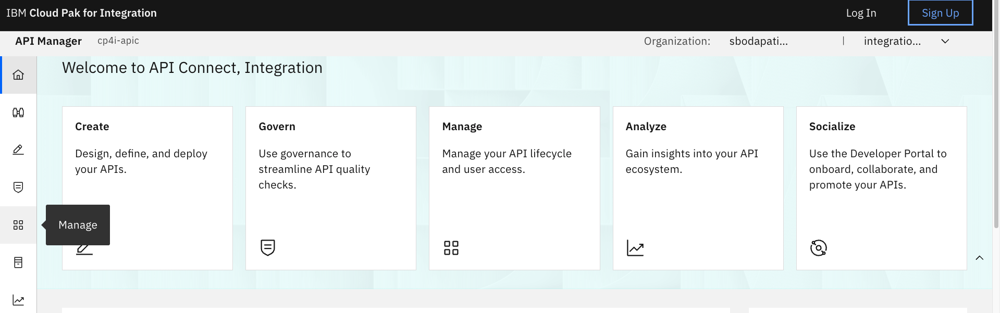

# IBM Event Automation & IBM API Connect: Socialization of Kafka Topics as AsyncAPI’s

---

# Table of Contents
- [1. Introduction](#introduction)
- [2. IBM Event Endpoint Manager](#eem-section)
    * [2a. Review FLIGHT.LANDINGS Topic](#review-topic)
    * [2b. Topics View](#topics-view)
    * [2c. Catalogs View](#catalogs-view)
- [3. IBM API Connect](#apiconnect)
    * [3a. API Connect Manager](#apiconnect-manager)
    * [3b. API Connect Developer Portal](#apiconnect-devptl)
- [4. Consuming Flight Landing Events](#consume-flight-events)
    * [4a. Generate client certificates of Event Gateway](#generate-egw-cert)
    * [4b. kafka-console-consumer.sh - Consume flight events](#kafka-console-consumer.sh)
    * [4c. Java Application -- Consume flight events](#java-consume)
- [5. Summary](#summary)

---


<br>

# 1. Introduction <a name="introduction"></a>

In this lab, you will explore the full potential of ASYNCAPI within IBM
Event Endpoint Management and IBM API Connect. ASYNCAPI enables the integration
of Kafka Topics into APIs via IBM Event Endpoint Management (EEM) and IBM API Connect. <br>

This lab will utilize a Kafka Topic named FLIGHT.LANDINGS, which is
established within Confluent Kafka cluster. Flight landing
events are produced in this topic each time a flight lands at an
airport. <br>

This lab will provide guidance on how to articulate and publish the
FLIGHT.LANDINGS topic into EEM, followed by making the API available on the IBM API Connect Developer Portal, enabling users to subscribe to and utilize events through Kafka Clients. <br>

Reference architecture diagram below;


**What is Confluent Kafka**

IBM Confluent Kafka  is an event streaming platform built on open
source [Apache
Kafka](https://www.ibm.com/think/topics/apache-kafka)®. It is available
both as a fully managed service or on-premise.


**What is IBM Event Endpoint Management?** <br>

IBM Event Endpoint Manager (EEM) enables organizations to efficiently manage, discover, and share event streams in a manner comparable to APIs. EEM facilitates the addition and management of Kafka Topics from any Kafka platforms thereby offering a unified platform for managing Kafka Platforms. <br>

**Event Endpoint Management Core Capabilities** <br>
**Event Catalog:** Provides a self-service, developer-friendly portal to search, discover, and reuse event sources.<br>
**AsyncAPI Standardization:** Automatically documents event streams using the standard AsyncAPI specification.<br>
**Centralized Control Plane:** Unifies governance across multiple disparate Kafka clusters.

**Main Components** <br>
**Event Manager:** The administrative plane where technical experts discover Kafka topics, define access rules, and publish definitions to the catalog. <br>
**Event Gateway:** The runtime enforcement point that abstracts direct access to Kafka clusters, handling security, traffic virtualization, and policy enforcement.

**Key Security and Governance Features** <br>
**Authentication:** Validates Kafka clients before granting access. <br>
**Quota Enforcement:** Limits the number of events a client can publish or consume over time.<br>
**Redaction and Filtering:** Automatically redacts sensitive information and enforces schema-based filtering as traffic flows through the gateway.


**What is IBM API Connect?** <br>
IBM API Connect is an enterprise-grade, integrated API management platform that helps businesses create, secure, manage, share, monetize, and analyze application programming interfaces (APIs) across cloud and on-premises environments. <br>

<br>

**About this hands-on lab** <br>
To support the hands-on activities in this lab, a dedicated environment
has been provisioned, consisting of a Red Hat OpenShift cluster and a
Linux workstation. These components provide the foundation for deploying
and testing AsyncAPIs in a realistic, cloud-native setup.

- **Red Hat OpenShift Cluster**\
    The OpenShift cluster serves as the container deployment platform for all IBM
    Capabilities throughout the lab.

- **Linux Workstation**\
    The Linux workstation functions as the primary interface for
    interacting with the OpenShift cluster. 

<br>

# 2. IBM Event Endpoint Manager <a name="eem-section"></a>

**Note:** This section is just showing the screens that an Event Endpoint Management Admin would use to expose a topic as AsyncAPI for IBM API Connect.
<br>

## 2a. Review FLIGHT.LANDINGS Topic <a name="review-topic"></a>

**THIS SECTIONS is REVIEW ONLY**

Let us examine the FLIGHT.LANDINGS Kafka Topic, which has already been pre-defined and cataloged in EEM.

Access IBM Event Endpoint Manager (***my-eem-manager***) from the Cloud Pak for Integration Platform Navigator Console.


Logon to IBM Event Endpoint Manager as an Admin user "eem-admin", and password "passw0rd".

If you get the below Welcome page, then simply click on the **Skip**
button to view the Topics view.


## Topics View


Click on the FLIGHT.LANDINGS to look at the options for the topic. Here
you will see that it has been published to the Event Gateway.

Please be informed that the FLIGHT.LANDINGS Topic from the Kafka Platform (Confluent or Other Kafka providers) 
is preconfigured within EEM, and an application is consistently generating flight landing events into this Topic at regular intervals.


Explore the **Information** tab. Notice the Schema, and Sample message
that is describing the FLIGHT.LANDINGS topic.


## Virtual topics 

Let's create a virtual topic with your student id, for example STUDENT1.FLIGHT.LANDINGS. <br>


After Publish, it should look like below. <br>


## Catalogs View

Now, click on the Catalog icon on the left to see the Published Topics
to the Event Gateway.


Click on FLIGHT.LANDINGS topic, and you should see your virtual topic for example STUDENT1.FLIGHT.LANDINGS. Explore the page. <br>


<br>


# 3. IBM API Connect <a name="apiconnect"></a>

Here, you will access, login, discover, and subscribe to the FLIGHT.LANDINGS AsyncAPI.
Consider the API Connect Developer Portal as a marketplace for all your
APIs, enabling application development teams to discover, subscribe to,
and utilize the APIs within their applications, including Web
Applications, Mobile Applications, and more.

## 3a. API Connect Manager<a name="apiconnect-manager"></a>

a) Logon to API Connect Manager using your student id. <br>  


b) Click on Manage. <br>


c) Click on Sandbox catalog, then locate the developer portal URL, by navigating Catalog Settings Catalogs, and Portal. <br>


d) Click on the devportal url. <br>


## 3b. API Connect Developer Portal<a name="apiconnect-devptl"></a>

Welcome to IBM API Connect Developer Portal. Now, Sign up to devportal if **not already** signed up. <br>


Enter id, email, and password. <br>


Sign-in now. <br>


Welcome to developer portal home page. <br>


Click on "Asset Gallery". <br>


You should see the Virtual Topic that you created and published in the Event Endpoint Manager section. <br>


Click on that tile (STUDENT1.FLIGHT.LANDINGS). Now click on \<Consume\> icon. <br>


Select "Create new application", then click \<Request\>. <br>


Give a name to your application, for example student1-asyncapi-demo. <br>


Now, click on the application to see the SASL username and password. <br>


Let's copy and paste the SASL Username, and Password into \~/EEM/config.properties file. <br>

Now, on the Desktop open a Terminal Window.


Go to the EEM directory

cd \~/EEM

gedit config.properties <br>
```
STUDENT_NUM=REPLACE_WITH_YOUR-STUDENT-NUMBER
APP_CLIENT_ID=REPLACE_WITH_SASL_USERNAME
APP_CLIENT_SECRET=REPLACE_WITH_SASL_PASSWORD
```

Click on the AsyncAPI. <br>


Copy the "gateway-group", and set EGW_BOOTSTRAP in  \~/EEM/config.properties file. <br>

```
STUDENT_NUM=1
APP_CLIENT_ID=app-xxxxx-xxxx-xxxx
APP_CLIENT_SECRET=a9fxxxxxxxxxxxxxxxxxx
EGW_BOOTSTRAP=REPLACE_WITH_GATEWAY_GROUP
```
Now, save and close config.properties file. <br>

<!--
Click on \<Download certificate\>. The certificate will be downloaded into ~/Downloads folder. <br>
-->

<br>


# 4. Consuming Flight Landing Events<a name="consume-flight-events"></a>

In this section, you will consume the flight landing events using Kafka Clients kafka-console-consumer.sh and a Java client.

## 4a. Generate client certificates of Event Gateway<a name="generate-egw-cert"></a>

**Note: Make sure you are logged into the OpenShift Cluster. If not, logon before running the script below. ** <br>

Run the generate_egw_cert.sh script

./generate_egw_cert.sh

When script is done run **ls -ltr** of the directory and you should see the egw cert files

ls -ltr


## 4b. kafka-console-consumer.sh - Consume flight events <a name="kafka-console-consumer.sh"></a>

Here, you will receive flight landing events using the open-source kafka-console-consumer.sh program.

Change Directory to \~/EEM.

```
 cd ~/EEM
```

 You should have the following info saved in
 your **config.properties** file.

```
 cat config.properties
```

 

gedit kafka_console_flight_landings_consumer.sh, and change topic (last line) to STUDENTyour-number.FLIGHT.LANDINGS, save and close file. <br>

Now run the kafka_console_flight_landings_consumer.sh script and you should see flight info being displayed.

```
 ./kafka_console_flight_landings_consumer.sh
```

 


## 4c. Java Application -- Consume flight events <a name="java-consume"></a>

 Here, you will receive flight landing events using a custom java program.

 Open a **NEW** Terminal window (keep the kafka_console_flight_landing_consumer.sh running).

 a\) Change the Directory.

```
 cd ~/EEM/java_flight_landing_project
```

 b\) Now run the following command to start the Java Consumer.

gedit config.properties.2 and change TOPIC to STUDENTyour-number.FLIGHT.LANDINGS. <br>


Now, run the Java consumer program. <br>
```
 ./java_flight_landing_consumer.sh
```

 You should see output like below.

 

 When both the Consumers are running, you should see both the Consumers
 receiving the events.


You have initiated two Kafka Clients and have successfully obtained
Flight landing events from Kafka via the IBM Event Gateway, with both
clients receiving identical data.

# 5. Summary <a name="summary"></a>

In this laboratory, you have examined the AsyncAPI of IBM Event Endpoint Management and IBM API Connect platforms to transform Kafka Topics into APIs, enabling secure consumption of Kafka stream data via IBM Event Gateway.

**!!! CONGRATULATIONS !!!**
