# IBM Event Automation & IBM API Connect: Socialization of Kafka Topics as AsyncAPI’s

1. Introduction [#introduction]

# Table of Contents

 [1. Introduction](#introduction)

 [2. IBM Event Endpoint Manager -- FLIGHT.LANDINGS Topic Review](#eem-section)

* [2.1 Topics View](#topics-view)

* [2.2 Catalogs View](#catalogs-view)

[3. Api Connect Manager](#api-connect-manager)

* [3.1 Add FLIGHT.LANDINGS AsyncApi](#add-flight-landings-asyncapi)

* [3.2 Create API Product & Add FLIGHT.LANDINGS AsyncAPI](#create-api-product-add-flight-landings-asyncapi)

* [3.3 Publish API Product](#publish-api-product)

[4. API Connect Developer Portal](#_Toc203031005)

* [4.1 Access API Connect Developer Portal](#access-api-connect-developer-portal)

* [4.2 Sign-on the API Connect Developer Portal](#sign-on-the-api-connect-developer-portal)

* [4.3 Subscribe to FLIGHT.LANDINGS API](#subscribe-to-flight-landings-api)

[5. Consuming Flight Landing Events](#consuming-flight-landing-events)

* [5.1 Generate client certificates of Event Gateway](#generate-client-certificates-of-event-gateway)

* [5.2 kafka-console-consumer.sh - Consume flight events](#kafka-console-consumer-sh---consume-flight-events)

* [5.3 Java Application -- Consume flight events](#java-application-consume-flight-events)

# Introduction <a name="introduction"></a>

In this lab, you will explore the full potential of ASYNCAPI within IBM
Event Endpoint Management and IBM API Connect. ASYNCAPI enables the integration
of Kafka Topics into APIs via IBM Event Endpoint Management (EEM) and IBM API Connect. <br>

This lab will utilize a Kafka Topic named FLIGHT.LANDINGS, which is
established within Confluent Kafka cluster. Flight landing
events are produced in this topic each time a flight lands at an
airport. <br>

This lab will provide guidance on how to articulate and publish the
FLIGHT.LANDINGS topic into EEM, followed by making the API available on the IBM API Connect Developer Portal, enabling users to subscribe to and utilize events through Kafka Clients. <br>

Reference architecture diagram below;


**What is Confluent Kafka**

IBM Confluent Kafka  is an event streaming platform built on open
source [Apache
Kafka](https://www.ibm.com/think/topics/apache-kafka)®. It is available
both as a fully managed service on IBM Cloud or on-premise


**What is IBM Event Endpoint Management?**

IBM Event Endpoint Management, a component of IBM Event Automation, is a
tool that allows organizations to manage, discover, and share event
streams as easily as APIs. It provides a catalog for event streams,
enabling application developers to discover, understand, and utilize
these events within their applications. Essentially, it helps bridge the
gap between event-driven architectures and API management practices.


**What is IBM API Connect?**

IBM API Connect is a comprehensive platform for managing the complete
lifecycle of APIs (Application Programming Interfaces). It enables
organizations to create, manage, secure, socialize, and analyze APIs,
allowing them to unlock their data and assets and power digital
applications. API Connect provides a unified experience across the API
lifecycle, from design and development to deployment, management, and
monitoring.

**About this hands-on lab**

To support the hands-on activities in this lab, a dedicated environment
has been provisioned, consisting of a Red Hat OpenShift cluster and a
Linux workstation. These components provide the foundation for deploying
and testing AsyncAPIs in a realistic, cloud-native setup.

- **Red Hat OpenShift Cluster**\
    The OpenShift cluster serves as the deployment platform for all IBM
    Capabilities throughout the lab. It offers a fully containerized and
    orchestrated environment that aligns with modern enterprise cloud
    strategies.

- **Linux Workstation**\
    The Linux workstation functions as the primary interface for
    interacting with the OpenShift cluster. It will be used to execute
    deployment scripts, manage queue manager configurations, and run
    test scenarios. Participants will also use the workstation to
    monitor queue manager behavior, evaluate failover performance, and
    validate high availability and disaster recovery features.

<br><br>

# IBM Event Endpoint Manager -- FLIGHT.LANDINGS Topic Review 
<a name="eem-section"></a>

**THIS SECTIONS is REVIEW ONLY**

**Note:** This section is just showing the screens that an Event
Endpoint Management Admin would use to expose a topic as AsyncAPI for
IBM API Connect.

IBM Event Endpoint Manager (EEM) enables organizations to efficiently
manage, discover, and share event streams in a manner comparable to
APIs. EEM facilitates the addition and management of Kafka Topics from
IBM Event Streams Kafka Brokers, along with other Vendor Kafka Brokers,
thereby offering a unified platform for managing Kafka Platforms.

Let us examine the FLIGHT.LANDINGS Kafka Topic, which has already been
pre-defined and cataloged in EEM.

Access IBM Event Endpoint Manager (***my-eem-manager***) from the Cloud
Pak for Integration Platform Navigator Console.


Logon to IBM Event Endpoint Manager as an Admin user "eem-admin", and
password "passw0rd".

If you get the below Welcome page, then simply click on the **Skip**
button to view the Topics view.

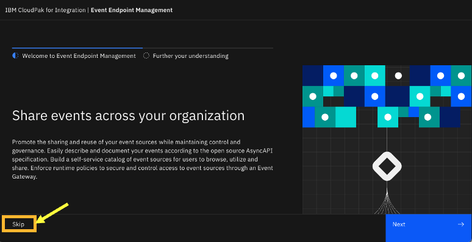

## Topics View

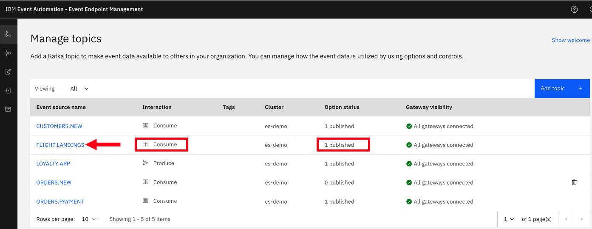

Click on the FLIGHT.LANDINGS to look at the options for the topic. Here
you will see that it has been published to the Event Gateway.

Please be informed that the FLIGHT.LANDINGS Topic from IBM Event Streams
is preconfigured within EEM, and an application is consistently
generating events into this Topic at regular intervals.

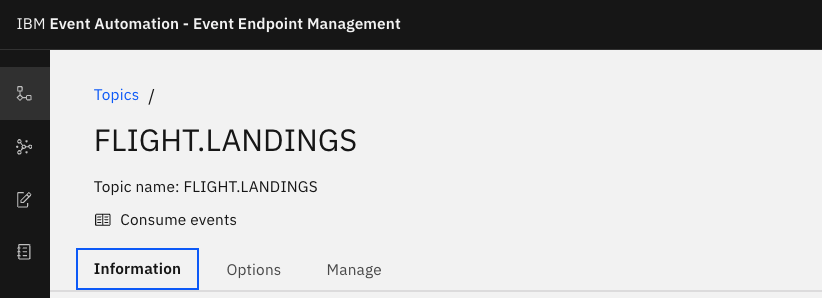

Explore the **Information** tab. Notice the Schema, and Sample message
that is describing the FLIGHT.LANDINGS topic.


## Virtual topics 

Let's create a virtual topic with your student id, for example STUDENT1.FLIGHT.LANDINGS. <br>


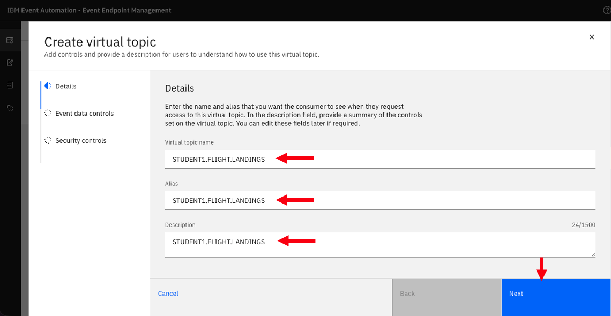


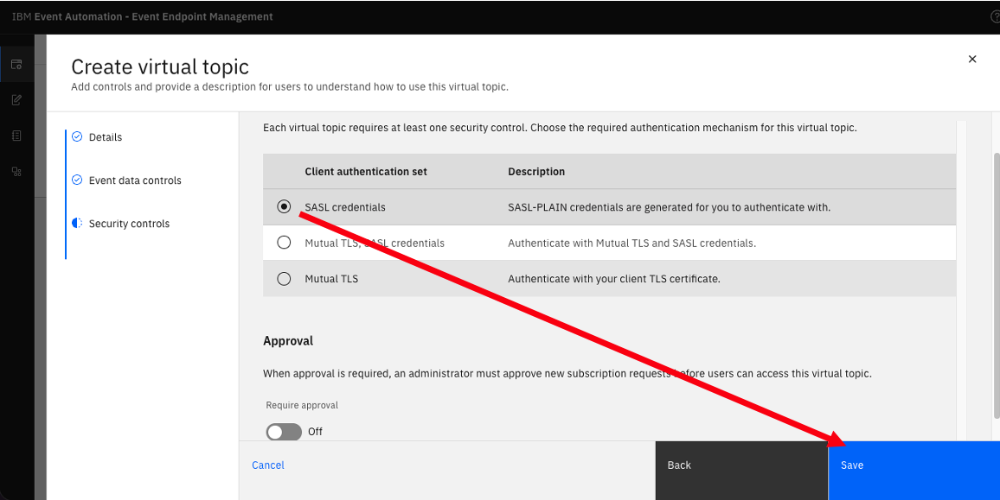

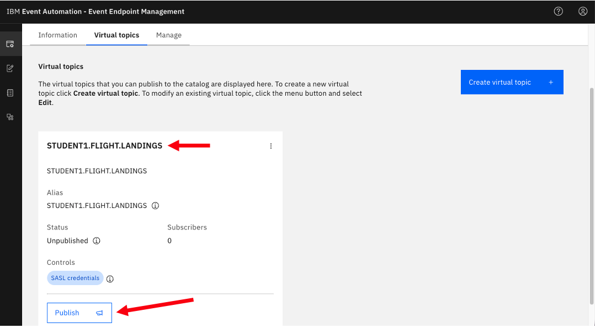


After Publish, it should look like below. <br>


## Catalogs View

Now, click on the Catalog icon on the left to see the Published Topics
to the Event Gateway.

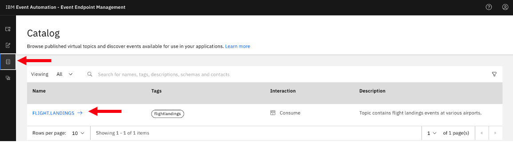

Click on FLIGHT.LANDINGS topic, and you should see your virtual topic for example STUDENT1.FLIGHT.LANDINGS. Explore the page. <br>


# API Connect Developer Portal

Here, you will access, login, discover, and subscribe to the AsyncAPI.
Consider the API Connect Developer Portal as a marketplace for all your
APIs, enabling application development teams to discover, subscribe to,
and utilize the APIs within their applications, including Web
Applications, Mobile Applications, and more.

## Access API Connect Developer Portal

a)  Locate the developer portal URL, by navigating to API Manager Home
    (Home Icon on top left) --\> Manage Catalogs, select Sandbox
    Catalog.


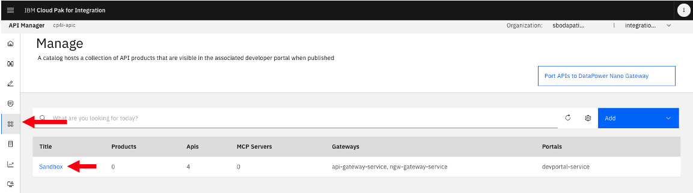

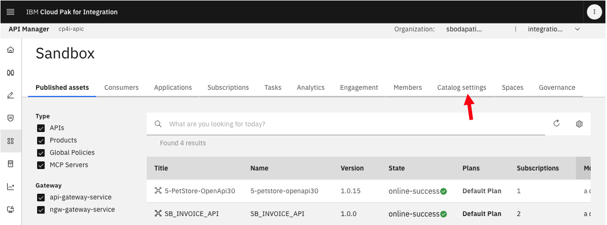

Locate the devportal url. <br>


Welcome to IBM API Connect Developer Portal. Now, Sign up to devportal. <br>

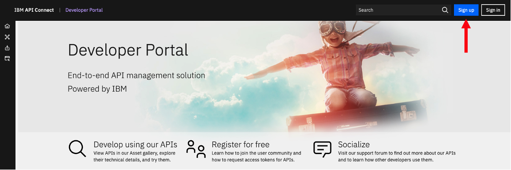

Enter id, email, and password. <br>

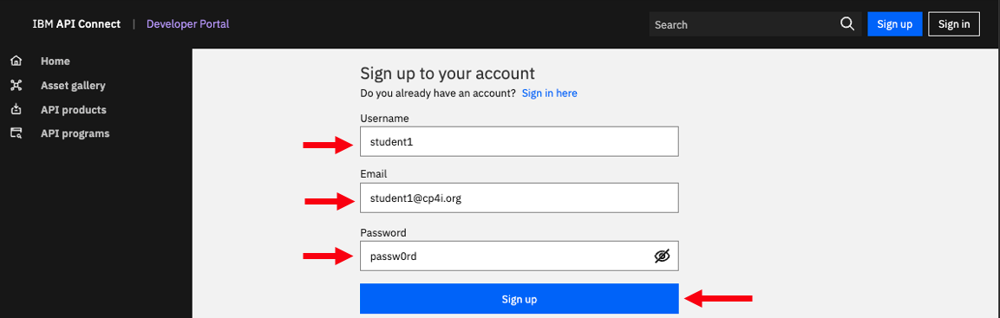

Sign-in now. <br>


Welcome to developer portal home page. <br>


Click on "Asset Gallery". <br>


You should see the Virtual Topic that you created and published from the Event Endpoint Manager section. <br>
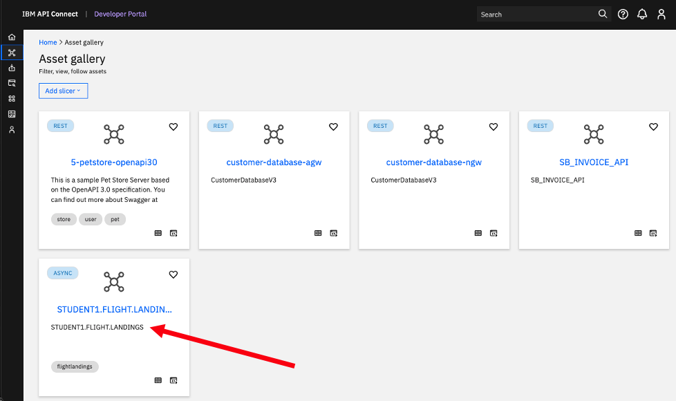

Click on that tile (STUDENT1.FLIGHT.LANDINGS). Now on \<Consume\> icon. <br>

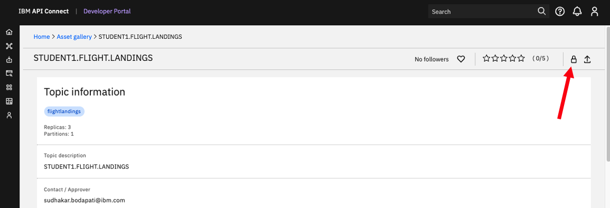

Select "Create new application", then click \<Request\>. <br>


Give a name to your application, for example student1-asyncapi-demo. <br>


Now, click on the application to see the SASL username and password. <br>
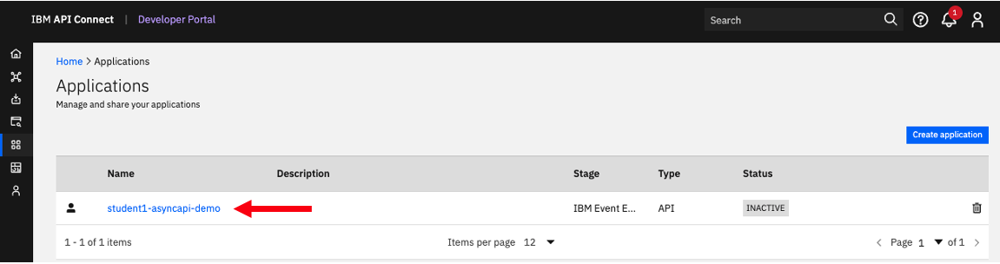

Save them to a Notepad or Textpad. We will use them later when Testing. <br>

After saving the SASL username, password, click on the AsyncAPI. <br>
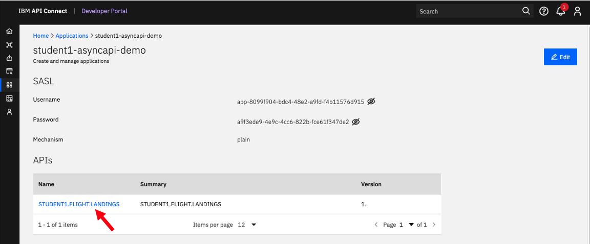

Copy the "Gateway group" into the Notepad or Textpad, then click on \<Download certificate\>. <br>


<br>

## Testing

Let's copy and paste the "Gateway group", SASL Username, and Password into \~/EEM/config.properties file.

 **IMPORTANT**\
 Copy and Paste the "Gateway group" to EGW_BOOTSTRAP_SERVER in config.properties file.
 Copy and Paste the "Username"" to APP_CLIENT_ID in config.properties file.
 Copy and Paste the "Password" to APP_CLIENT_SECRET in config.properties file.


# Consuming Flight Landing Events

In this section, you will consume the flight landing events using Kafka
Clients kafka-console-consumer.sh and a Java client.

## Generate client certificates of Event Gateway

Now, on the Desktop minimize the Google Chrome Browser, and open a
Terminal Window.


a)  Go to the EEM directory

cd \~/EEM


b)  Run the generate_egw_cert.sh script

./generate_egw_cert.sh

When script is done run **ls -ltr** of the directory and you should see the egw cert files

ls -ltr

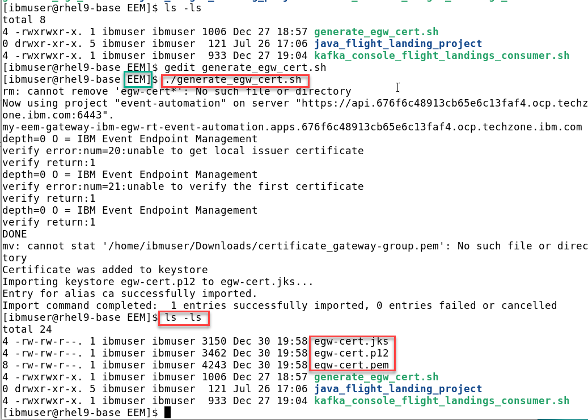

## kafka-console-consumer.sh - Consume flight events

Here, you will receive flight landing events using the open-source kafka-console-consumer.sh program.

Change Directory to \~/EEM.

```
 cd ~/EEM
```

 You should have the following info saved in
 your **config.properties** file.

```
 cat config.properties
```

 

 Now run the kafka_console_flight_landings_consumer.sh script and you
 should see flight info being displayed.

```
 ./kafka_console_flight_landings_consumer.sh
```

 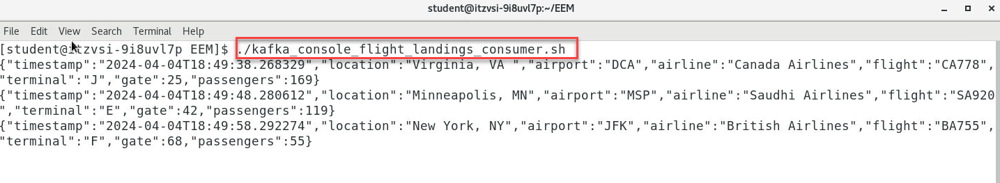

## Java Application -- Consume flight events

 Here, you will receive flight landing events using a custom java program.

 Open a **NEW** Terminal window (keep the kafka_console_flight_landing_consumer.sh running).

 a\) Change the Directory.

```
 cd ~/EEM/java_flight_landing_project
```

 b\) Now run the following command to start the Java Consumer.

```
 ./java_flight_landing_consumer.sh
```

 You should see output like below.

 

 When both the Consumers are running, you should see both the Consumers
 receiving the events.


You have initiated two Kafka Clients and have successfully obtained
Flight landing events from Kafka via the IBM Event Gateway, with both
clients receiving identical data.

**Summary:**

In this laboratory, you have examined the AsyncAPI of IBM Event
Automation and IBM API Connect platforms to transform Kafka Topics into
APIs, enabling secure consumption of Kafka stream data via IBM Event
Gateway.

**!!! CONGRATULATIONS !!!**
