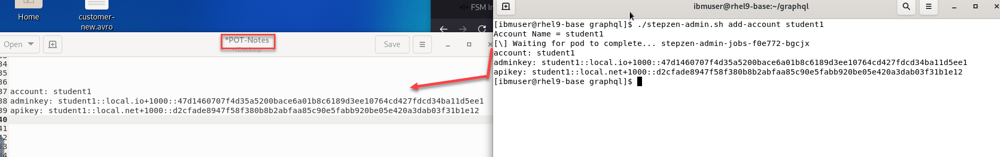
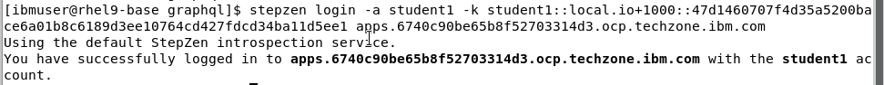
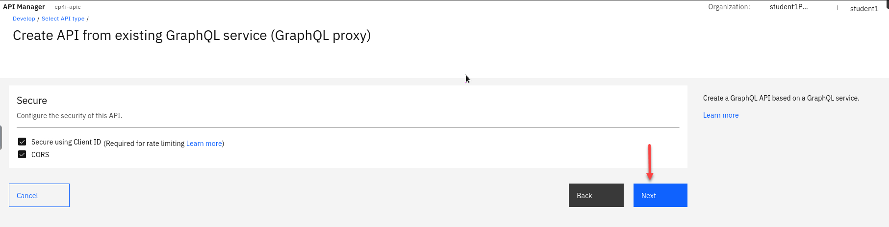
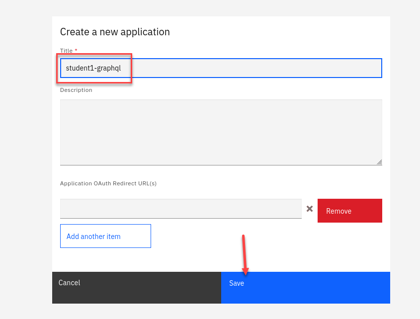
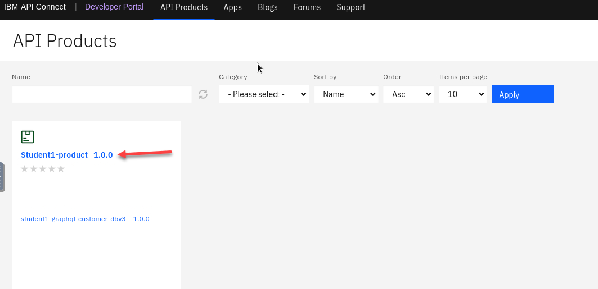

# lab 1: GraphQL - CustomerDatabaseV3 REST API 


---

# Table of Contents
- [1. Overview](#overview)

- [2. IBM App Connect Dashboard ](#ace-dashboard)
  * [2a. App Connect Dashboard - Deploy CustomerDatabaseV3](#ace-dashboard-deploy)
  * [2b. App Connect Dashboard - Capture CustomerDatabase API Endpoints](#ace-dashboard-endpoints)

- [3. StepZen CLI - Expose CustomerDatabaseV3 endpoints into GraphQL Engine](#stepzen)
  * [3a. login to APIC GraphQL Server](#stepzen-login)
  * [3b. Import /customers, /customers/getCustomerById operations ](#stepzen-import)
  * [3c. Tweak index.graphql files ](#stepzen-index-files)

- [4. StepZen CLI - Deploy & Start](#stepzen-start)

- [5. StepZen Local Testing](#stepzen-local-testing)

- [6. IBM API Connect - Expose GraphQL API](#apic-expose)
  * [6a. IBM API Connect Manager](#apic-manager)
  * [6b. Publish the GraphQL API into the API Connect Developer Portal](#apic-portal)

- [7. IBM API Connect Dev Portal - Testing API Connect GraphQL Endpoint](#apic-portal-testing)

- [8. References](#references)

---

## 1. Overview <a name="overview"></a>
In this lab, we will leverage an existing REST API to create StepZen GraphQL Proxy and then expose the GraphQL Proxy through ApiConnect. For the lab, we will be leveraging CustomerDatabaseV3 REST API deployed onto IBM AppConnect. <br>


## 2. IBM App Connect Dashboard <a name="ace-dashboard"></a>

### 2a App Connect Dashboard - Deploy CustomerDatabaseV3 <a name="ace-dashboard-deploy"></a>

1. Download CustomerDatabaseV3 from <br>
[<b><u>here</u></b>](./src/CustomerDatabaseV3.bar)

1. Open App Connect Dashboard from the Cloud Pak for Integration Platform Navigator and deploy the bar file.<br>
    

1. Select \"Quickstart Integration\" tile =-> drag and drop CustomerDatabaseV3.bar --> \<Next\>\<Next\>.
    
 
1. t
    
1. t
       

1. Click \"Create\". <br>
Refresh the page in about a minute and make sure student(n)-customer-database-v3 Integration Tile is in Ready state.
     

1. t
    
1. t
        
<br>

### 2b App Connect Dashboard - Capture CustomerDatabase API Endpoints <a name="ace-dashboard-endpoints"></a>

1. In the App Connect Dashboard click on student(n)-customer-database-v3 tile. <br>
    

1. Click on the Integration Runtime student(n)-customer-database-v3. <br>

    

1. Capture API endpoint for GET /customers operation.

    Copy and paste the URL to Notepad or Scratchpad.
  

1. Similarly, capture API endpoint for GET /customers/{customerId} operation.<br>

    **Save both endpoints to the Notepad.**

    


## 3. StepZen CLI  <a name="stepzen"></a>
Now we will expose CustomerDatabaseV3 endpoints into GraphQL Engine on local desktop.

**NOTE:** Do these steps on the VDI and make sure you are logged into the OCP cluster with your student id.

**NOTE:** To login to the OCP Cluster: <br>
**(a) Login to the OpenShift Console with your student(id)**<br>
**(b) On top right of the screen, click on your student(id), then click on "Copy login command".**<br>
**(c) Logon again with your student(id).**<br>
**(d) Click on "Display Token".**<br>
**(e) Copy full "oc login --token=\<token\> --server=\<url\> into the clipboard**<br>
**(f) Paste the copied command into the Terminal Window, and hit enter.**<br>

1. Make sure you are in the correct namespace **apic-graphql**

    ```
    oc project apic-graphql
    ```
1. Add user account.  Change directories before creating the user account. 

    ```
    cd ~/graphql
    ```
1.    Now add your account.  You should use your student id **ex: student1**

      ```
      ./stepzen-admin.sh add-account student1
      ```
1.   Make sure to save the adminkey and apikey for later.
      
        

      **NOTE: if you don't save them you can always get them running the following commands:**

      ```
      ./stepzen-admin.sh get-apikey 
      ./stepzen-admin.sh get-apiadmin
      ``` 

1.  Now we will login to stepzen server running in our OCP cluster. 
    
    First we will need to create a local route to our cluster.
    Download the **local-route** files from 
[<b><u>here</u></b>](./src/local-route.zip) 
    
    This will be in the **Downloads** directory.
    
    1. Change to the directory and run the unzip command.
    1. *cd* to the new **local-route** directory.
    1. run the command to create route and pass in your account you created (ex: student1) 

    

1. You can go the the Routes and under the project apic-graphql you will see the new route you created. 

    


1. We will login using **adminkey**  we saved when we created our account.  

    The last part of the command is the address for the cluster you are using.  You can get that by running **oc cluster-info**

    Just copy the highlighted part.  We don't want to use api but apps instead. 

    

1. Following is the command format and it maybe easier to update this in your notepad.   Copy it in and update before coping to command line to run. 

    
 
    ```
    stepzen login -a student1 -k student1::local.io+1000::47d1460707f4d35a5200bace6a01b8c6189d3ee10764cd427fdcd34ba11d5ee1 apps.6740c90be65b8f52703314d3.ocp.techzone.ibm.com
    ```
      

### 3b Import /customers, /customers/getCustomerById operations <a name="stepzen-import"></a>

You will import customers, customers{id} operations into API Connect GraphQL engine.

1.  Import Get All Customers api

    You should have your api urls saved in your notepad from the beginning when you installed the customer database API.  

    ```
    stepzen import curl "http://student1-customer-dbv3-http-student1.apps.6740c90be65b8f52703314d3.ocp.techzone.ibm.com/customerdb/v3/customers" --query-name=getCustomers
    ```

1.  Next you will be asked *What would you like your endpoint to be called?* **api/student1-customer-dbv3**

    Starting... done<br>
    Successfully imported curl data source into your GraphQL schema
  
    

1.  Now we will import the Get Customer by Id

    You should have your api urls saved in your notepad from the beginning when you installed the customer database API.  

     ```
      stepzen import curl "http://student1-customer-dbv3-http-student1.apps.6740c90be65b8f52703314d3.ocp.techzone.ibm.com/customerdb/v3/customers/1" --query-name=getCustomerById
      Starting... done<br>
      Successfully imported curl data source into your GraphQL schema
    ```
       

  
1.   Tweak index.graphql files
      You should be in the graphql directory.
      You will need to remove the address segment. 

      ```
        gedit  curl-01/index.graphql
      ```

      Remove Address segment - this is already present in curl/index.graphql. 

      Append (id: ID) to getCustomerById as below.

      

1.  Once you complete editing the file it should look like this.

    Once ready Click **Save**

     

<br>


## 4. StepZen CLI - Deploy & Start <a name="stepzen-deploy"></a>

Disable security for API Connect

```
echo "access:
  policies:
    - type: Query
      policyDefault:
        condition: true" > config.yaml 
```

1. We will now start stepzen and deploy our GraphQL queries into our account.  

    ```
    stepzen start
    ```

    That will deploy GraphQL Queries into StepZen Account, output below. 

    **Note** you will need to leave this window running.

    

    You can test your hosted API with curl:<br>
    Or <br>
    explore it with GraphQL on local instance

1.   Copy the localhost url from your window running stepzen.  Enter that into a browser:

      1. First click the Explore tab.
      2. Click on getCustomers query, select all fields
     3. click on the Execute button

      

1. Similary, select getCustomerById and test.
You can use a number between 1-10 for the customer id. 

      


## 6. IBM API Connect - Expose GraphQL API <a name="apic-expose"></a>

We will expose the GraphQL Endpoint into API Connect so that the API is secured, and consumed securely by the consumers. <br>

1. FIrst we will login to the IBM API Connect Manager from the platform navigator.

    **Note:** Make sure you are login with your credentials and make sure you select *apim-demo* for type **API management** 

    

1. Select the **Cloud Pak User Registry** to login

    

1.  You are now on the API Manager home page.  You will see you are login to your POrg in the upper right corner. 

    We will now add our GraphQL API into API manager.  

    You can select the icon on the left or the tile on the page.

    

1.  Now we will select **Add** dropdown and select **API** 

    

1.  Now select under Create the **From existing GraphQL service (GraphQL proxy)**

    Click **Next**

      

1.  Enter a Title for your API (ex: student1-graphql-customer-db3)

    Next copy the url from the terminal where you ran the **stepzen start** command.

    Scroll to the bottom of the page and Click **Next**

      
      

1. On the Security page leave the defaults and Click **Next**

      

1. The summary screen will show the status of creating your API.   Click **Edit API**

      

1. You will now see all the details of the API.   For now we will select the Develop tab in the upper left.  

    This will take us to the Develop page and you should see your API here. 

    Continue to next section to create a Product for your API and publish it. 

      


## 6b Create Product and Publish the GraphQL API into the API Connect Developer Portal<a name="apic-portal"></a>

1. We will now add a new Product.  Click on **Add** dropdown and select **Product**

    **Note:** you will see your GraphQL API you just added in. 

    

1. Select the New Product and Click **Next**
 
   

1. Add Title for new product, name it Student(n)-product. 

    

1. Now select the student(n)-graphql-customer-dbv3 api into the product.

    Click **Next**

   

1. The next section is were you can define varies plans to apply limits to your Products. 

    For this one we will use the Default Plan. 
    Click **Next**

   

1. The next section Select to Publish the product 
    Click **Next**
    
   

1. The new product is created now and you will see the summary.   The last one shows it Published the product. 
    Click **Done**
    
   

1. You now see your new Product on the main page. Next is to select the **Manage icon**
  
    
   

1. You will now be on the Catalog Manage page.  You should have just one catalog the default **Sandbox**  Click on that. 
    
   

1. From the Sandbox catalog page:

    1. Click on the **Catalog Settings** on the top menu.
    1. On the left side menu click on **Portal**
    1. Copy the Portal URL and paste in a new browser tab.  
    
   

1. Go to the tab you just pasted the Portal URL.   You will see the sign on page.  Click on **Sign in**

    **Note:** You should see the Product you just published to the portal. 
    
   

1. Now we will login to the portal.  You will be provided with you COrg credentials. (ex: student1dev)

    **Note:** You also have the option to Create account using self service.  For this cluster we will not be using that. 

     

1. We will first create an Application that we will use for our new API. 

    Click on **Apps** on the top menu and then on the right select **Create new app**

     

1.  Add a title for your new app and Click **Save**  

    Ex: *student1-graphql*

     


1. You will now have a display with your application credentials.  **Make** sure to save the key and secret in to your text file then click OK

     

1. You are now on the Application page.  

    Click on **API Products** on the top menu. 
     

1. Now click on your product.

     

1. Now we will need to select a Plan for our API.  In this case we have just the one so select that plan.

     

1. We will now do the process of subscribing to your product.  First we will select an Application.   You should see your application you just created above.  

    Click on that. 

      

1. Click **Next**
      

1. Summary page click **Done**
     

1. You will now be back on the Product page.   

    Select your API.
     


<br>

## 7. API Connect Dev Portal - Testing API Connect GraphQL Endpoint <a name="apic-portal-testing"></a>


1. Click on the Product and the API.  Click on the **Try it** 

    Copy and paste the Endpoint into a new browser tab.

     

1. Now from the new browser tab 
  
    1. Enter the Application clientID you captured above.
    1. Enter the below getCustomers GraphQL Query into the body.
        ```
        query MyQuery {
          getCustomers {
            id
            lastname
            email
            firstname
            address {
              city
              country
              postalCode
              state
              street
            }

          }
        }
        ```
    Click the Execute and you will see results on the right side pane.

    


1.  Similarly test getCustomerById GraphQL Query.<br>
Enter the below getCustomerById GraphQL Query into the body.<br>
    ```
    query MyQuery {
      getCustomerById(id: "1") {
        id
        email
        firstname
        lastname
        address {
          city
          country
          postalCode
          state
          street
        }
      }
    }
    ```

    

1. Now, run two queries in one request as below. <br>
      ```
      query MyQuery {
        getCustomerById(id: "1") {
          id
          email
          firstname
          lastname
          address {
            city
            country
            postalCode
            state
            street
          }
        }
        getCustomers {
          id
          lastname
          email
          firstname
          address {
            city
            country
            postalCode
            state
            street
          }
        }
      }
      ```
    

### Congratulations!!!
You have successfully created a StepZen GraphQL Proxy in Api Connect!!!

## 8. References <a name="references"></a>
Customer Database V3 - ACE Project Interchange file.

Download CustomerDatabaseV3-PIF.zip from [<b><u>here</u></b>](./src/CustomerDatabaseV3-PIF.zip)
