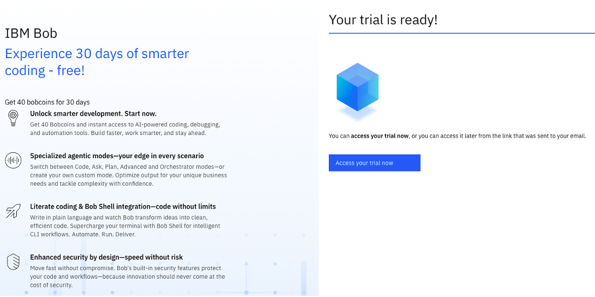
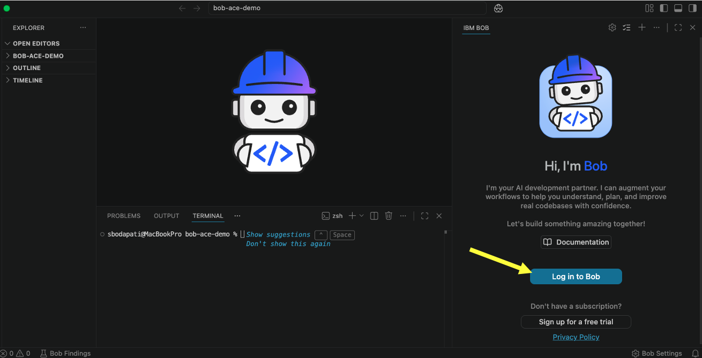
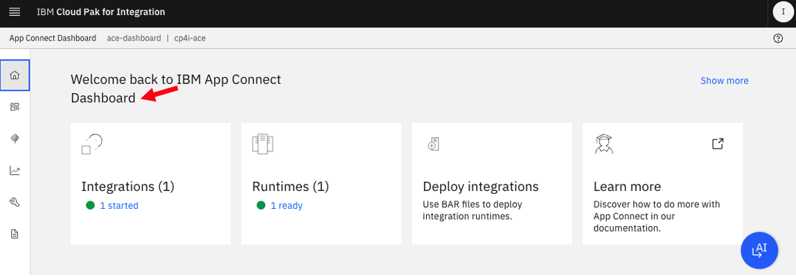
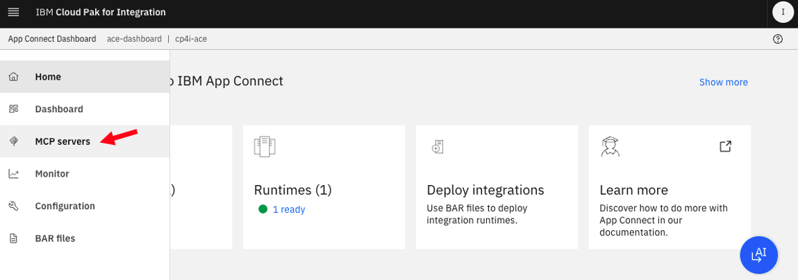
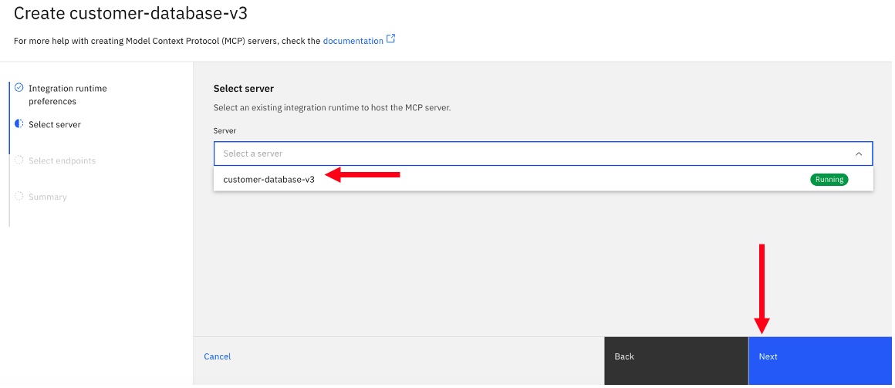
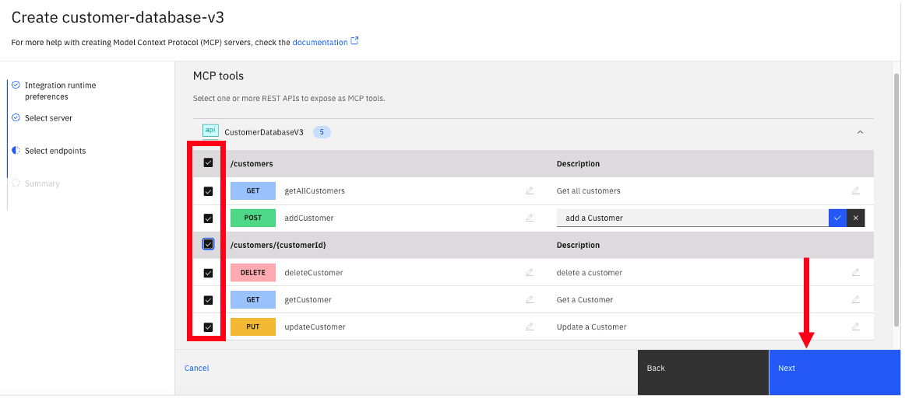
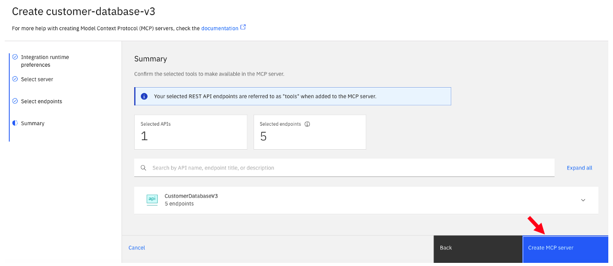
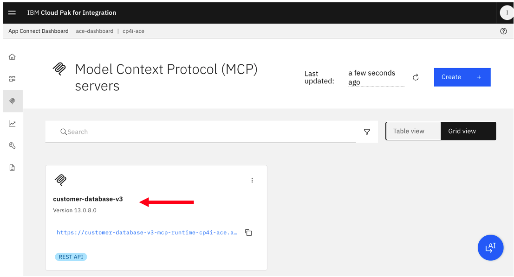

# App Connect MCP Servers Bob

[Return to MQ lab page](../index.md)

## Pre-reqs

Free trial of Bob

https://bob.ibm.com/trial
 

 

## App Connect Dashboard 

### Deploy Customer Database REST API

REST Open API 3.0 

### Create MCP Servers

Capture MCP Server Basic Auth Credentials.  

## Bob	
	
### Add Customer Database MCP Server 

Settings > MCP

Make sure it's connected.  

### Run prompts

## Summary

[Return to ACE lab page](../index.md)