# App Connect MCP Servers Bob

[Return to MQ lab page](../index.md)


## Pre-reqs

Free trial of Bob

https://bob.ibm.com/trial
<br>


<br>


## App Connect Dashboard 

### Deploy Customer Database REST API


Click Quick Start , then click \<Next\>. <br>


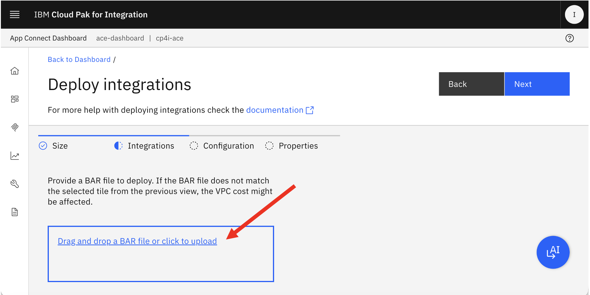


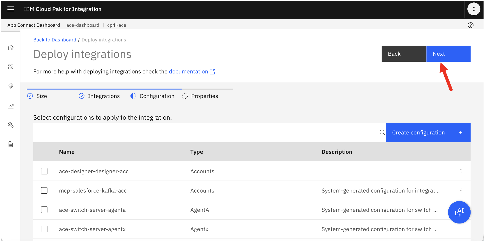

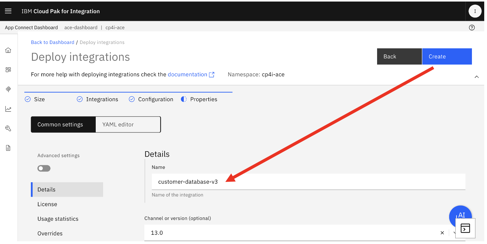


<br><br>

### Create MCP Servers


Capture MCP Server Basic Auth Credentials. <br>


## Bob
	
### Add Customer Database MCP Server 

Open the IBM Bob IDE, and navigate to Settings <br>


Navigate to MCP. <br>

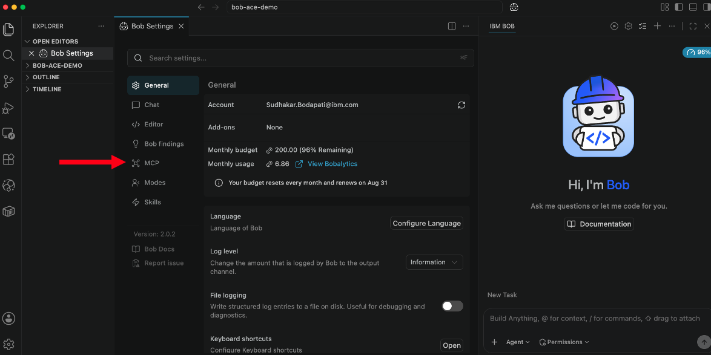

Click + sign. <br>

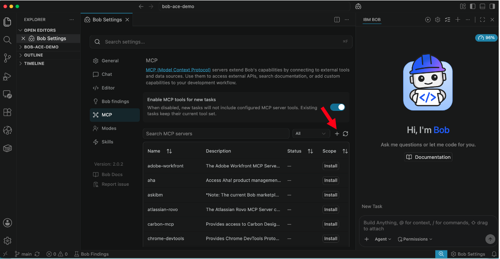


Append the below between the curly braces. <br>
```
    "customer-database-v3": {
        "url": "",
        "headers": {
            "Authorization": ""
        }
    }
```

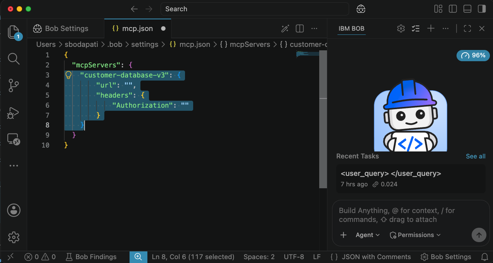

Now, populate the url, and Authorization values from the MCP Server created in the App Connect Dashboard. <br>

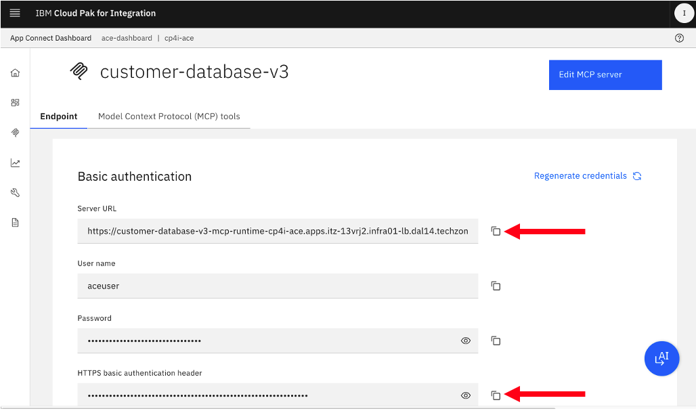

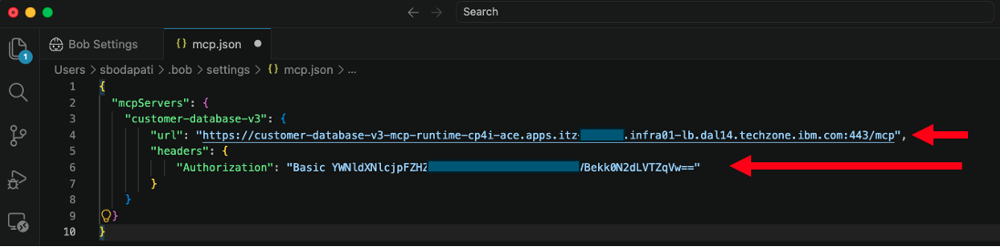

Now, save and close mcp.json. <br>

Notice that customer-databasev-v3 is connected to the MCP server. <br>

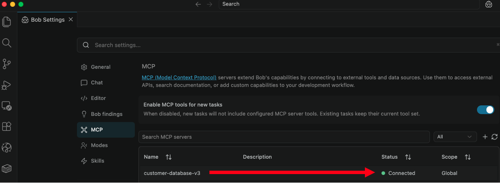


### Run prompts


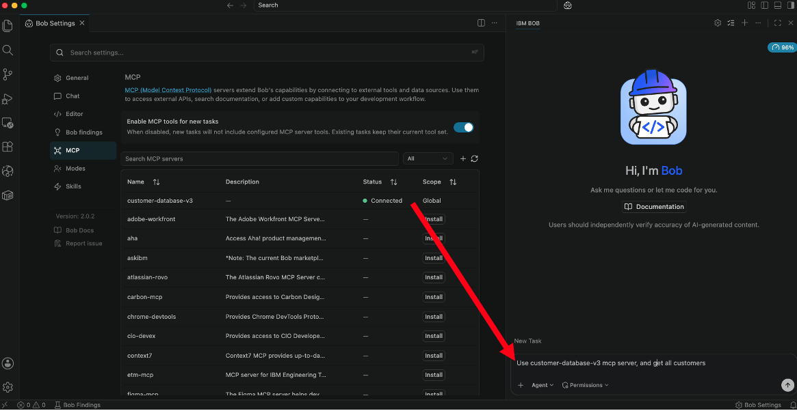

Click on Approve. <br>

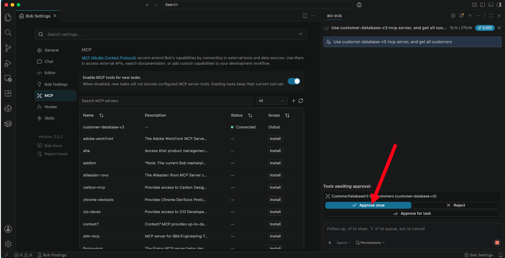

Notice that Bob called the backend MCP server and the REST API and retrived list of customers. <br>

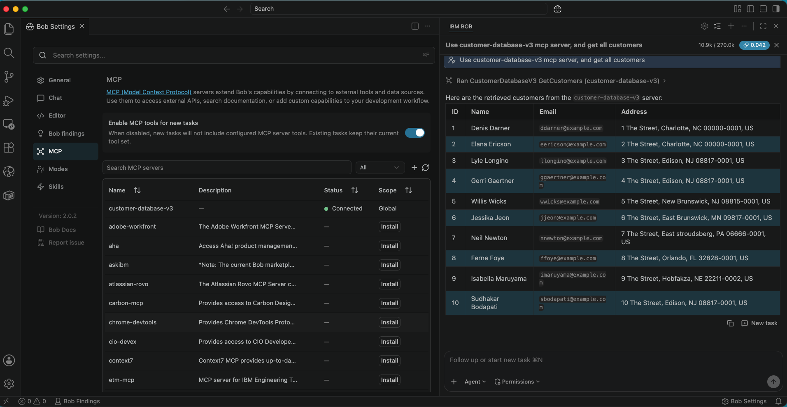

Let's add few Customers using below prompt. <br>
```
add customer, firstname Joe, lastname Jodl, address 144 marina drive, edison, nj, zip code 11111-1111
```
Notice that Bob automatically formed the JSON payload for addCustomer operation. <br>


Click "Approve Once". <br>

Notice that Customer 11 was created Successfully.


## Summary

[Return to ACE lab page](../index.md)