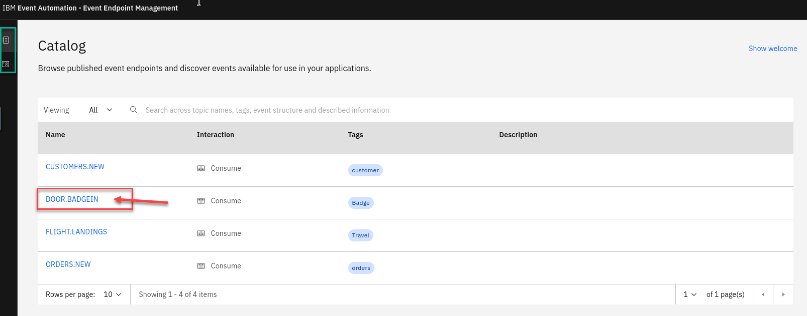
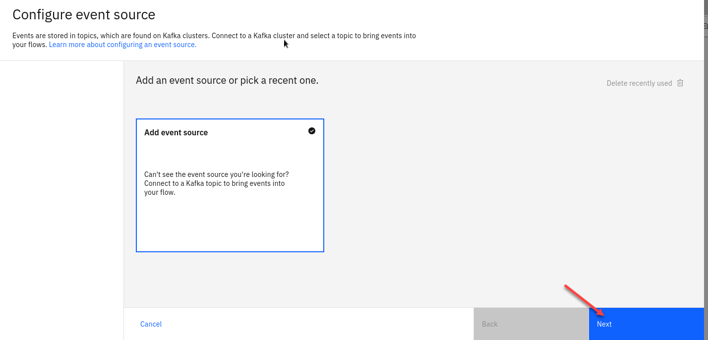

# Enrich events with reference data 
---

## Table of Contents
- [1. Overview](#overview1)
- [2. Introduction ](#overview2)
- [3. Discover the topic to use ](#overview3)
- [4. Event Processing - Create the source of events](#overview4)
- [5. Recap.. ](#overview5)

---
## 1. Overview <a name="overview1"></a>

The logistics team want to track the hourly number of events captured by door sensors in each building.

Events from door sensors can be slow to reach the Kafka topic, so the team need to handle a Kafka topic with events that are out of sequence.

## 2. Introduction  <a name="overview2"></a>

In this lab the instructor will act as the Event Endpoint Management administrator to expose the topics that students will need to complete the lab.

Event Endpoint Management provides the capability to describe and catalog your Kafka topics as event sources, and to share the details of the topics with application developers within the organization. Application developers can discover the event source and configure their applications to subscribe to the stream of events, providing self-service access to the message content from the event stream.

Access to the event sources are managed by the Event Gateway. The Event Gateway handles the incoming requests from applications to consume from a topic’s stream of events. The Event Gateway is independent of your Kafka clusters, making access control to topics possible without requiring any changes to your Kafka cluster configuration.


## 3. Discover the topic to use <a name="overview3"></a>

For this scenario, you need to find information about the source of door badge events.

1. Login to the EEM home page as **eem-user** we will need to get info on the topic for this lab.

    

1. Go to the **Event Endpoint Management** catalog home page and find the **DOOR.BADGE.IN** topic.
   
   **NOTE:** You will notice that as a user you will only have access to the Catolog page and Subscription page.

   **Click** on the **DOOR.BADGE.IN**

    
1.  We will now generate access to this topic.  

      If you scroll down on the page you will see the Servers available that will be used in the Event Processing and also Code samples.

      Save the **egw** url into your text file for later.   

      Now select the **Generate access credentials** in the upper right.

     

1.  Here you will be asked for contact info.  Enter something like a email or just your userid 

      Now click on **Generate**

      

1.    You now will have your credentials for accessing this topic.   You will need to save this into a text file for use later.  

      You should Download the credentials.   
      So you should have the **egw** url and the userid and password.  

       

1. You can now click on the Subscriptions link and you see your info. 

     

## 4. Event Processing - Create the source of events <a name="overview4"></a>

1. Now login to the Event Processing using the URL and credentials provided to you. 
   
      Click on **Create**

   

   
1. Create a flow, and give it a name and description to explain that you will use it to track hourly badge events.

   **NOTE:** Since this is a shared environment make sure to use your studentXX in front of the name. 
   **EX: student1 - off hours building access**

   

1. Update the **Event source** node.
   
   Hover over the pencial to go to edit mode for the node.

   

1. Add an event source. Click on the **Add event source** tile and  Click **Next**

   

1. In the **Cluster connection** pane, give the Node Name a unique name for this node
**Ex: Door Events**

   Next fill in the server address by using the value that you saved in your notepad.  
   If you don't have it you can go back to the EEM manager to copy from the catalog.  

   Click **Next**.

    

1. You will need to now Accept the certificates for this cluster.  Click **Accept certificates** and then Click **Next**

    

1. In the **Access credentials** pane, paste the credentials by using a username and password created in {{site.data.reuse.eem_name}} using the **Generate access credentials** button.   You should have this in your NotePad or if you Downloaded the JSON file you can get from there. 

   Click **Next**

      

1. Select the `DOOR.BADGEIN` topic to process events from, and then click **Next**.

    
    
1. The format `JSON` is auto-selected in the **Message format** drop-down and the sample message is auto-populated in the **JSON sample message** field. 

   Click **Next**.

   

1. In the **Event details** verify that the type of the `badgetime` property has been automatically detected as `Timestamp`.

   Configure the event source to use the `badgetime` property as the source of the event time, and to tolerate lateness of up to **3 minutes**.

   Also for the **Save for re-use** turn that off on the bottom.

   Click **Configure** to finalize the event source.
   
   

### Step 3 : Derive additional properties

The next step is to define transformations that will derive additional properties to add to the events.

1. Add a **Transform** node to the flow.

   Create a transform node by dragging one onto the canvas. You can find this in the **Processors** section of the left panel.

   Click and drag from the small gray dot on the event source to the matching dot on the transform node.

   Hover over the node and click Edit to configure the node.

   

   
1. Give the transform node a name that describes what it will do: **additional properties**

   Click **Next**.

   


1. Compute two new additional properties using the transform node.
   
   You should call the first property day of week

   This will identify the day of the week from the timestamp contained in the door event. This is created as a
   number, where 1 means Sunday, 2 means Monday, and so on.

   Use this function expression:
      ```sql
      DAYOFWEEK ( CAST(badgetime AS DATE) )
      ```
   
   You should call the second property building

   Door IDs are made up of: [building id] - [floor number] - [door number]

   For example: H-0-36

   For your second property, you should use the function expression:
      ```sql
      REGEXP_EXTRACT(`door`, '([A-Z]+)-.*', 1)
      ```

   This expression will capture the building ID from the start of the door ID.
   Click **Next** and then **Configure** to finalize the transform.

      

1. Test the flow
The next step is to run your event processing flow and view the results.

   Use the Run menu, and select **Include historical** to run your filter on the history of door badge events available on this Kafka topic.

      

1. Verify that the day of the week is being correctly extracted from the timestamp, and that the building ID is
correctly being extracted from the door ID.

   Make sure to stop your flow before continuing. 

      


### Step 4 : Filter to events of interest
The next step is to identify door badge events that occur at weekends. The additional day of week property that
you computed in the transform node will be helpful for this.

1. Create a filter node by dragging one onto the canvas.    

   You can find this in the Processors section of the left
panel.

   Click and drag from the small gray dot on the transform node to the matching dot on the filter node.

   Hover over the node and click on Edit to configure the node.

      


1. Give the filter node a name that describes the events it should identify: **weekend door events**

   Click **Next**

      

1. Define a filter that matches door badge events with a day of week value that indicates Saturday or
Sunday.

   Filter expression:
   ```sql
   `day of week` = CAST (1 AS BIGINT)
      OR
   `day of week` = CAST (7 AS BIGINT)
   ```
   
   **NOTE:** Did you know? Including line breaks in your expressions can make them easier to read.
   Click Configure to finalize the filter.

   

### Enrich the events
The next step is to add additional information about the building to these out-of-hours door events.
1. Add a Database node to the flow.
Create

   Click and drag from the small gray dot on the filter node to the matching dot on the Database node.

   Hover over the node and click on Edit to configure the node.

      

1. Give the database node a name **ex: Building Database**
And paste the JDBC URI for your database into the Database URL field.

   You should have this from the insturctor.   If you don't have it saved you can run the following command 

   **(As long as you are logged into your cluster for cli)**

   ```
   oc get secret pgapicedemo-pguser-demouser -n postgresql -o jsonpath='{.data.jdbc\-uri}' | base64 -d
   ```

   

1. Since we included the user name and password in the url you don't need to enter it here.

   Click **Next**
   

1. Choose the buildings database table.

   Click **Next**

   

1. Use the assistant to define a join that matches events with the database row about the same building.
   
   Match the building value from the Kafka events with the database row using the buildingid column.
 
   
   
1. Your criteria should look like this. 

   Click **Next**
   
   
   
1. Choose the database columns to include in your output events.

   Include the street name and security contact columns.
There is no need to include the buildingid column because this value is already contained in the events.

   Click **Next**

   

1. Choose the properties to output.

   For example, the day of week property was useful for our filter, but we may not need to output it as a finished result.

   **Note:** Use the **-** next to the property names you want to remove.  They will still be visable below under **Properties to remove** section.
   From there you can use the **+** to add them back. 
   
    Click **Configure**

   

### Step 5 : Test the flow

The final step is to run your completed flow.

1. Use the **Run** menu, and select **Include historical** to run your filter on the history of door badge events available on this topic.

   

1. You should see events and you will now have the **streetname** and **securitycontact** added from the Database. 

   Once done reviewing stop the flow
   


## 5. Recap  <a name="overview5"></a>

It is not unusual to need to process events on a Kafka topic that are out of sequence and with unreliable timestamps in the message header.

{{site.data.reuse.ep_name}} makes it easy to perform time-based analysis of such events, by allowing you to specify what value to use as a reliable source of time and describe how long it should wait for out-of-sequence events.
