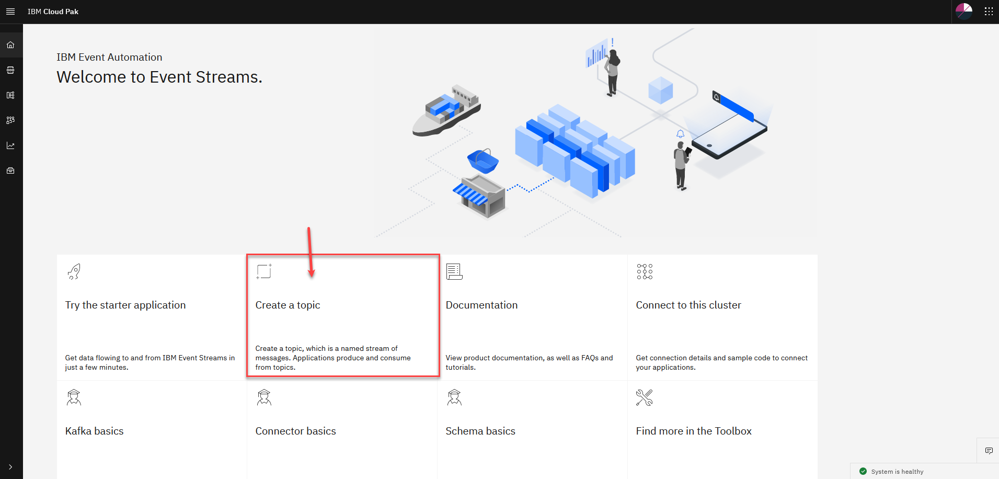
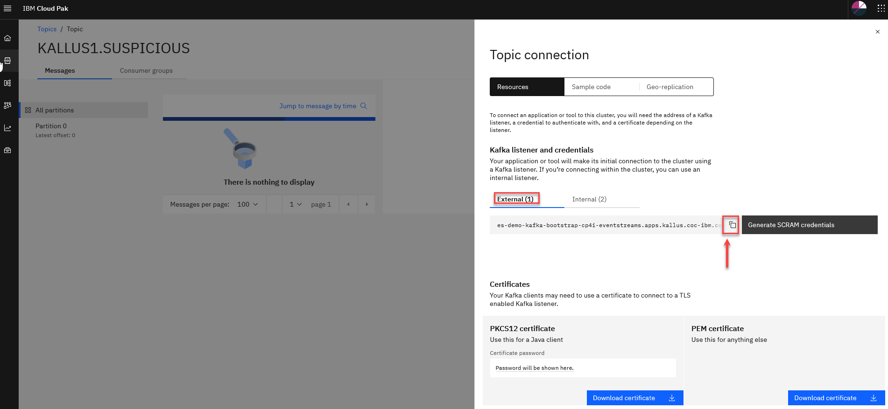
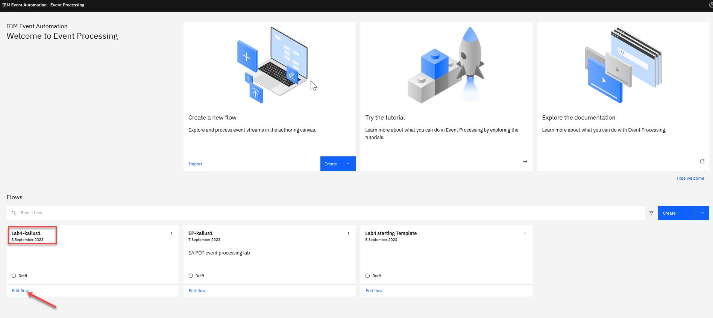
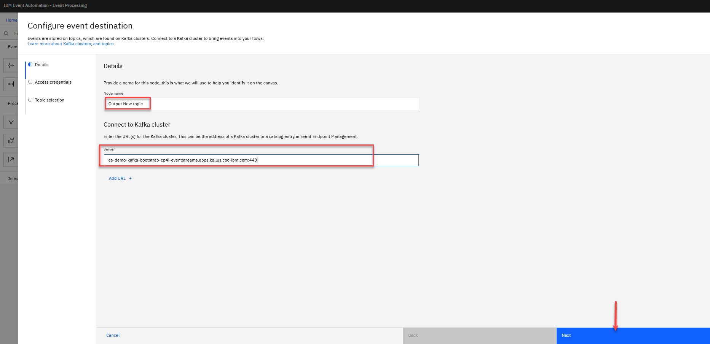
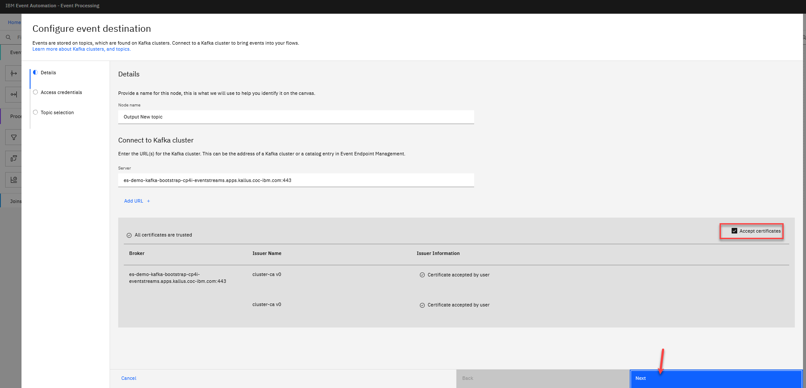
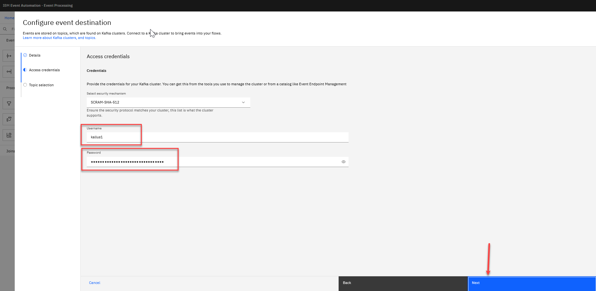
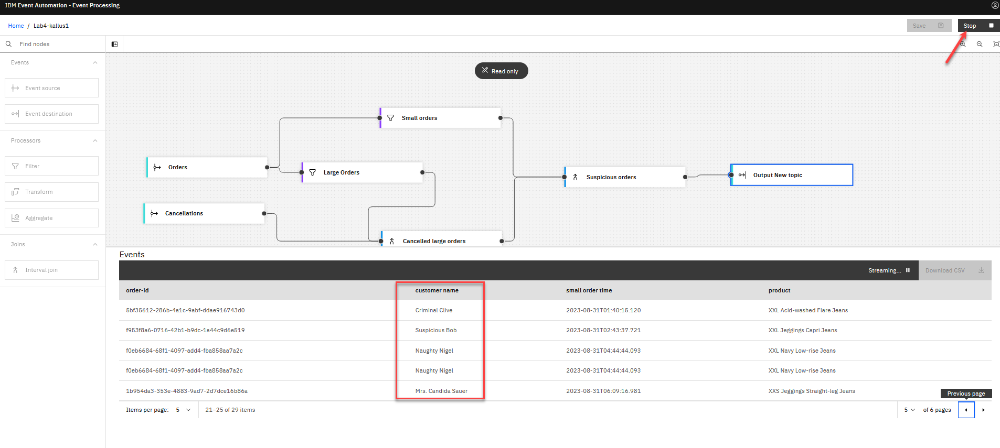
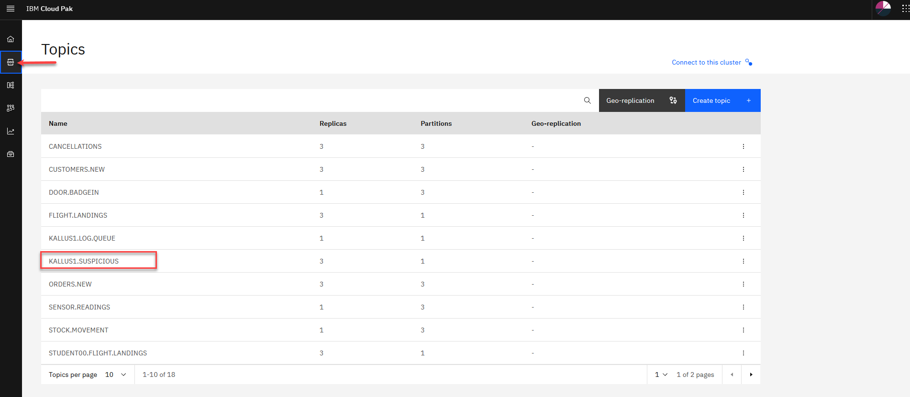
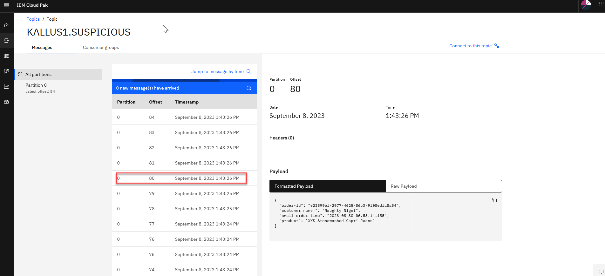

# Lab 2 - Save the results to a Kafka Topic in Event Streams

When processing events we can send the results to a new Kafka topic.  This lets the results from the flow be used to trigger automation, notifications, business workflows, or be processed further in other applications.

## Scenario : Acting on the results of analysis and processing

We want to send an email or a slack message to someone in order processing when there is a suspicious order.
### 1.0 Create a destination Kafka topic

 The first step is to create a topic that you will use for the results from the Event Processing flow from the last lab.

1. Go to the **Event Streams** home page.

    Click the "Create a topic" tile.

    

1. Create a topic called "\<Student Name\>.SUSPICIOUS" for
 example "KALLUS1.SUSPICIOUS"

    

    Keep selecting the "Next" button to accept the defaults for the remaining properties to create the topic.

1. Find the topic you just created by searching for your student name. Click the topic name.

    

1. Click on the **Connect to this topic**

    

1. Click on the "External" tab and Get the address of the Kafka listener to use for the new topic.
    
    Click the copy button for the **External** Kafka listener to copy the address to the clipboard. Keep this window open.
    
    

**NOTE:** You should have created SCRAM credentials already as part of the Pre-Req at the start of the Event Automation labs.
**Create Connection to Kafka cluster** 

You should have created SCRAM id using your student id. (ex: kallus1)

If you didn't do that you can go back to the pre-req and create the SCRAM credentials. 

Or you can create new SCRAM id by clicking on the **Generate SCRAM credentials**  
Use your \<Student id\> - ex: kallus1

Then click using all defaults and make sure to save the new password. 
    
  

### 1.1 Update the Event Processing Flow
 For this scenario, we will use the flow from the last lab (lab4).

1. Go to the **Event Processing** home page, search for your User Name and click on the **Edit flow** for your Lab4 flow

    For example "Lab4-kallus1".

    

1. Create an **Event destination** node by dragging one onto the canvas. You can find this in the "Events" section of the left panel.

    Connect your Suspicious order node to the new Event destination node. 

    Then click the pen icon to edit your new node.

    

1. Give the new node a meaningful name for **ex: Output New Topic**

    Put the Kafka listener address from Event Streams (that you saved in last steps) into the server address for the event destination node.

    

1. You need to accept the certificates for the Kafka cluster.   

    Click **Next**

    
            
1. Use the SCRAM username and password that you create for your kafka connection in the Pre-Req at the start of the Event Automation labs. **Create Connection to Kafka cluster**  for accessing the new topic.

   Click **Next**

    

1. Final step is the select the new topic from the list of topics. You should see the new topic you created at the start of this lab.  

    You can use the Seach option to search for your id.

    In this example it is **KALLUS1.SUSPICIOUS** 

    Click **Configure** to finalize the event destination.

    

### 2.0 Test the flow

The final step is to run the flow and confirm that the suspicious orders are published to the new topic.

1. Use the "Run" menu, and select **Include historical** to run your flow on the output node. 
    

    **NOTE:** "Include historical" is useful while you are developing your flows, as it means that you don't need to wait for new events to be produced to the Kafka topic. You can use all of the events already on the topic to check that your flow is working the way that you want.
  
1. Click the "output node" node to see a live view of results. 

    **Note:** You may see the message "Waiting for receiving the events" while the process is running.

     

1. When you have finished reviewing the results, you can stop this flow.

    
### 2.1 Check the topics in Event Streams

1.  Go back to Event Streams home page and select the **Topic** tile or icon.  Find your topic that you created to publish you messages to and click on it.

    

1.  You should see messages that have been published to your new topic.   Click on one of the messages to see the payload.
 
    

### 3.0 Recap
 You output the results of your event processing flow to a new Kafka topic. You can create an App Connect integration to act on the suspicious orders to send an email or slack notification for example.

[Return to main Event processing lab page](../index.md)

