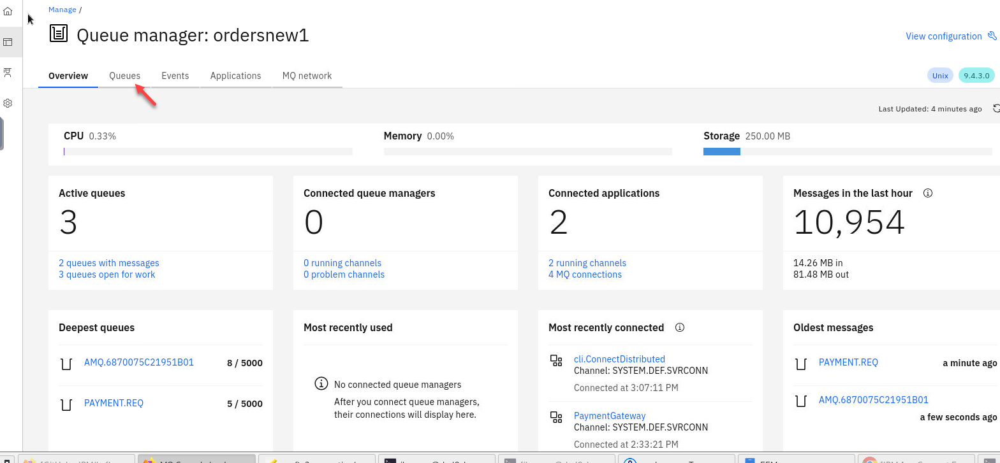
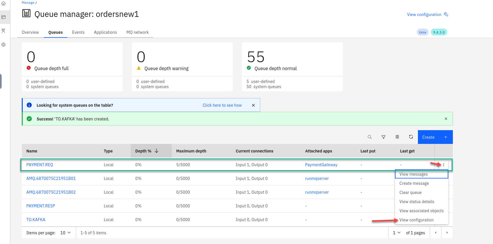

# Discover how event automation makes it easy to create new Kafka event streams from existing message queues 

For this scenario, you will use a fictitious company **Focus Corp** who's integration team will be asked to exposes the enterprise’s data using event streams. This will allow application teams to subscribe to the data without impacting the backend system, decoupling development, and lowering risks.  The order management system and its payment gateway exchange customer orders over IBM MQ. 

# 1.1 Setup your own MQ Payment enviorment. 

1. We will first download the scripts to make it easy to setup your environment.  The following shows what  you will have.  You will have your payments coming it to the Order Managerment system using MQ and the Payment gateway will process the transactions. 

    

1. Now go to the github repo to download.

```
https://github.com/ibm-cloudintegration/mqandes
```

1. Click on **Code** drop down and select the **Download ZIP**

    

1.  Now go to the Download directory and run the following commands.   Once done you should be in */home/ibmuser/MQ-Order* directory.  

    ```
    cd ~/Downloads
    unzip mqandes-main.zip
    cd mqanddes-main
    mv MQ-Order ~/
    cd ~/MQ-Order
    find . -type f -iname "*.sh" -exec chmod +x {} \;
    ```
       

1.  Now we will run the create script that will build everything  

    **Note:** There is just one argument to pass which is your student id.   The screen shots will show us using **Student1**

    
  
1. This will take about 5-10 minutes to build everything.   Leave the window open where you started the script.  You can go to the CP4I Platform Navigator to see that it is in progress. 

     

1. When the script is done the command window will look similar  to this.  

     

## 1.2 Review the MQ environment.  

1. Now from the Platform Navigator search for your userid (ex: student1)

    Right click on the new Qmgr and open in a new tab.
   
    
   
1. If you get worries like this click on advanced and accept the certificates.    
   
    

1. You are now on the MQ Console page for the new Qmgr (ex: student1ordersnew)

    Click on the tile.
   
    

1. Here you will see all the details for your QMgr about queues, channels, connections, etc.  

    Click on **Queues**
   
    

1. You will see your payment queues here.  You will notice that you will always have at least 5 messages on the payment queue.  That is the way we have the payment consuming app confiugred. 

    Click on the **PAYMENT.REQ** queue to see the messages to view details of the messages. 
   
    

1. Click on one of the messages and review the application data.  
   
    

## 1.3 Clone and publish the Payment Messages to Event Streams. 

1. We have our MQ payments processing all running and now we will need to clone the messages and publish to Event Streams without impacting the current environment.  

    

1. Now go to the MQ console for the orders QMgr and select **Queues** and click on **Create**

    

1. Select the tile for Local Queues and click **Next**

    

1. Now we will create our new StreamQ and call it **TO.KAFKA**.  

    Click **Create**  

    

1. Now you will be back on the Queue page and will see your new queue **TO.KAFKA** you just created. 

    We will now update our **PAYMENT.REQ** queue to use the new queue as a streaming queue.

    Click **View configuration**

    

1. Now select **Edit** so we can update the PAYMENT.REQ config.

    

1. On the left hand menu select **Storage** and you will see the field for *Streaming queue name*

    Enter the streaming queue name **TO.KAFKA** and click on **Save**

    

1. You will now be back on the MQ console page showing your queues.  You will now see messages being added to the new streamQ **TO.KAFKA**

    **NOTE:** The Qmgr takes care of this with no impact to are current processing of messages. 

    

1. Last step now is to create our kafka source connector that will take messages from the **TO.KAFKA** queue and publish to Event Streams.

    You have two options for this:

    1. From the command line where you ran the **create-orders.sh** script there is a mq-source.yaml file.  
        You can run the following command but make sure you are login to the OCP cluster in order to run **oc* commands.
        ```
        oc apply -f mq-source.yaml
        ```
    1. The other option is open a **Import YAML** screen by clicking the **+** on the top menu.
    Then run the following command. 
        ```
        cat mq-source.yaml 
        ```
        copy the content and paste it into the OCP console and click **Create**

    

1. Now in the OCP console we can verify the source connector is running.  Go to **Installed Operators** and select **cp4i-eventstreams** project and click on **Kafka Connector**

    

1. You should see your source connector and the sink connectors.

    

1. Now if you go back to your MQ Console for the ordersnew QMgr you will see that the current depth for the **TO.KAFKA** queue is zero.  Every time the **PAYMENT.REQ** queue gets a message it also goes to the **TO.KAFKA** queue and the source connector will take the message and publish to the Topic. 

    

1. From the Platform Navigaotor *right click* on the **es-demo** and open in new tab. 

    

1. On the Event Streams page click on topics and search for your user id (ex: student1)

    

1. You will see the messages from your MQ queue being published to the topic.  Select a message to view the details. 

    


## Recap

 So we have our **Order Management System** processing messages on MQ and we are also cloning them to kafka topic in Event streams.  
    The Next lab we will use Event Processing to tap in to this new data. 


[Return to main Event processing lab page](../index.md#lab-abstracts)