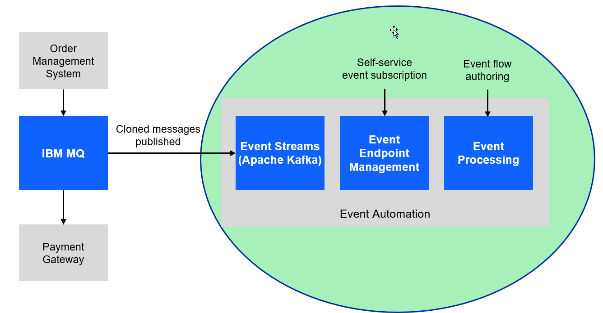

# Discover how event automation makes it easy to create new Kafka event streams from existing message queues 

For this scenario, you will use a fictitious company **Focus Corp** who's integration team will be asked to exposes the enterprise’s data using event streams. This will allow application teams to subscribe to the data without impacting the backend system, decoupling development, and lowering risks.  The order management system and its payment gateway exchange customer orders over IBM MQ. 

<B> Note:</B> In the messaging experince lab 2 we went thru the process of setting up streaming Queues and connect to a new topic.   
In this lab we will continue using topics that have already been published in Event Endpoint Management gateway.  It will contain the same messages.

# 1.1 Discover the topic to use

In this lab the instructor will act as the Event Endpoint Management administrator to expose the topics that students will need to complete the labs.   

**Event Endpoint Management** provides the capability to describe and catalog your Kafka topics as event sources, and to share the details of the topics with application developers within the organization. Application developers can discover the event source and configure their applications to subscribe to the stream of events, providing self-service access to the message content from the event stream.

Access to the event sources are managed by the Event Gateway. The Event Gateway handles the incoming requests from applications to consume from a topic’s stream of events. The Event Gateway is independent of your Kafka clusters, making access control to topics possible without requiring any changes to your Kafka cluster configuration.

1. We will now login to the EEM screen.  In the search bar enter **eem** 

    Right click on **my-eem-manager** and open in new tab.

    

1. Login to the EEM home page as **eem-user** and the password is **passw0rd**

    

1. Go to the **Event Endpoint Management** catalog home page and find the **ORDERS.NEW** topic.

    You will notice that as a user you will only have access to the Catolog page and Subscription page. 

    

1. Click on the **ORDERS.NEW** topic to review the information about the events that are available here.
Look at the schema to see the properties in the order events.   You can also review *Code accelerator* to see code samples. 

    

1. Will will also see what Controls have been created for this Topic.  For the ORDERS.NEW we will be using the **Self service** Control
     Go to top of page and select **Subscribe**

    

1. On the right hand side enter an email address.  For this just use your student id.

    Click **Subscribe**

    

1. You will now see your Access Credentials. You will need to save these for later.  On the Desktop if you open the **POT-notes** file that is a scratch pad to save credentials and other info for the labs. 

    Save the Username and Password under Orders New in the file. 
    Also save the **gateway-group** url
    
    **Note:** This will be the same for all the topics you subscribe to so save just once.
    

1. Repeat steps 3-7 for the **CUSTOMER-NEW** topic

# 1.2 Event Automation Processing
IBM Event Automation touts a scalable, low-code event stream processing platform that helps you
automate and act on data in real-time. It also enables you to filter, aggregate, transform and join streams
of events with assistance and validation at each step. Likewise, it lowers the skills barrier and empowers
both business and IT users to define business scenarios and detect when they arise and respond in realtime.
Event processing works with any Kafka implementation, and also any other kind of event broker that
implements the Kafka Protocol.

# 1.2.1 Event Automation Processing
1. We will now login to the Event Processing screen.  In the search bar enter **ep** 

    Right click on **my-ep** and open in new tab.

    

1. Create a flow, and give it a name and description to explain what you will use it for.

    Name your Flow **Student Name-payment** 
     for example **student1-payment**

     And add a Description (ex: POT Event processing payment lab)

     Click **Create**

     

    **Note:  You will see other student flows so make sure to to add your student id to the flow name.**

    The next step is to bring the stream of events you discovered in the catalog into Event Processing.

1. You will now be on the canvas. You will have a source node already on the canvas.  
To configure the event source node hover over the node and select the **pen icon**.

    

1. You will now configure the event source.  First step is to select **Add evnet source**

    Then click **Next**

    
1. First step is to connect to the kafka gateway that you saved in your *PoT-notes*
   Then click **Next**
   

1. Next we will **click on** Accept certificates and then click on **Next** 
   

1. Now we will add the access credentials we saved for the **ORDERS.NEW** topic.

   Then click **Next**

   

1. You should now for the Topic Selection see **ORDERS.NEW**.   Select that one and click **Next**
   

1. The next screen you can review the *Message format and then click **Next** 
   

1. The next screen we will not map any key or header fields so just click **Next**  
   

1. The last step is to name the Node to describe the stream of events and included your userid for ex: **Payment-student1**

    Also turn off the Save for re-use and then click on **Configure**
   

1.  Now let's do a quick test to make sure are Source Connector can receive messages. Click on the **Run** in upper right corner and select **Include historical**.

    

1.  Once the Flink task starts you will start to see messages displayed.  

    Click stop in the upper right corner to stop it. 

    

# 1.2.3 Event Automation Processing filtering
When processing events, we can use filter operations to select a subset
that we want to use. Filtering works on individual events in the stream.

1. Create a **Filter** node and link it to your event source.
Create a filter node by dragging one
 onto the canvas. You can find this in the "Processors" section of the
 left panel.  Click and drag from the small gray dot on the event source to the
matching dot on the filter node.
Hover over the node and select the pen icon to edit the flow. 

   

    **Note:** You can add a node onto the canvas and automatically
  connect it to the last node added by  double-clicking it in the
  palette. 
 
1. Give the filter node a name that    describes the events it
should identify: NA orders

    Click **Next**

      

1. Use the assistant to define a filter that matches events with:

    *region = NA* 

    Use the drop down for the property and conditon and type in NA.  
    
    Click "Add to expression".

    

1. You will now see your new expression.

    Click "Configure".
      

### 1.2.4 Configure the Customer new event source node

1. You will now be on the canvas. You will have a source node already on the canvas.  
To configure the event source node hover over the node and select the **pen icon**.

    

1. You will now configure the event source.  First step is to select **Add evnet source**

    Then click **Next**

    
1. First step is to connect to the kafka gateway that you saved in your *PoT-notes*
   Then click **Next**
   

1. Next we will **click on** Accept certificates and then click on **Next** 
   

1. Now we will add the access credentials we saved for the **ORDERS.NEW** topic.

   Then click **Next**

   

1. You should now for the Topic Selection see **ORDERS.NEW**.   Select that one and click **Next**
   

1. The next screen you can review the *Message format and then click **Next** 
   

1. The next screen we will not map any key or header fields so just click **Next**  
   

1. The last step is to name the Node to describe the stream of events and included your userid for ex: **Payment-student1**

    Also turn off the Save for re-use and then click on **Configure**
   

### 1.2.5 Configure an Interval join of two sources. 

### 1.2.6 Configure sink connector to new Kafka topic. 

 The final step is to run your event processing flow and view the results.

1. Use the "Run" menu, and select **Include historical** to run your
filter on the history of order events available on this Kafka topic.

   
 
    **NOTE:** "Include historical" is useful while you are developing your flows, as it means that you don't need to wait for new events to be produced to the Kafka topic. You can use all of the events already on the topic to check that your flow is working the way that you want.

1. Click the NA orders node to see a live view of results from your filter. It is updated as new events are emitted onto the orders topic.

    **Note:** You may see the message "Waiting for receiving the events"

   

1. You will see only messages from Region NA.
    When you have finished reviewing the results, you can stop this flow.

   

## Recap

 You used a filter node to specify a subset of events on the topic that you are interested in.
 
[Return to main Event processing lab page](../index.md#lab-abstracts)