# IBM Event Automation & IBM API Connect: Socialization of Kafka Topics as AsyncAPI’s

1. Introduction [#introduction]

# Table of Contents

 [1. Introduction](#introduction)

 [2. IBM Event Endpoint Manager -- FLIGHT.LANDINGS Topic Review](#eem-section)

* [2.1 Topics View](#topics-view)

* [2.2 Catalogs View](#catalogs-view)

[3. Api Connect Manager](#api-connect-manager)

* [3.1 Add FLIGHT.LANDINGS AsyncApi](#add-flight-landings-asyncapi)

* [3.2 Create API Product & Add FLIGHT.LANDINGS AsyncAPI](#create-api-product-add-flight-landings-asyncapi)

* [3.3 Publish API Product](#publish-api-product)

[4. API Connect Developer Portal](#_Toc203031005)

* [4.1 Access API Connect Developer Portal](#access-api-connect-developer-portal)

* [4.2 Sign-on the API Connect Developer Portal](#sign-on-the-api-connect-developer-portal)

* [4.3 Subscribe to FLIGHT.LANDINGS API](#subscribe-to-flight-landings-api)

[5. Consuming Flight Landing Events](#consuming-flight-landing-events)

* [5.1 Generate client certificates of Event Gateway](#generate-client-certificates-of-event-gateway)

* [5.2 kafka-console-consumer.sh - Consume flight events](#kafka-console-consumer-sh---consume-flight-events)

* [5.3 Java Application -- Consume flight events](#java-application-consume-flight-events)

# Introduction <a name="introduction"></a>

In this lab, you will explore the full potential of ASYNCAPI within IBM
Event Automation and IBM API Connect. ASYNCAPI enables the integration
of Kafka Topics into APIs via IBM Event Endpoint Management (EEM), which
is a feature of IBM Event Automation, as well as IBM API Connect.

This lab will utilize a Kafka Topic named FLIGHT.LANDINGS, which is
established within IBM Event Streams Kafka cluster. Flight landing
events are produced in this topic each time a flight lands at an
airport.

This lab will provide guidance on how to articulate and publish the
FLIGHT.LANDINGS topic into EEM, followed by the establishment of the
FLIGHT.LANDINGS topic as ASYNCAPI within IBM API Connect. Subsequently,
the API will be made available on the IBM API Connect Developer Portal,
enabling users to subscribe to and utilize events through Kafka Clients.

Reference architecture diagram below;


**What is IBM Event Automation?**

IBM Event Automation is a composable, event-driven solution designed to
help businesses accelerate their event-driven transformation
projects. It enables users to detect situations, act in real-time,
automate decisions, and maximize revenue potential by putting business
events to work. The solution includes [Event
Streams](https://www.google.com/search?sca_esv=4da7261d6af0beeb&rlz=1C5MACD_enUS1032US1032&cs=0&q=Event+Streams&sa=X&ved=2ahUKEwi1ksHCwZ6OAxVlhYkEHTmfBYAQxccNegQIBhAB&mstk=AUtExfDlQhrW9SEOa4CieD1tMQ5yOCVs9K_q2WXiKZDIhMlDssvCf0Ta3k5-dFH1cZsih5t2FVh9gV5rfeJZeizkGWS-b4NZO4pU0erzJOsQ7b2e-VL3lNJa-BQ_jPBGoRdlmWU&csui=3), [Event
Endpoint
Management](https://www.google.com/search?sca_esv=4da7261d6af0beeb&rlz=1C5MACD_enUS1032US1032&cs=0&q=Event+Endpoint+Management&sa=X&ved=2ahUKEwi1ksHCwZ6OAxVlhYkEHTmfBYAQxccNegQIBhAC&mstk=AUtExfDlQhrW9SEOa4CieD1tMQ5yOCVs9K_q2WXiKZDIhMlDssvCf0Ta3k5-dFH1cZsih5t2FVh9gV5rfeJZeizkGWS-b4NZO4pU0erzJOsQ7b2e-VL3lNJa-BQ_jPBGoRdlmWU&csui=3), and [Event
Processing](https://www.google.com/search?sca_esv=4da7261d6af0beeb&rlz=1C5MACD_enUS1032US1032&cs=0&q=Event+Processing&sa=X&ved=2ahUKEwi1ksHCwZ6OAxVlhYkEHTmfBYAQxccNegQIBhAD&mstk=AUtExfDlQhrW9SEOa4CieD1tMQ5yOCVs9K_q2WXiKZDIhMlDssvCf0Ta3k5-dFH1cZsih5t2FVh9gV5rfeJZeizkGWS-b4NZO4pU0erzJOsQ7b2e-VL3lNJa-BQ_jPBGoRdlmWU&csui=3), providing
a foundation for event-driven architectures.

**What is IBM Event Streams?**

IBM Event Streams is an event streaming platform built on open
source [Apache
Kafka](https://www.ibm.com/think/topics/apache-kafka)®. It is available
both as a fully managed service on IBM Cloud or on-premise as part
of [Event
Automation](https://www.ibm.com/products/event-automation/event-streams) or
as part
of [CP4I](https://www.ibm.com/products/cloud-pak-for-integration). To
deliver more engaging customer experiences, you need to accelerate your
event-driven efforts so that you can act in real-time. With IBM® Event
Streams, you can leverage enterprise-grade event streaming capabilities
to build smart apps to help react to events as they happen. Based on
years of operational expertise gained from running Apache Kafka® for
enterprises, IBM Event Streams is ideal for mission-critical workloads.

**What is IBM Event Endpoint Management?**

IBM Event Endpoint Management, a component of IBM Event Automation, is a
tool that allows organizations to manage, discover, and share event
streams as easily as APIs. It provides a catalog for event streams,
enabling application developers to discover, understand, and utilize
these events within their applications. Essentially, it helps bridge the
gap between event-driven architectures and API management practices.

**What is IBM Event Processing?**

IBM Event Processing, a component of [IBM Event
Automation](https://www.google.com/search?sca_esv=4da7261d6af0beeb&rlz=1C5MACD_enUS1032US1032&cs=0&q=IBM+Event+Automation&sa=X&ved=2ahUKEwiozr2fwZ6OAxVIrokEHeOZGTwQxccNegQIBBAB&mstk=AUtExfC4-8MgPqQzSmY8-COKIL37jU2phKZR9DMw8pyFnxkbKpa5xtVSCeNGTf9j1-2jXURdNzAxxcPK9uPx_zssO_6WzpzrFWpR2WbkaCNqOoMQj_QNgMSdnUd9wfYpKVgQrdo&csui=3), is a
low-code platform that helps businesses analyze and act on real-time
data streams. It allows users to build event processing flows using a
visual, drag-and-drop interface, enabling them to filter, transform,
aggregate, and join events from various sources. This helps businesses
gain insights from event data and automate actions based on specific
event triggers.

**Note:** We will not utilize this capability in this lab.

**What is IBM API Connect?**

IBM API Connect is a comprehensive platform for managing the complete
lifecycle of APIs (Application Programming Interfaces). It enables
organizations to create, manage, secure, socialize, and analyze APIs,
allowing them to unlock their data and assets and power digital
applications. API Connect provides a unified experience across the API
lifecycle, from design and development to deployment, management, and
monitoring.

**About this hands-on lab**

To support the hands-on activities in this lab, a dedicated environment
has been provisioned, consisting of a Red Hat OpenShift cluster and a
Linux workstation. These components provide the foundation for deploying
and testing AsyncAPIs in a realistic, cloud-native setup.

- **Red Hat OpenShift Cluster**\
    The OpenShift cluster serves as the deployment platform for all IBM
    Capabilities throughout the lab. It offers a fully containerized and
    orchestrated environment that aligns with modern enterprise cloud
    strategies.

- **Linux Workstation**\
    The Linux workstation functions as the primary interface for
    interacting with the OpenShift cluster. It will be used to execute
    deployment scripts, manage queue manager configurations, and run
    test scenarios. Participants will also use the workstation to
    monitor queue manager behavior, evaluate failover performance, and
    validate high availability and disaster recovery features.

# IBM Event Endpoint Manager -- FLIGHT.LANDINGS Topic Review 
<a name="eem-section"></a>

**THIS SECTIONS is REVIEW ONLY**

**Note:** This section is just showing the screens that an Event
Endpoint Management Admin would use to expose a topic as AsyncAPI for
IBM API Connect.

IBM Event Endpoint Manager (EEM) enables organizations to efficiently
manage, discover, and share event streams in a manner comparable to
APIs. EEM facilitates the addition and management of Kafka Topics from
IBM Event Streams Kafka Brokers, along with other Vendor Kafka Brokers,
thereby offering a unified platform for managing Kafka Platforms.

Let us examine the FLIGHT.LANDINGS Kafka Topic, which has already been
pre-defined and cataloged in EEM.

Access IBM Event Endpoint Manager (***my-eem-manager***) from the Cloud
Pak for Integration Platform Navigator Console.


Logon to IBM Event Endpoint Manager as an Admin user "eem-admin", and
password "passw0rd".

If you get the below Welcome page, then simply click on the **Skip**
button to view the Topics view.


## Topics View


Click on the FLIGHT.LANDINGS to look at the options for the topic. Here
you will see that it has been published to the Event Gateway.

Please be informed that the FLIGHT.LANDINGS Topic from IBM Event Streams
is preconfigured within EEM, and an application is consistently
generating events into this Topic at regular intervals.


Explore the **Information** tab. Notice the Schema, and Sample message
that is describing the FLIGHT.LANDINGS topic.

Explore "Options" and "Manage" tabs.

## Catalogs View

Now, click on the Catalog icon on the left to see the Published Topics
to the Event Gateway.


**That is the end of the review of Event Endpoint Manager.**

# Api Connect Manager

At this point, we will develop and promote the AsyncAPI for
FLIGHT.LANDINGS within the IBM API Connect Management Platform. After it
has been promoted, the AsyncAPI will be accessible to application
development teams through the central API Connect Developer Portal,
enabling them to securely subscribe to and utilize the events. The API
Connect Developer Portal serves as the marketplace for all your APIs,
including REST, SOAP, GraphQL, as well as the AsyncAPIs.

From the IBM Cloud Pak for Integration Platform Navigator Console, open
IBM Api Management Console.

Find the API Management link on the Platform navigator

**Note:** Right click on link and open in new tab.


If you get "Warning: Potential Security Risk Ahead", click "Advanced",
and click "Accept Risk and Continue" button to continue.

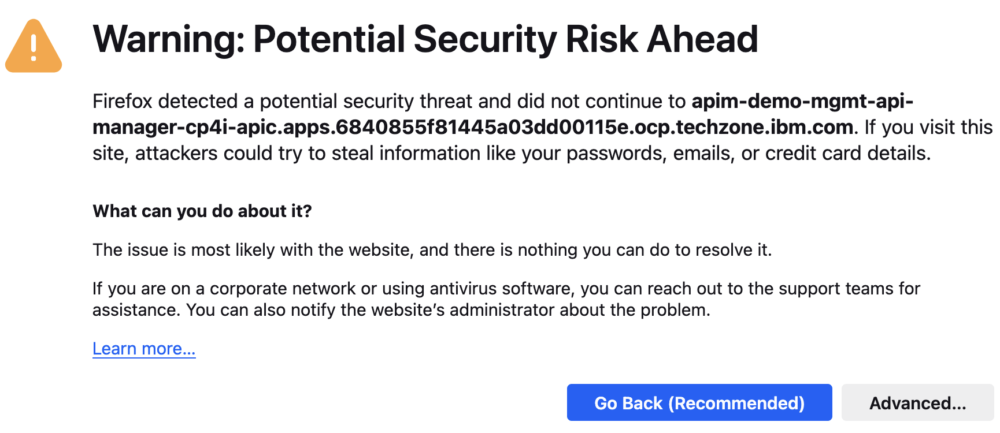

## Add FLIGHT.LANDINGS AsyncApi

Login as Cloud Pak User Registry


Once login make sure you are logged in the correct Provider
Organization. In this screen shot it is **student\<n\>-porg**

a)  Select Develop APIs from the Tile or the link on the left menu.


b)  Now select **Add** and pick API.


c)  Select **AsyncAPI**


d)  Now you will be on the page to Create from Event Endpoint Management
    or you can import existing definition.

Select **Create** and click **Next**

> **Note:** This is a new feature that will allow you to add ASyncAPIs
> with out exporting and importing.


e)  You will now see all AsyncAPIs that have been published in Event
    Endpoint Management. Select the **FLIGHT.LANDINGS**

Click **Next**

{width="6.5in"
height="2.920138888888889in"}

f)  Now, click on \<Done\> Button.

{width="7.0in"
height="3.3715277777777777in"}

> You have successfully imported AsyncApi into IBM Api Connect.

## Create API Product & Add FLIGHT.LANDINGS AsyncAPI

a)  Select **Add** and **Product**


b)  Select *New product* and click **Next**


c)  Add a Title and Summary.

**Ex:** *Flight Landings AsyncAPI*

> Click **Next** 

d)  Click check box next to FLIGHT.LANDINGS to add this to the Product.

> Click **Next** 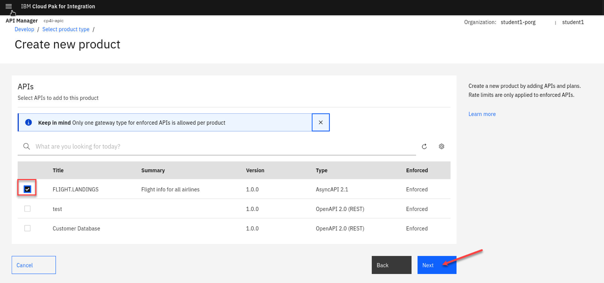

e)  Click **Next** two more times till you get to the Summary page.

> Click **Done**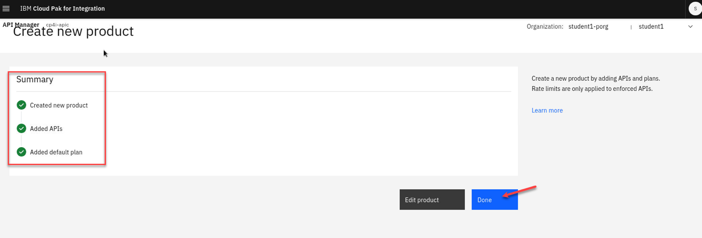

## Publish API Product

Now, publish the AsyncApi's Product to the IBM Api Connect Developer
Portal, and to the IBM Event Gateway.

a)  Go to the Develop page and select Products. Click on the 3-dots on
    the right side of the Product and select Publish.


b)  We only have 1 Catalog so select that and click **Next**

> 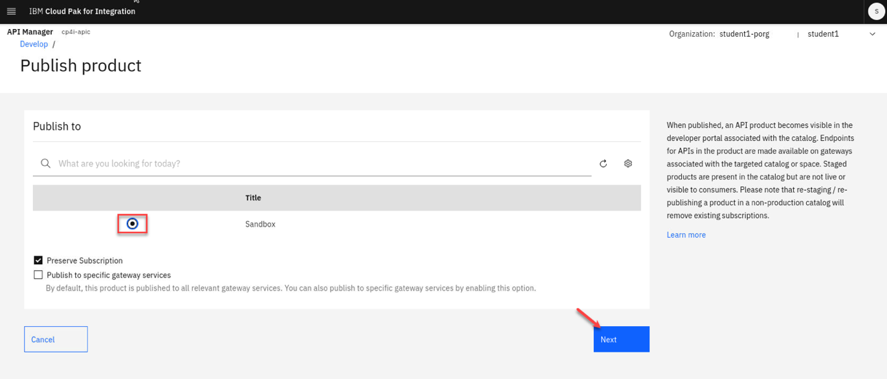
>
> Next page click **Publish**
>
> 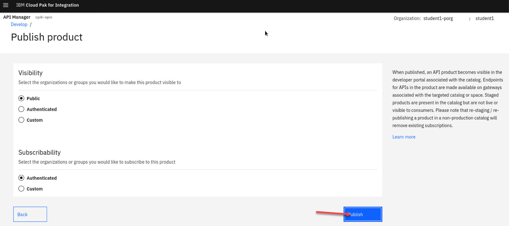

# API Connect Developer Portal

Here, you will access, login, discover, and subscribe to the AsyncAPI.
Consider the API Connect Developer Portal as a marketplace for all your
APIs, enabling application development teams to discover, subscribe to,
and utilize the APIs within their applications, including Web
Applications, Mobile Applications, and more.

## Access API Connect Developer Portal

a)  Locate the developer portal URL, by navigating to API Manager Home
    (Home Icon on top left) --\> Manage Catalogs, select Sandbox
    Catalog.


b)  Click on "Catalog Settings" tab.

**Note:** Make sure you are in the correct Organization.


c)  Click on Portal tab on left panel and right click the Portal URL and
    open in new tab.


## Sign-on the API Connect Developer Portal

If you see "Warning: Potential Security Risk Ahead", click "Advanced",
and click "Accept Risk and Continue" button to continue.

a)  Click "Sign in" on the top right of the screen.


b)  Sign-in to API Connect Developer Portal using your student id, and
    password.

**Ex:** student\<1\>dev, passw0rd

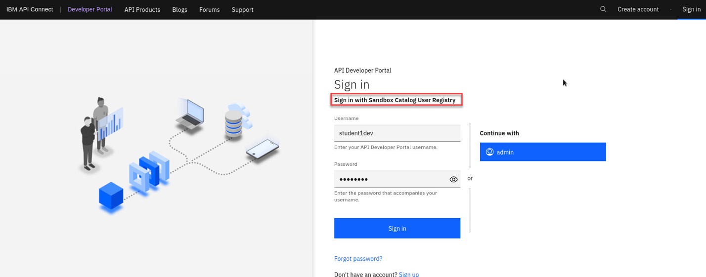

c)  You should now be signed in under your student COrg. You will also
    see the Flight Landings AsyncAPI that you published in the pervious
    lab.


## Subscribe to FLIGHT.LANDINGS API

Subscribe to FLIGHT.LANDIGS API.

- i) First you will open config.properties.
- ii) Second, you will create an application.
- iii) Third, when you create the application you will get key, and secret. You will copy and paste them into config.properties APP_CLIENT_ID, and APP_CLIENT_SECRET fields.

a)  On the desktop, Open config.properties file with Text Editor as
    below.

Click on Applications (top left of the desktop) --\> Files and locate
EEM folder.


Double click on EEM (Event Endpoint Manager) folder.

Open config.properties file using "Open With Text Editor".

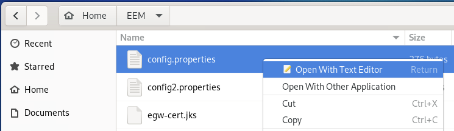

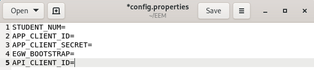

 Now populate each field.\
 STUDENT_NUM=1,2,...20

b)  Switch to API Connect Developer Portal. Select Flight.Landing
    asyncapis Product.\
    Select the default plan for this lab.

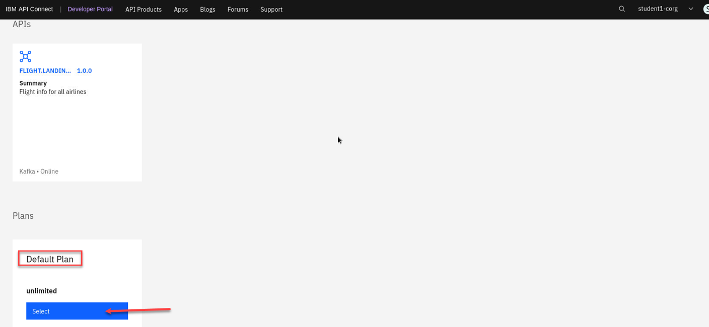{width="6.404009186351706in"
height="2.955696631671041in"}

c)  Now we will need to create an application to subscribe to this plan.

 

d)  Give the new Application a Name.

**EX:** Flight landing


Click **Save** button, and that will display API Key, and Secret screen as below. Do **NOT** close it, move the below step.

e)  You will now have the credentials for your application. Let's copy
    and paste them into \~/EEM/config.properties file.

 **IMPORTANT**\
 Copy and Paste the Key to APP_CLIENT_ID in config.properties file.
 Copy and Paste the Secret APP_CLIENT_SECRET in config.properties file.


f)  Click **Next** 

g)  Click **Done** 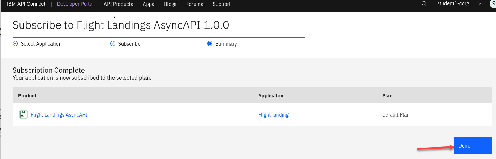

h)  Now Click on the FLIGHT.LANDING API


i)  From here go to the Subscribe(operation) and scroll down to
    the *Properties* section.

- Copy and Paste the **bootstrap.servers** to EGW_BOOTSTRAP field in config.properties file.
- Copy and Paste the **client.id** to API_CLIENT_ID field in config.properties file.


j)  Save config.properties file.

**Summary:**\
You have created an AsyncApi, added it to an API Product, Published,
Subscribed, and finally captured APP_CLIENT_ID, APP_CLIENT_SECRET,
EGW_BOOTSTRAP, and API_CLIENT_ID and saved them to config.properties.

# Consuming Flight Landing Events

In this section, you will consume the flight landing events using Kafka
Clients kafka-console-consumer.sh and a Java client.

## Generate client certificates of Event Gateway

Now, on the Desktop minimize the Google Chrome Browser, and open a
Terminal Window.


a)  Run the below commands for logging into the OpenShift.

oc login -u student\<n\> -p welcometotxc
[https://api.6840855f81445a03dd00115e.ocp.techzone.ibm.com:6443](https://api.6840855f81445a03dd00115e.ocp.techzone.ibm.com:6443/)

oc project student\<n\>

{width="6.5in"
height="1.3381944444444445in"}

b)  Now go to the EEM directory

cd \~/EEM


c)  Run the generate_egw_cert.sh script

./generate_egw_cert.sh

When script is done run **ls -ltr** of the directory and you should see the egw cert files

ls -ltr


## kafka-console-consumer.sh - Consume flight events

Here, you will receive flight landing events using the open-source kafka-console-consumer.sh program.

Change Directory to \~/EEM.

```
 cd ~/EEM
```

 You should have the following info saved in
 your **config.properties** file.

```
 cat config.properties
```

 

 Now run the kafka_console_flight_landings_consumer.sh script and you
 should see flight info being displayed.

```
 ./kafka_console_flight_landings_consumer.sh
```

 

## Java Application -- Consume flight events

 Here, you will receive flight landing events using a custom java program.

 Open a **NEW** Terminal window (keep the kafka_console_flight_landing_consumer.sh running).

 a\) Change the Directory.

```
 cd ~/EEM/java_flight_landing_project
```

 b\) Now run the following command to start the Java Consumer.

```
 ./java_flight_landing_consumer.sh
```

 You should see output like below.

 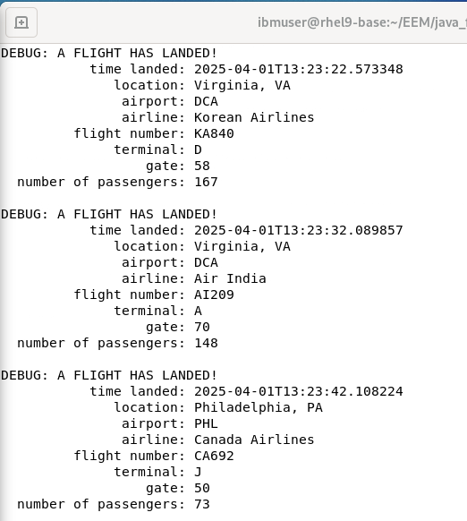

 When both the Consumers are running, you should see both the Consumers
 receiving the events.


You have initiated two Kafka Clients and have successfully obtained
Flight landing events from Kafka via the IBM Event Gateway, with both
clients receiving identical data.

**Summary:**

In this laboratory, you have examined the AsyncAPI of IBM Event
Automation and IBM API Connect platforms to transform Kafka Topics into
APIs, enabling secure consumption of Kafka stream data via IBM Event
Gateway.

**!!! CONGRATULATIONS !!!**
