# IBM Cloud Pak for Integration - Creating AsyncAPI

In this lab you will import the AsyncApi definition of FLIGHT.LANDINGS that you downloaded in previous lab. After importing, you will create a Product and Publish.

# 1. Api Connect Manager

From the IBM Cloud Pak for Integration Platform Navigator, open IBM Api Management Console.  

1. Find the API Management link on the Platform navigator

    **Note:** Right click on link and open in new tab.

    

    Accept the certificate exceptions if needed by clicking on the Advanced Tab and accept the certificate exceptions.  

## 1.0 Import AsyncApi definition

1. Login as Cloud Pak User Registry

    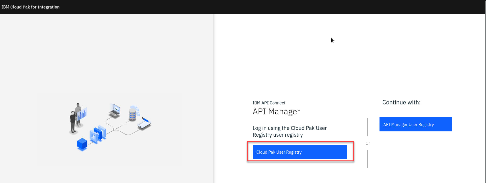

1. Once login make sure you are logged in the correct POrg.  In this screen shot it is **student1-porg**

    Then select Develop APIs from the Tile or the link on the left menu.

    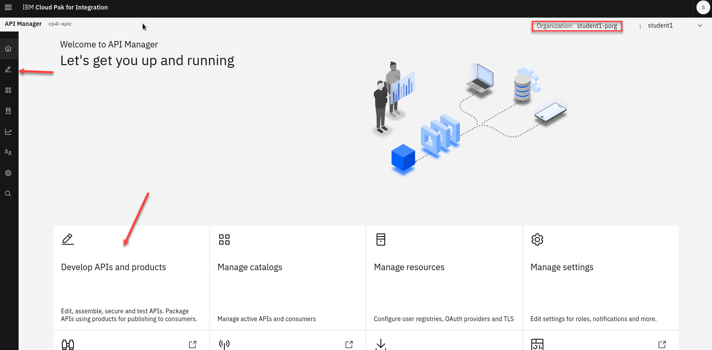

1. Now select **Add** and pick API.

    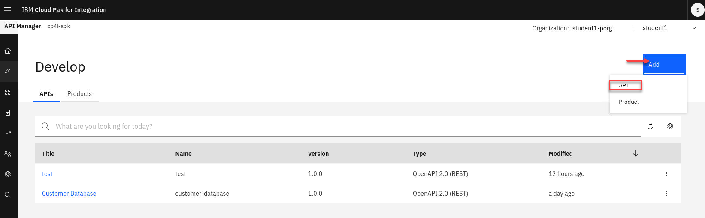

1. Select **AsyncAPI** 

    

1. Now you will be on the page to Create from Event Endpoint Management or you can import existing definition.   

    Select **Create** and click **Next**

    **Note:** This is a new feature that will allow you to add ASyncAPIs with out exporting and importing. 

    

1. You will now see all AsyncAPIs that have been published in Event Endpoint Management.   Select the **FLIGHT.LANDINGS**  

    Click **Next**

    

1. You have successfully imported AsyncApi into IBM Api Connect.

    Click **Develop** to return to main page. 

    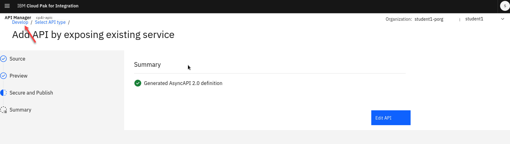

## 1.1 Create Product and add FLIGHT.LANDINGS AsyncApi

1. Select **Add** and **Product**

    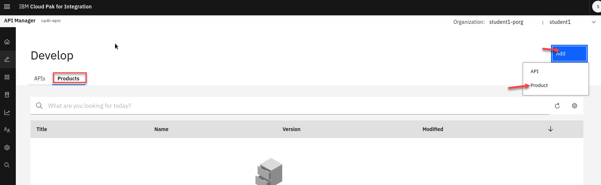
1. Select *New product* and click **Next**

    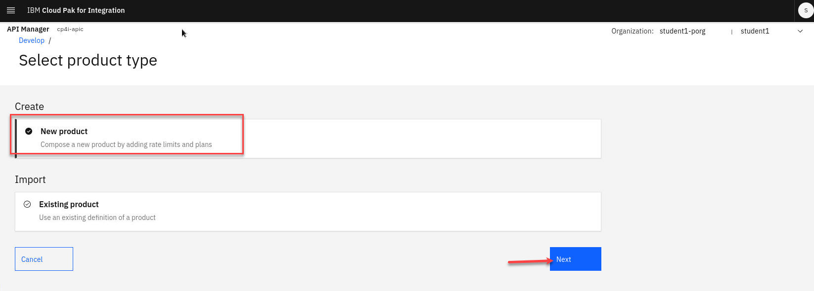

1. Add a Title and Summary. 

    **Ex:** *Flight Landings AsyncAPI*
    
    Click **Next**
    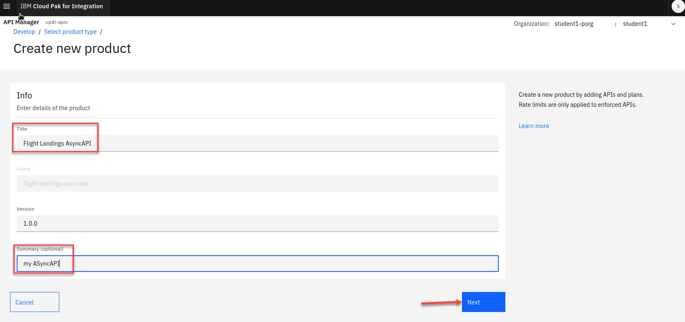

1. Click check box next to FLIGHT.LANDINGS to add this to the Product. 

    Click **Next**
    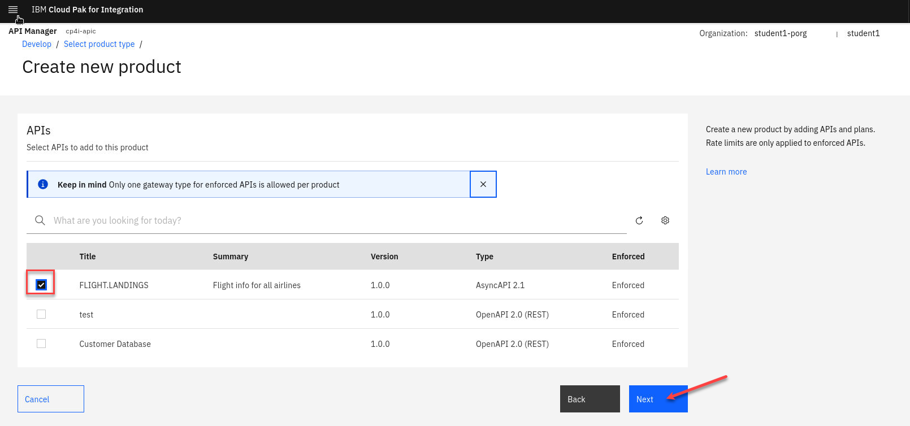

1. Click **Next** two more times till you get to the Summary page. 

    Click **Done**
    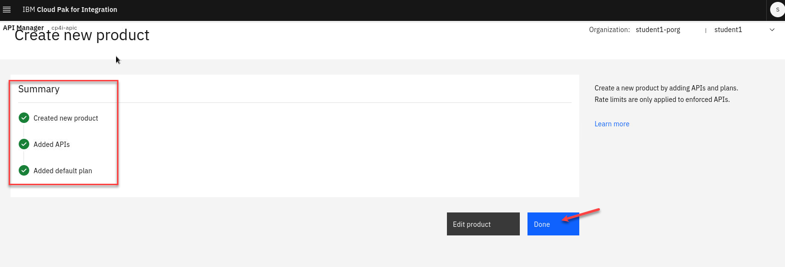

## 1.2 Publish Product

Now, publish the AsyncApi's product to the IBM Api Connect Developer Portal, and to the IBM Event Gateway.

1. Go to the Develop page and select Products.  Click on the 3-dots on the right side of the Product and select Publish.

    

1. We only have 1 Catalog so select that and click **Next**
    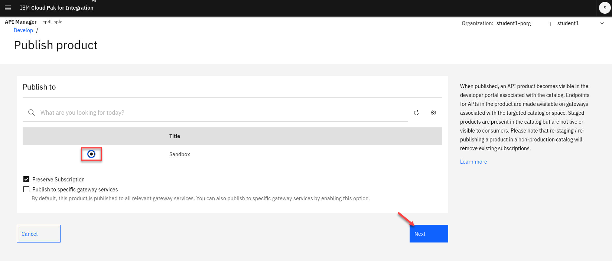

1. Next page click **Publish**
    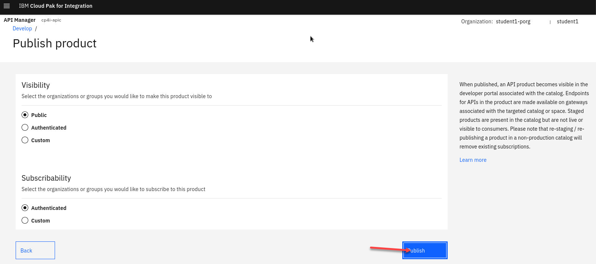

## 1.3 Api Connect Developer Portal

1. Locate the developer portal Url, by navigating to API Manager Home (Home Icon on top left) --> Manage Catalogs, select Sandbox Catalog.

    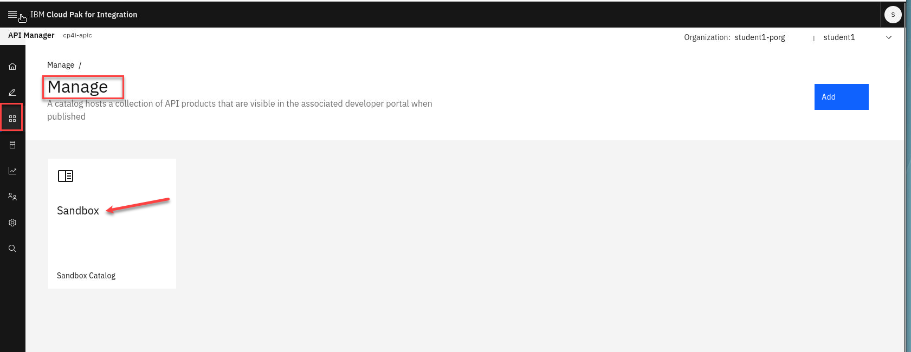

1. Click on "Catalog Settings" tab.

    **Note:** Make sure you are in the correct Organization.

    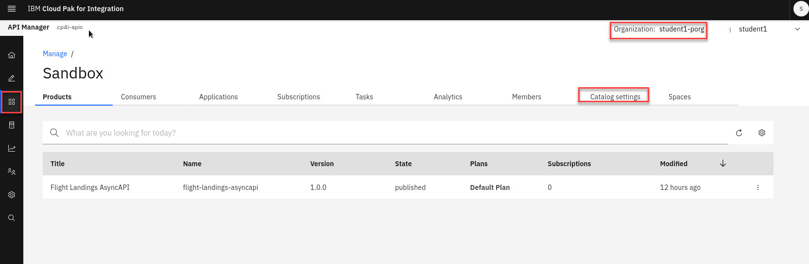

1. Click on Portal tab on left panel, and right click the Portal URL and open in new tab..
    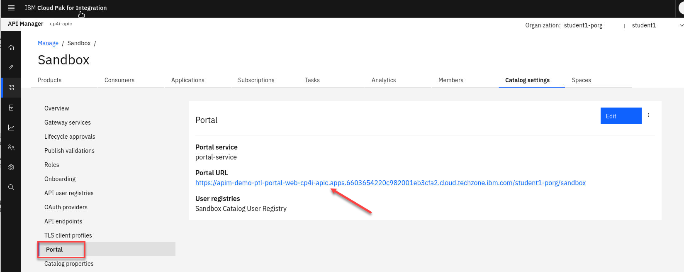

1. Go to the API Connect Developer Portal tab and click on Sign in.

    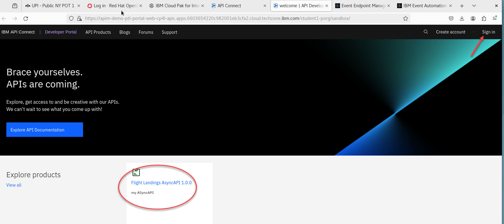

1. Sign-in to API Connect Developer Portal using your student id.

    **Ex:** student1dev

    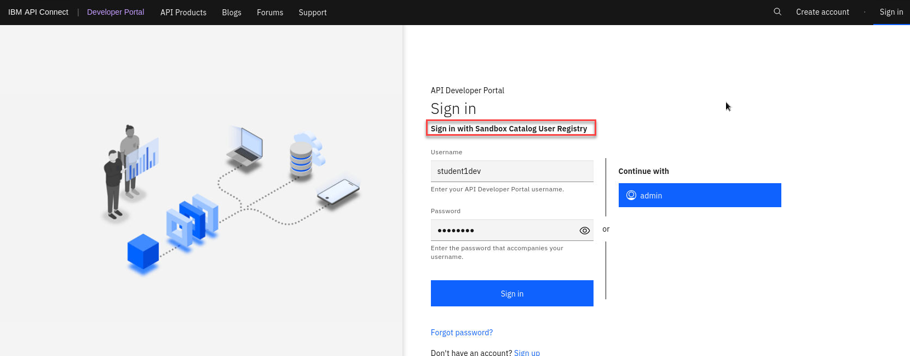

1. You should now be signed in under your student COrg.  You will also see the Flight Landings AsyncAPI that you published in the pervious lab. 

    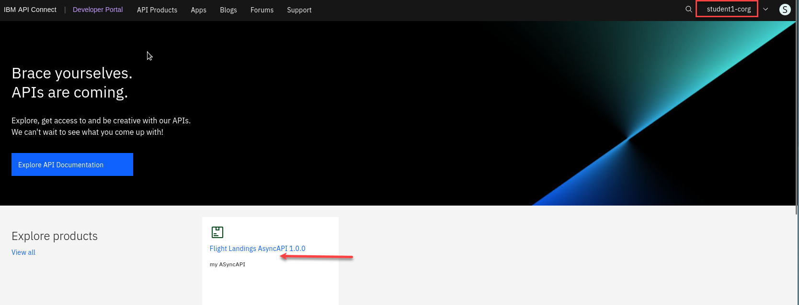

## 1.4 Subscribing to AsyncAPI

In this section, you will subscribe to FLIGHT.LANDIGS API.  
a) First you will open config.properties.  
b) Second, you will create an application.  
c) Third, when you create the application you will get key, and secret. You will copy and paste them into config.properties APP_CLIENT_ID, and APP_CLIENT_SECRET fields.

1. Open config.properties file with Text Editor as below.

   Click on Applications (top left of the desktop) --> Files and locate EEM folder.  
    
   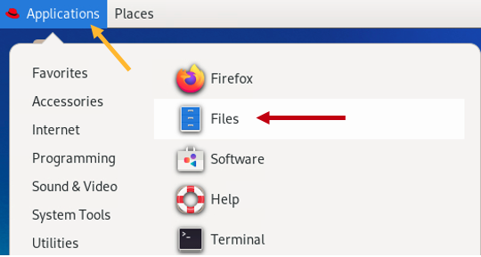

   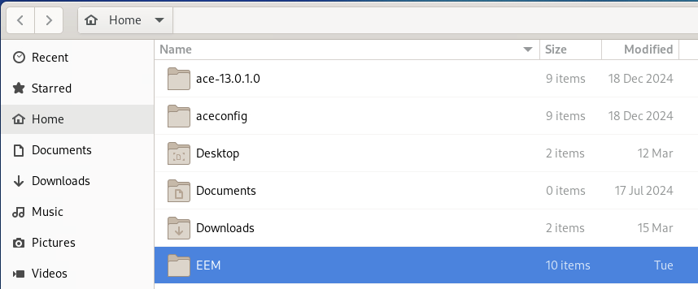

   Double click on EEM (Event Endpoint Manager) folder.  
   
   Open config.properties file using "Open With Text Editor".

   

   

   Now populate each field.  
   STUDENT_NUM=1,2,...20  

1. Switch to API Connect Developer Portal. 
   Select Flight.Landing asyncapis Product.  
   Select the default plan for this lab.  

    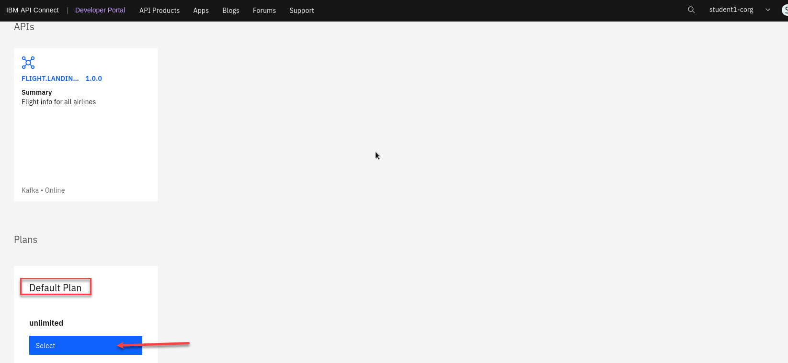

1. Now we will need to create an application to subscribe to this plan.
     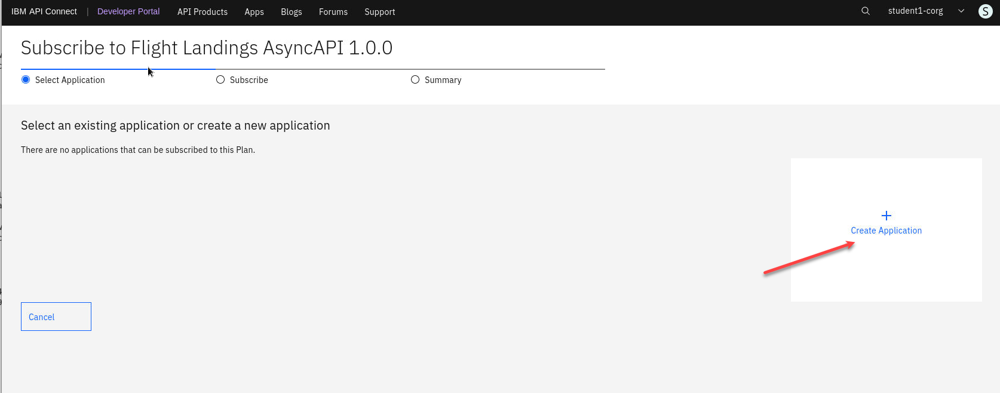

1. Give the new Application a Name.

    **EX:** Flight landing
     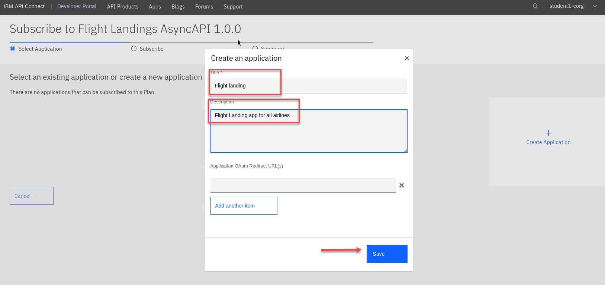

1. You will now have the credentials for your application. Let's copy and paste them into ~/EEM/config.properties file.

    **IMPORTANT**  
    Copy and Paste the Key to APP_CLIENT_ID in config.properties file.
    Copy and Paste the Secret APP_CLIENT_SECRET in config.properties file.
     

     
1. Click **Next**
     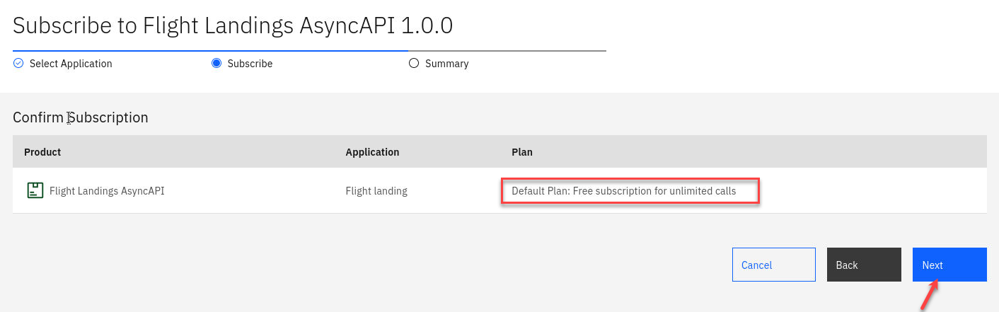

1. Click **Done**
     

1. Now Click on the FLIGHT.LANDING API
     

1. From here go to the Subscribe(operation) and scroll down to the *Properties* section.

    Copy and Paste the **bootstrap.servers** to EGW_BOOTSTRAP field in config.properties file..   Copy and Paste the **client.id** to API_CLIENT_ID field in config.properties file.  
    
    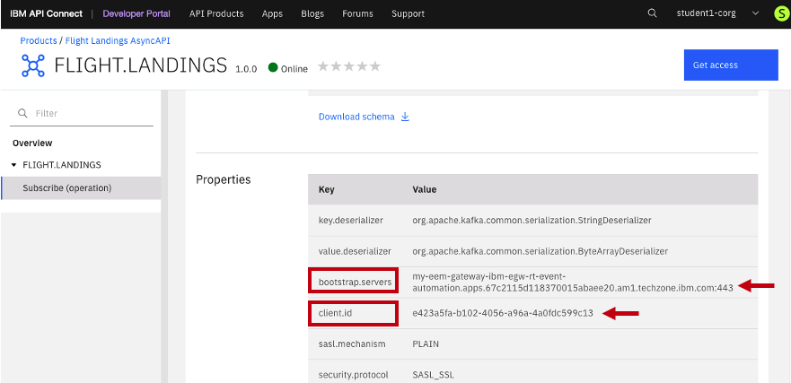

1. Save config.properties file. 

**Summary:**  
You have created an AsyncApi, added it to a API Product, Published, Subscribed, and finally captured APP_CLIENT_ID, APP_CLIENT_SECRET, EGW_BOOTSTRAP, and API_CLIENT_ID and saved them to config.properties file.  
<b> CONGRAGULATIONS !!! 

[Return to main Event Endpoint Management lab page](../index.md#lab-abstracts)
