# IBM Cloud Pak for Integration - AsyncApi - Consuming Flight Landing Events

In this lab, you will consume the flight landing events using Kafka Clients kafka-console-consumer.sh and Java program.


# 1. Consuming Flight Landing Events

## 1. kafka-console-consumer.sh

Here, you will receive flight landing events using the open-source kafka-console-consumer.sh program. <br>

Open a Terminal Window. <br>
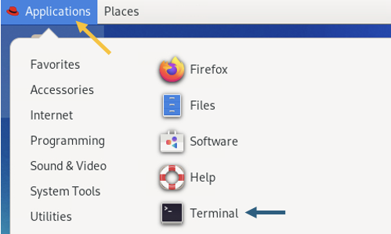

Change Directory to ~/EEM. <br>


  ```
  cd ~/EEM
  ```
  <!--
  Then use gedit to edit the kafka_console_flight_landings_consumer.sh
  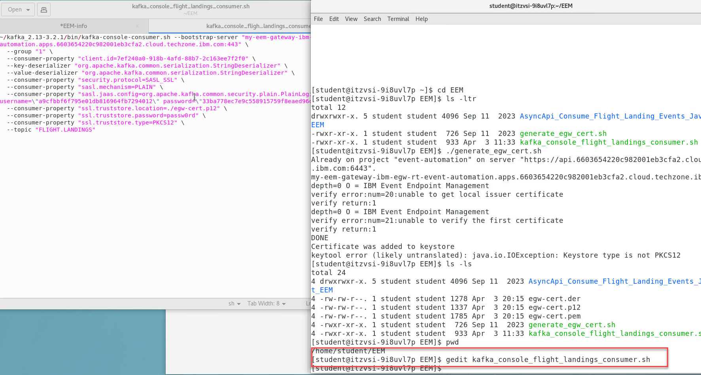
-->

1. You should have the following info saved in your **config.properties** file.  
  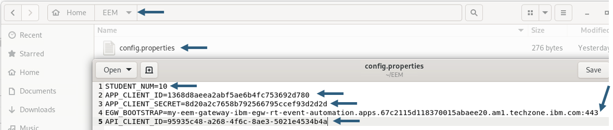

<!--
1. Update the *kafka_console_flight_landings_consumer.sh* with the values from EEM-info.  This screens shows all fields to update. 

    **Note:** Make sure to change the group number to your student number. 
  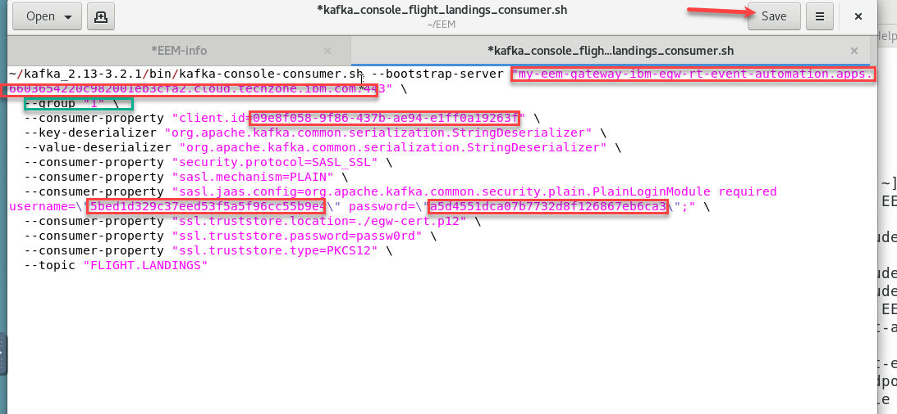
-->

1. Now run the kafka_console_flight_landings_consumer.sh script and you should see flight info being displayed. 
  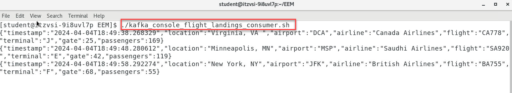


# 2. Java Application

Here, you will receive flight landing events using a custom java program. <br>

Open a **NEW** Terminal window (keep the kafka_console_flight_landing_consumer.sh running).

<br>

<!--
1. First we will need to get the JKS cert for the JAVA client. 
    ```
    cd ~/EEM
    ```
    From that directory copy and paste the following command to create the JKS cert.
    ```
    ~/openjdk-22.0.2/jdk-22.0.2/bin/keytool -importkeystore -srckeystore egw-cert.p12 \
	-srcstoretype PKCS12 \
        -destkeystore egw-cert.jks \
        -deststoretype JKS \
        -srcstorepass passw0rd \
        -deststorepass passw0rd \
        -noprompt
    ```
    When done you should now have a JKS cert.
      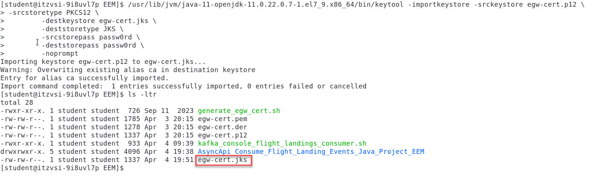
-->

a) Change the Directory. <br>

```
cd ~/EEM/java_flight_landing_project
```

<!--
    Then use gedit to edit the config.properties file.  
  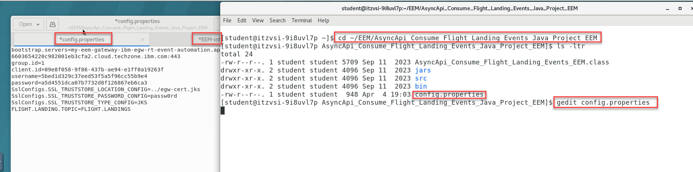

1. You should still have the **EEM-info** file open.  If not open that in gedit since you will need the same details from there to updated the config.properties file.  

    Updated the config.properties file with details from your EEM-info. 

    When done **Save** your changes. 

    **Note:** Make sure to change the group number to your student number. 
  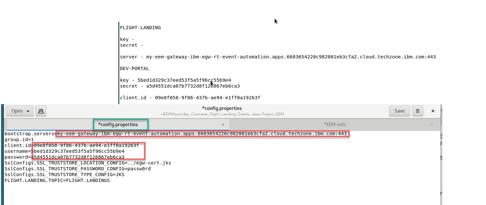


1. Now run the following command.  Copy and paster into the terminal window and you will start to see flight landing info. 

    ```
    java -cp :jars/jackson-annotations-2.10.5.jar:jars/jackson-databind-2.10.5.1.jar:jars/slf4j-api-1.7.30.jar:jars/jackson-core-2.11.4.jar:jars/kafka-clients-2.8.0.jar: AsyncApi_Consume_Flight_Landing_Events_EEM
    ```
    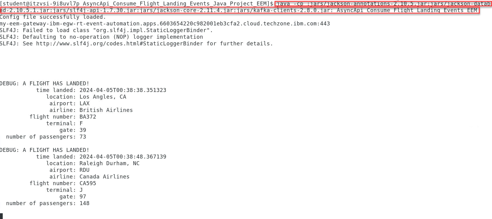
-->

b) Now run the following command to start the Java Consumer.

```
./java_flight_landing_consumer.sh
```

You should see output like below. <br>

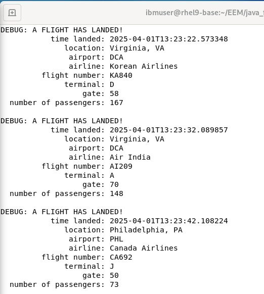


When both the Consumers are running, you should see both the Consumers receving the events. <br>

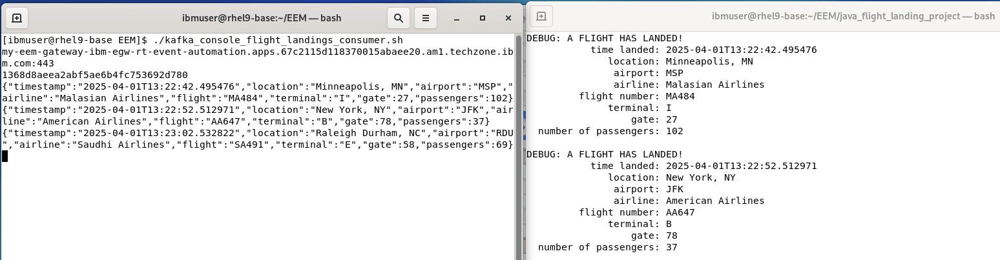


[Return to main Event Endpoint Management lab page](../index.md#lab-abstracts)
