## Lab 1A - NativeHA: Deploying a container Native HA persistent IBM MQ Queue Manager on the Cloud Pak for Integration

[Return to MQ lab page](../index.md)

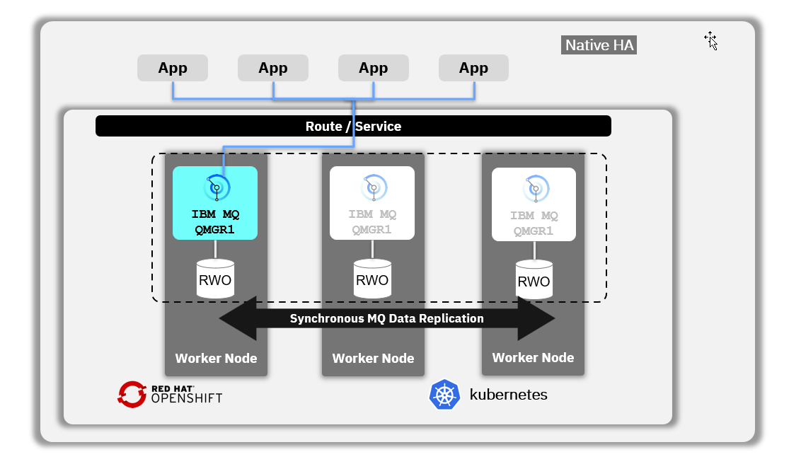

These instructions will document the process to deploy a NativeHA highly available (HA) persistent IBM MQ on the Cloud Pak for Integration. 

A Native HA configuration provides a highly available queue manager where the recoverable MQ data (for example, the messages)  are replicated across multiple sets of storage, preventing loss from storage failures. The queue manager consists of multiple running instances, one is the leader, the others are ready to quickly take over in the event of a failure, maximizing access to the queue manager and its messages.

A Native HA configuration consists of three Kubernetes pods, each with an instance of the queue manager. One instance is the active queue manager, processing messages and writing to its recovery log. Whenever the recovery log is written, the active queue manager sends the data to the other two instances, known as replicas. Each replica writes to its own recovery log, acknowledges the data, and then updates its own queue data from the replicated recovery log. If the pod running the active queue manager fails, one of the replica instances of the queue manager takes over the active role and has current data to operate with.

A Kubernetes Service is used to route TCP/IP client connections to the current active instance, which is identified as being the only pod which is ready for network traffic. This happens without the need for the client application to be aware of the different instances.

Three pods are used to greatly reduce the possibility of a split-brain situation arising. In a two-pod high availability system split-brain could occur when the connectivity between the two pods breaks. With no connectivity, both pods could run the queue manager at the same time, accumulating different data. When connection is restored, there would be two different versions of the data (a 'split-brain'), and manual intervention is required to decide which data set to keep, and which to discard.
Native HA uses a three pod system with quorum to avoid the split-brain situation. 

## Pre-reqs

You should have already downloaded the artifacts for this lab in the lab Environment Setup from [GitHub MQonCP4I](https://github.com/ibm-cloudintegration/mqoncp4i-2025). 

If you are doing this lab out of order return to [Environment Setup](../envsetup/mq_cp4i_pot_envsetup.md) to perform the download. Then continue from here.

### Important points to note

The lab guide assumes you are using the RHEL desktop VM from the IBM TechZone.

**Note**: The screen shots were taken on a test cluster and many will not match what you see when running the lab. Particularly URL values will be different depending on the cluster where CP4I is running. Projects (Namespaces) may also vary. It is important to follow the directions, not the pictures.


## Deploy the MQ nativeHA Queue Manager with associated resources

1. Navigate to the *nativeha-crr* directory with the following command to get to the correct directory and enter the ls -l command:

	```sh
	cd /home/ibmuser/MQonCP4I/nativeha-crr/deploy

	ls -l
	```
	

1. You will see the 1-live
	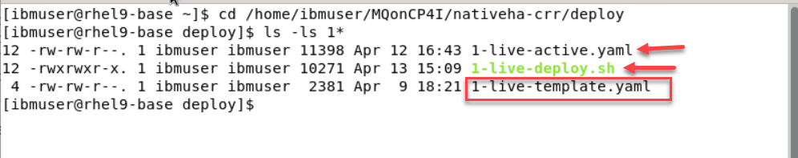
	There is nothing to change here since the **MQ_Setup.sh** built this for you,  but it is necessary to review how the queue manager is created by the yaml code. The first Kubernetes API is a *ConfigMap* named (QMGR Name)-mqsc
	
	**(ex: mq01ha-mqsc).** 
	
	This creates a file of mqsc commands to define MQ objects in the queue manager. The second Kubernetes API is a *Secret* called (QMGR Name)-qm-tls
	
	**(ex: mq01ha-qm-tls).** 
	
	This includes three files to build the secret. *tls.crt* is the signer certificate for the queue manager and *tls.key* is the queue manager's private key. nativehamqsc and nativehacert will be used to define the third Kubernetes kind, the queue manager itself.   

	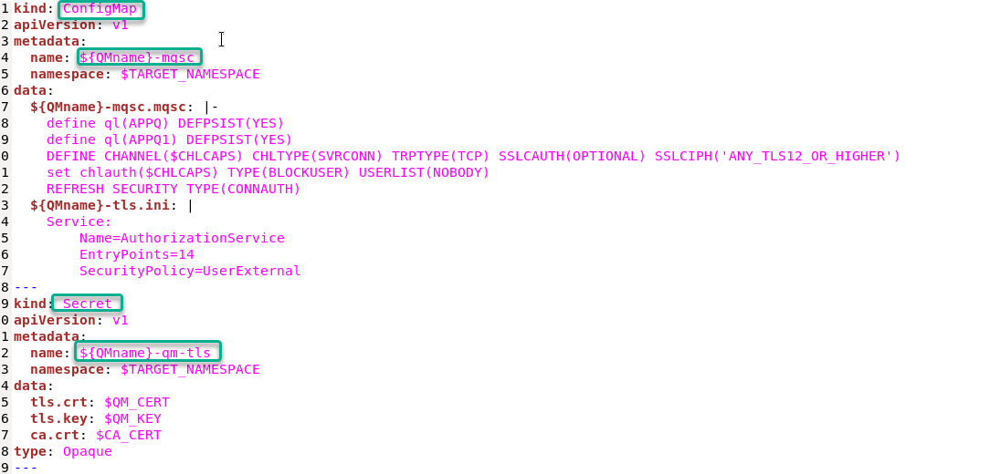
	
1. Native HA is configured using the *.spec.queueManager.availability* of the QueueManager API. Scroll down to the *kind: QueueManager*. *QMname* takes the value from the install.sh script so **mq00ha** (substituted with your student number) will be the name of the deployment and the name of the queue manager. Under *spec*, version is being substituted by the variable defined in install.sh and includes the license value. *pki* pulls in the secret defined earlier. *queuemanager* pulls in the mqsc definitions defined earlier and availability shows type **NativeHA**. This tells the MQ Operator to implement the native HA pattern and will create three pods running the same queue manager with replicated data. 

	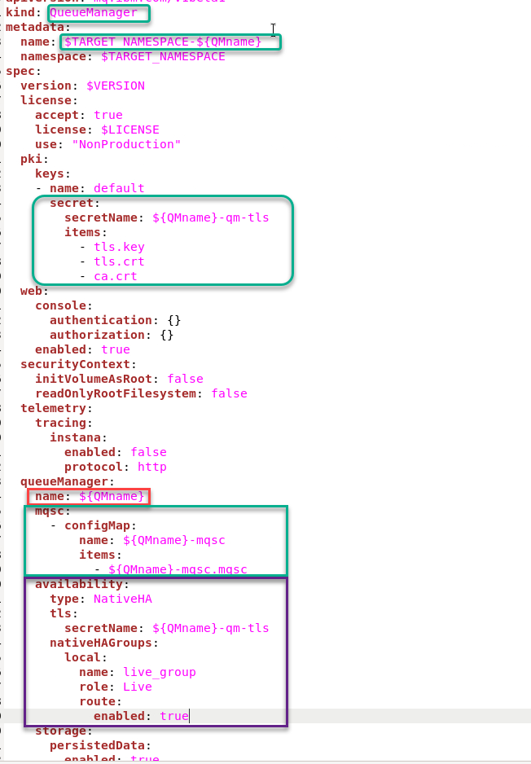
	
	There is nothing to change so just close the yaml file. 
	
1. Looking again at *1-live-deploy.sh *, you will see the 1-live-template.yaml which is used to create the 1-live-active.yaml and that is then applied to create the queue manager.

	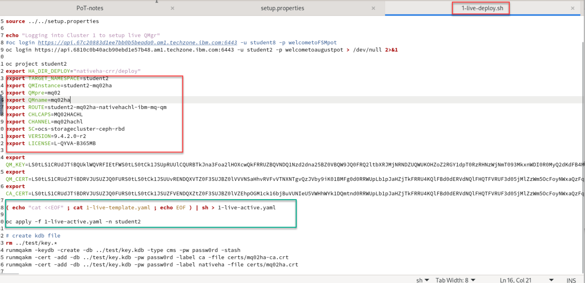
	
	You can now close the gedit editor.
	
	### Login to OCP Console to get login token

1. In OCP console, click the drop-down next to your username and select "Copy Login Command".

	**Note:** Make sure that you are in the correct namespace.  Here in this example I am student1 

	

1. A new browser tab opens. Click the *Display Token* hyperlink.

	
	
1. Copy the command under "Log in with this token".

	
	
1. Open a terminal window and paste the command into the terminal and hit enter which logs you into the cluster. Enter the following command to change to your namespace.
Here we are using namespace student1

	```
	oc project student1
	```

	
	
1. Now we will go to the deployment for nativeha-crr directory.   Will see all the scripts that were created earlier when you ran the **MQ_setup.sh**

	We will in this lab only be focused on the **1-live-deploy.sh** script. 

	Change to the correct directory and run the ./1-live-deploy.sh script to create your HA Qmgr.

	```sh
	cd ~/MQonCP4I/nativeha-crr/deploy
	```
	```sh
	./1-live-deploy.sh 
	```
	
	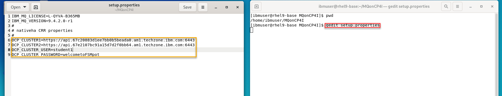 
	
	The response is that the configmap, secret, and queue manager were successfully created.  
	
 	**NOTE:** If you receive an unauthorized message, your session may have timed out. You will need to sign-on again with the OCP token. 

1. Now we will login to the OCP console using are student account.  In the screen shots we are using *student1* .  Make sure you use your assigned student id. Also make sure to use Enterprise LDAP when logging in. 
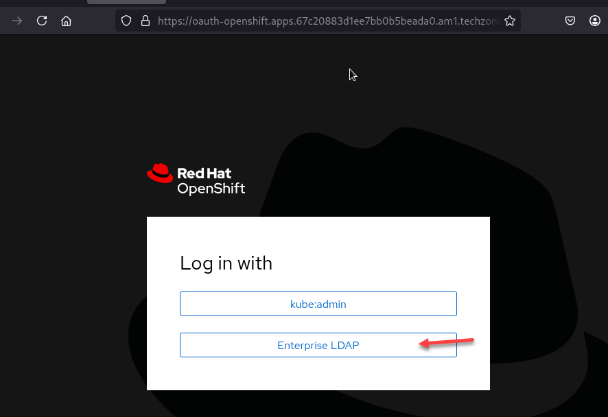 
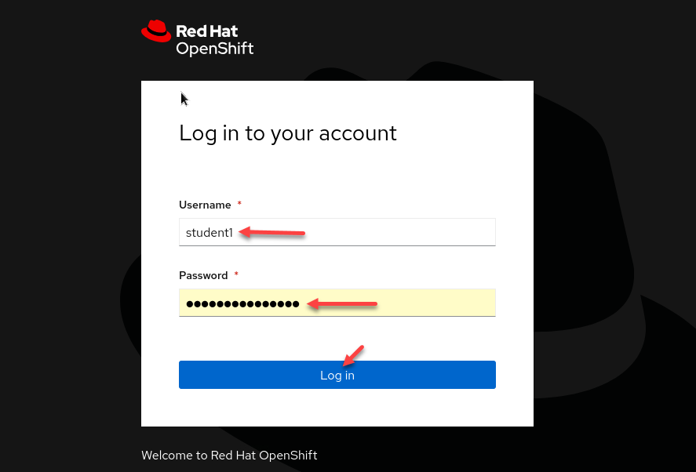 

1. Once logged in make sure you are in your namespace/project.   Then on the left hand side select **Workloads** and select **Pods** 

	You should see your 3 pods running for your QMGr.   Notice that one of them is showing ready state of 1/1.   That is your active running QMgr and the others are standbys. 
	
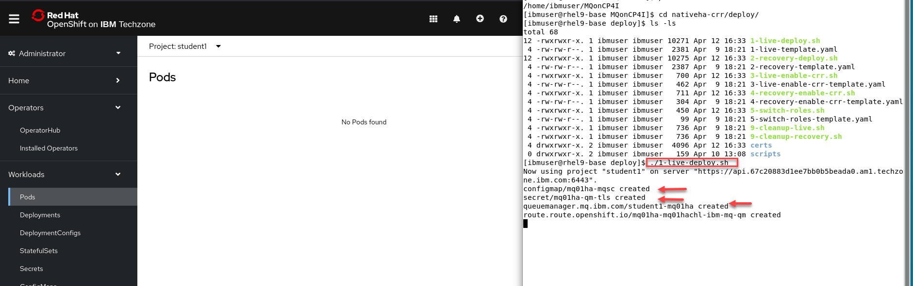 

## Explore the queue manager 

### MQ Console
 To access the queue manager and the MQ Console, you need to go to the CP4I Platform Navigator. 
 
1. From the Platform Navigator make sure you are login as the correct userid and in the filter section enter your userid so you will only see your components.    
Right click on your navtiveHA QMgr link and open in new tab.

	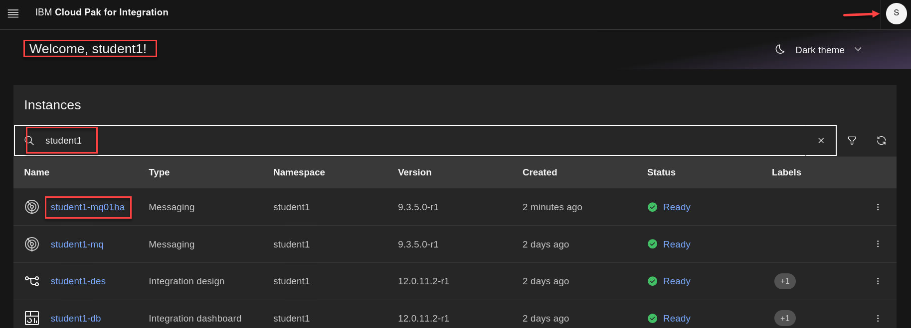
	
1. The MQ Console is now opened for for your queue manager. In this example it is the Qmgr for student1 **mq01ha** 

	(**Example:** if you are student5 you will see mq05ha) 

	Click the *Manage* icon.

	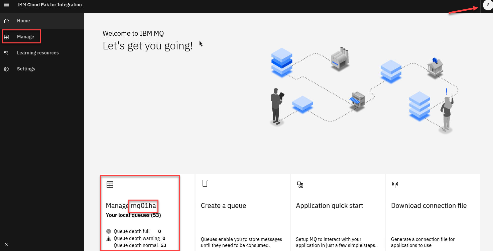

1. The Manage page has tabs for *Queues*, *Events*, *Applications*, and *MQ network*. The main page here has several new tiles showing varies status of the QMgr. 

	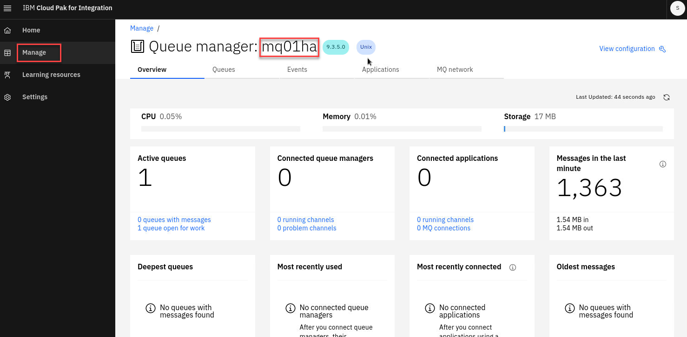	

1. Click **Applications** tab and then select App channels.
Here you see **MQ01HACHL** which was defined in the *Queue Manager* stanza of the yaml.

	**Note:** Remember that depending on your student number you will see something different then **01**.

	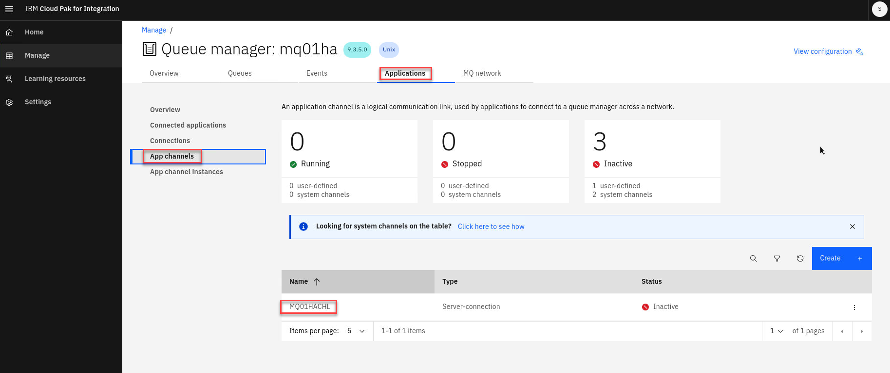

1. In the OCP Console, change the project to your namespace, for example *student1*. Click the drop-down for *Operators* then select *Installed Operators*. Scroll to the bottom and click the hyperlink for **IBM MQ**.

	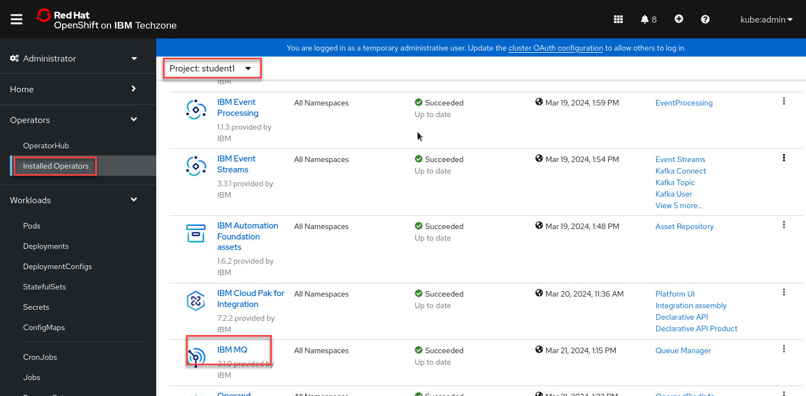

1. You can browse the details about the MQ Operator, then click *Queue Manager*. You see your queue manager **student1-mq01ha** and it is *Running*. Any other queue managers running in the namespace will also be displayed.  

	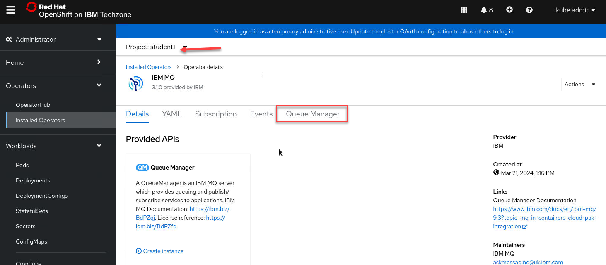

	Click the hyperlink for **student1-mq01ha**.
	
	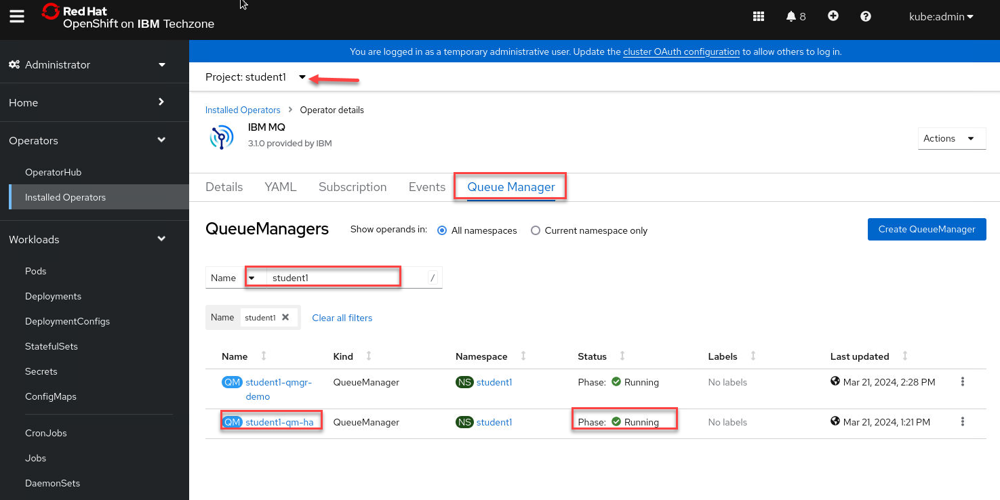		
1. The details and properties for the queue manager are displayed. Review by scrolling through the details. You can also see the yaml that for the queue manager object. 

	After reviewing, click the drop-down for *Workloads* and select *Pods*. 
	
	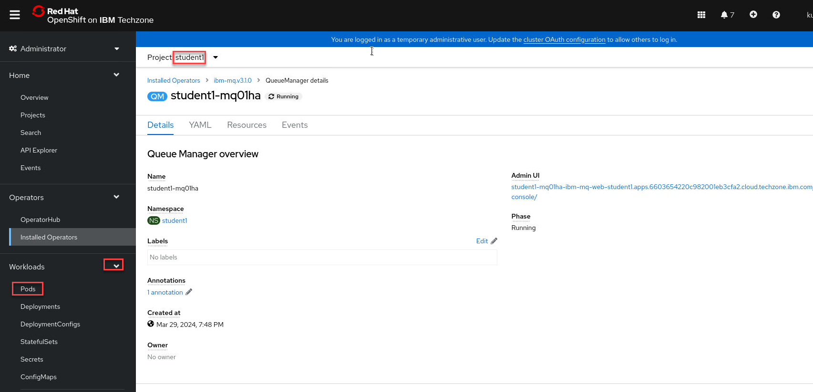		
1. Type **mq01** (your student number in place of 05) in the filter so you will only see the pods for your queue manger. As expected you will see three pods for the nativeha queue manager. One of the pods has 1 of 1 containers running. Two of the pods have 0 of 1 containers running. This is the nature of nativeHA, one pod running the queue manager and data being replicated to the other two pods which are in standby mode.

	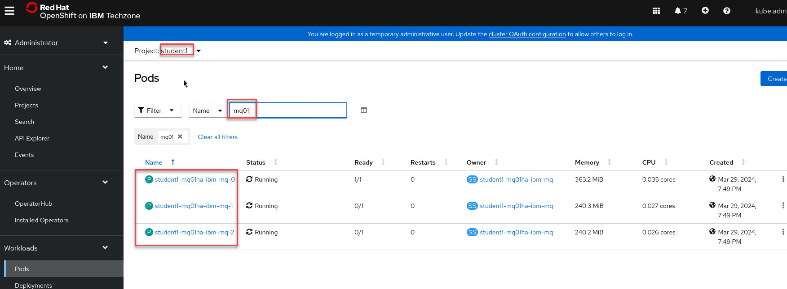
	
1. If you click the hyperlink for the running pod, you will see its details and the logs. 	Click *Logs* to review the messages. Below is a sample from pod *student1-mq01ha-ibm-mq-0* where you can see the messages involved with HA.

	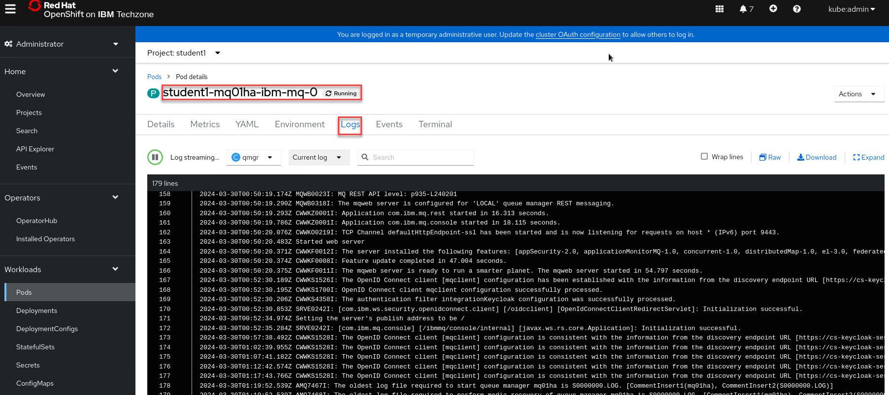

1. Under *Workloads* click *ConfigMaps* then select **nativehamqsc**.

	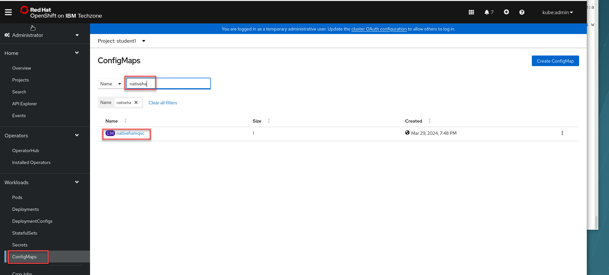
	
1. Scroll down to *Data* and you will see the mqsc statements to define the queue manager objects.

	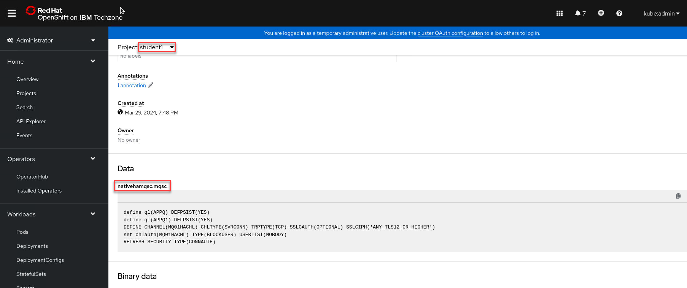
	
	
### Viewing the status of Native HA queue managers 

You can view the status of the Native HA instances by running the dspmq command inside one of the running Pods.

You can use the dspmq command in one of the running Pods to view the operational status of a queue manager instance. The information returned depends on whether the instance is active or a replica. The information supplied by the active instance is definitive, information from replica nodes might be out of date.
You can perform the following actions:

* View whether the queue manager instance on the current node is active or a replica.
* View the Native HA operational status of the instance on the current node.
* View the operational status of all three instances in a Native HA configuration.

The following status fields are used to report Native HA configuration status:

* ROLE
    Specifies the current role of the instance and is one of Active, Replica, or Unknown.
* INSTANCE
    The name provided for this instance of the queue manager when it was created using the -lr option of the crtmqm command.
* INSYNC
    Indicates whether the instance is able to take over as the active instance if required.
* QUORUM
    Reports the quorum status in the form number_of_instances_in-sync/number_of_instances_configured.
* REPLADDR
    The replication address of the queue manager instance.
* CONNACTV
    Indicates whether the node is connected to the active instance.
* BACKLOG
    Indicates the number of KB that the instance is behind.
* CONNINST
    Indicates whether the named instance is connected to this instance.
* ALTDATE
    Indicates the date on which this information was last updated (blank if it has never been updated).
* ALTTIME
    Indicates the time at which this information was last updated (blank if it has never been updated).

1. Find the pods which are part of your queue manager with the following command:

	**Note:** Remember that depending on your student number you will see something different then **01**.
	```sh
	oc get pods --selector app.kubernetes.io/instance=student1-mq01ha
	```
	
	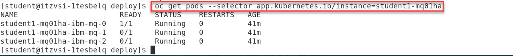
	
1. Use the following command to run the *dspmq* command in the active pod: 

	```sh
	oc exec -t student1-mq01ha-ibm-mq-0 dspmq
	```
	
	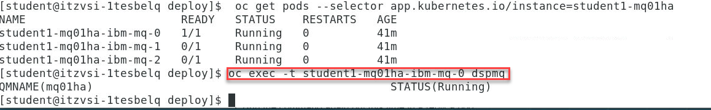 
	
	In the active pod the queue manager shows *Running*.
	
1. Run the command again but this time in a replica pod.

	```sh
	oc exec -t student1-mq01ha-ibm-mq-1 dspmq
	```
	
	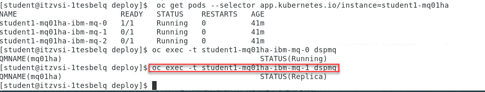
	
	In a replica pod the queue manager shows *Replica*.

1. To determine Native HA operational status of the instance in the specified pod:

	```sh
	oc rsh student1-mq01ha-ibm-mq-0 dspmq -o nativeha -m mq01ha
	```
	
	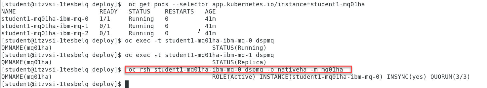

## Test the deployment

1. Open a new terminal window and navigate to */home/ibmuser/MQonCP4I/nativeha/test* directory using the following command:

	```sh
	cd ~/MQonCP4I/nativeha-crr/test
	```
1. When you ran the MQ_setup script the following scripts were created in the *test* directory with your credentials.
	
	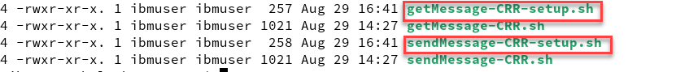
	
1. It is best to open two more terminal windows one for **Sending** and one for **getting** messages.  Using the followng scripts: 

	```sh
	./sendMessage-CRR-setup.sh 
	./getMessage-CRR-setup.sh
	```
	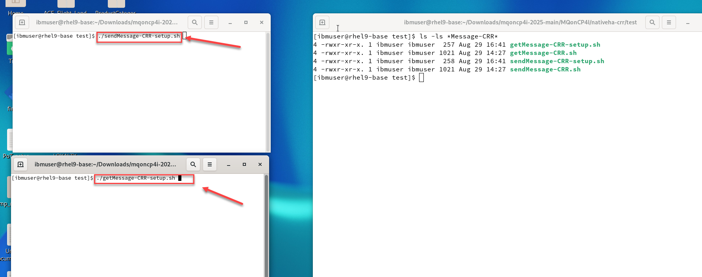

	When you start the programs you will see it logs into the cluster and your namespace and will start putting messages and getting messages from your **APPQ**.
	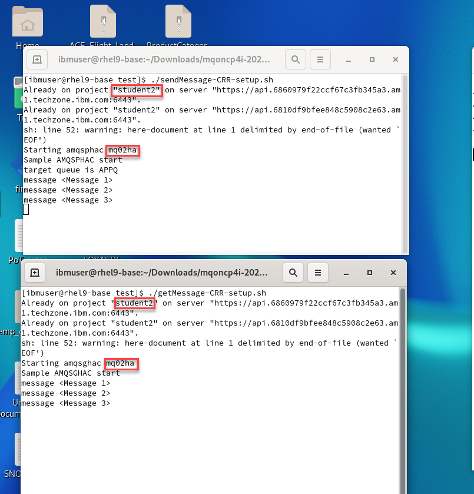

1. Open a new terminal window. To see how the pods work together in action, run the following command to view the current pods:

	```sh
	oc get pod | grep mq02ha
	``` 

	**NOTE:** Make sure you change the number from 02 to what ever student # you are using.

	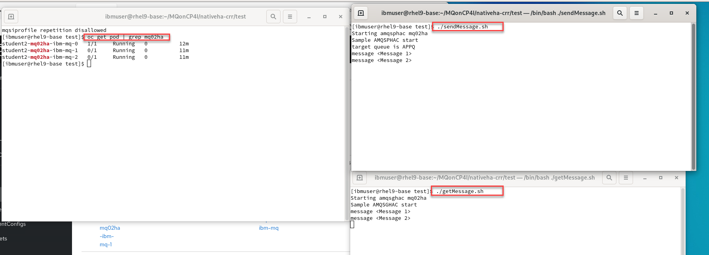	
	
1. Delete the running pod by issuing the command: 

	```sh
	oc delete pod student1-mq01ha-ibm-mq-0
	```
	
	Once the active pod is deleted, the running programs will then reconnect to the other pod for it to take over.
   
   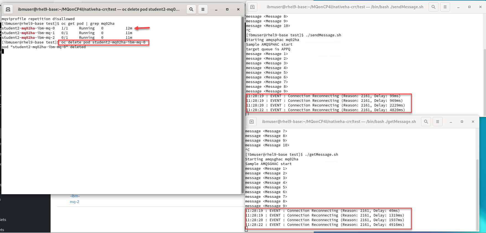

1. To verify that the other pod is now running, return to the terminal where you ran the "oc" command and issue the "get pods" again.

	```sh
	oc get pods | grep mq01ha
	```
	
	You will see that pod **student2-mq02ha-ibm-mq-2** is now the active pod and the other two are in standby. This is indicated by the *Ready* column which shows 1 of 1 containers is running. The other pods have 0 of 1 containers running.
	
	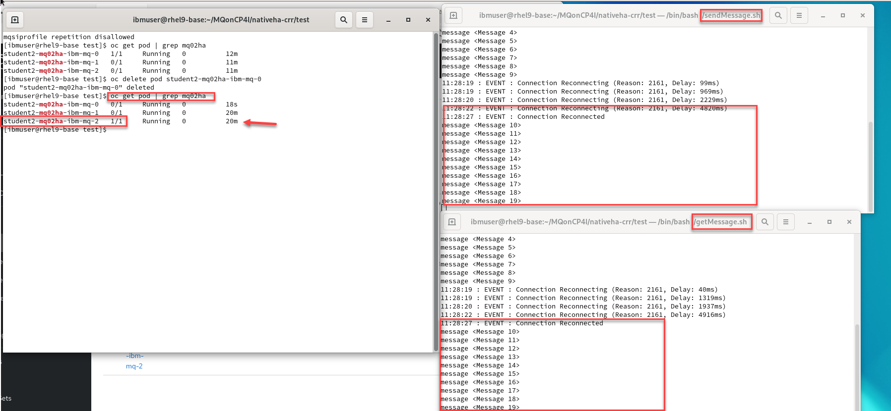

1. Return to the browser tab where OCP is open. In your project, click the drop-down for *Workloads* and select *Pods*. Enter your queue manager name in the *Name* field to filter out the rest. You will see the same information - **student1-mq01ha-ibm-mq-1** is currently running. 

	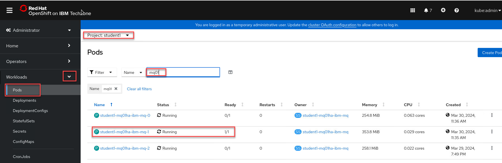

1. Still in OCP, kill the running pod and watch one of the standbys take over. Click the elipsis on the far right and select *Delete Pod*.

	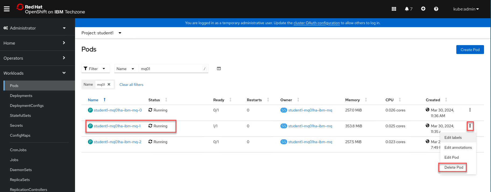
	
1. In the pop-up, click *Delete* to confirm the deletion.

1. You will see pod *student1-mq01ha-ibm-mq-1* status change to *Terminating* immediately and within seconds, **student1-mq01ha-ibm-mq-0** becomes *Running*.

	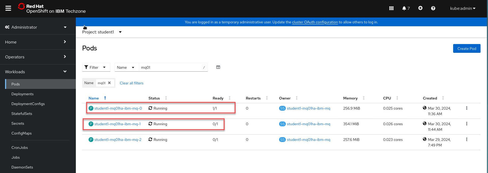

1. Return to the browser tab where MQ Console is running. Refresh the page and click *Manage*. Verify that queue **APPQ1** still has the number of messages you put to the queue earlier. 

	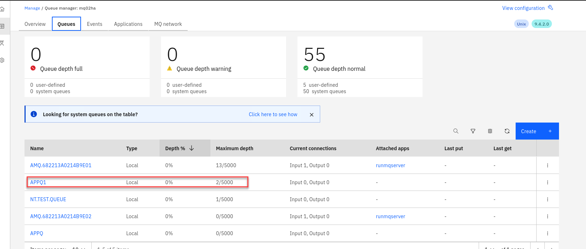
	
	Click the hyperlink for the queue to verify that those are the messages you created.
	
	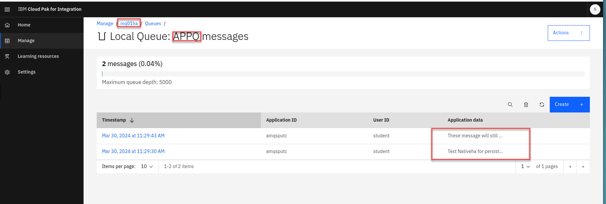	

## Congratulations

You have completed this lab nativeHA for MQ on CP4I.

		
[Continue to Lab 2](../Lab_2a/Readme.md)

[Return to MQ lab page](../index.md)

## Appendix A
### This covers varies commands to review. 

	We will not test every possibility, but the following are possible displays to expect. Review the possibilities.

	* An active instance of the queue manager named **mq05ha** would report the following status:

			QMNAME(mq05ha)                 STATUS(Running)

	* A replica instance of the queue manager would report the following status:

			QMNAME(mq05ha)                 STATUS(Replica)

	* An inactive instance would report the following status:

			QMNAME(mq05ha)                 STATUS(Ended Immediately)
	
	We will not test every possibility, but the following are possible displays to expect. Review the possibilities.
	
	* The active instance of the queue manager named **mq05ha** might report the following status:

			QMNAME(mq05ha)               ROLE(Active) INSTANCE(inst1) INSYNC(Yes) QUORUM(3/3)

	* A replica instance of the queue manager might report the following status:

			QMNAME(mq05ha)               ROLE(Replica) INSTANCE(inst2) INSYNC(Yes) QUORUM(2/3)

	* An inactive instance of the queue manager might report the following status:

			QMNAME(mq05ha)               ROLE(Unknown) INSTANCE(inst3) INSYNC(no) QUORUM(0/3)

1. To determine the Native HA operational status of all the instances in the Native HA configuration:

	```sh
	oc rsh student1-mq01ha-ibm-mq-0 dspmq -o nativeha -x -m mq01ha
	```
	
	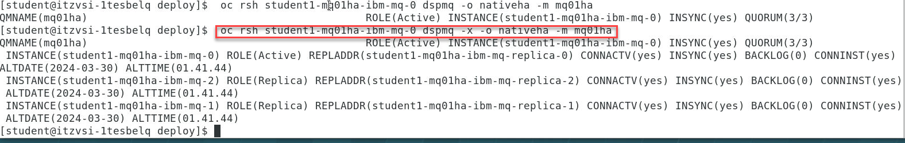
	
	We will not test every possibility, but the following are possible displays to expect. Review the possibilities.
	
	* If you issue this command on the node running the active instance of queue manager **mq05ha**, you might receive the following status:

			QMNAME(mq05ha)			ROLE(Active) INSTANCE(inst1) INSYNC(Yes) QUORUM(3/3) 
				INSTANCE(mq05ha-ibm-mq-0) ROLE(Active)  REPLADDR(mq05ha-ibm-mq-0) 					CONNACTV(Yes) INSYNC(Yes) 					BACKLOG(0) CONNINST(Yes) ALTDATE(2021-01-12) ALTTIME(12.03.44) 
				INSTANCE(mq05ha-ibm-mq-1) ROLE(Replica) REPLADDR(mq05ha-ibm-mq-1) 					CONNACTV(Yes) INSYNC(Yes) 					BACKLOG(0) CONNINST(Yes) ALTDATE(2021-01-12) ALTTIME(12.03.44) 
				INSTANCE(mq05ha-ibm-mq-2) ROLE(Replica) REPLADDR(mq05ha-ibm-mq-2) 					CONNACTV(Yes) INSYNC(Yes) 					BACKLOG(0) CONNINST(Yes) ALTDATE(2021-01-12) ALTTIME(12.03.44)

	* If you issue this command on a node running a replica instance of queue manager **mq05ha**, you might receive the following status, which indicates that one of the replicas is lagging behind:

			QMNAME(mq05ha)			ROLE(Replica) INSTANCE(inst2) INSYNC(Yes) QUORUM(2/3)
				INSTANCE(mq05ha-ibm-mq-2) ROLE(Replica) REPLADDR(mq05ha-ibm-mq-2) 					CONNACTV(Yes) INSYNC(Yes) 					BACKLOG(0) CONNINST(Yes) ALTDATE(2021-01-12) ALTTIME(12.03.44) 
				INSTANCE(mq05ha-ibm-mq-0) ROLE(Active)  REPLADDR(mq05ha-ibm-mq-0) 					CONNACTV(Yes) INSYNC(Yes) 					BACKLOG(0) CONNINST(Yes) ALTDATE(2021-01-12) ALTTIME(12.03.44) 
				INSTANCE(mq05ha-ibm-mq-1) ROLE(Replica) REPLADDR(mq05ha-ibm-mq-1) 					CONNACTV(Yes) INSYNC(No)  					BACKLOG(435) CONNINST(Yes) ALTDATE(2021-01-12) ALTTIME(12.03.44)

	* If you issue this command on a node running an inactive instance of queue manager **mq05ha**, you might receive the following status:

			QMNAME(mq05ha)			ROLE(Unknown) INSTANCE(inst3) INSYNC(no) QUORUM(0/3)
			 	INSTANCE(mq05ha-ibm-mq-0) ROLE(Unknown) REPLADDR(mq05ha-ibm-mq-0) 					CONNACTV(Unknown) 							INSYNC(Unknown) BACKLOG(Unknown) CONNINST(No) ALTDATE() ALTTIME() 
				INSTANCE(mq05ha-ibm-mq-1) ROLE(Unknown) REPLADDR(mq05ha-ibm-mq-1) 					CONNACTV(Unknown) 							INSYNC(Unknown) BACKLOG(Unknown) CONNINST(No) ALTDATE() ALTTIME() 
			 	INSTANCE(mq05ha-ibm-mq-2) ROLE(Unknown) REPLADDR(mq05ha-ibm-mq-2) 					CONNACTV(No) 								INSYNC(Unknown) BACKLOG(Unknown) CONNINST(No) ALTDATE() ALTTIME()

	* If you issue the command when the instances are still negotiating which is active and which are replicas, you would receive the following status:

			QMNAME(mq05ha)              STATUS(Negotiating)

1. If necessary, use these commands while testing the deployment.
