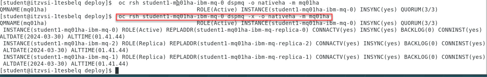

## Lab 1b - NativeHA Cross Region Replication: Deploying a Cloud Native HA Recovery IBM MQ Queue Manager for Cross region clusters

NativeHA: Deploying a container Native HA persistent IBM MQ Queue Manager on the Cloud Pak for Integration

[Return to MQ lab page](../index.md)

These instructions will document the process to deploy a NativeHA highly available Cross Region Replicated (CRR) IBM MQ on the Cloud Pak for Integration. 

A Native HA Cross Region Replication provides a replication of queue manager where the recoverable MQ data (for example, the messages)  are replicated across regions to a recovery instance of the Queue manager. 

The following figure shows a typical deployment with three instances of a queue manager deployed in three container and connected to another region running a queue manager with three containers.  


## Pre-reqs

You should have already downloaded the artifacts for this lab in the lab Environment Setup from [GitHub MQonCP4I](https://github.com/ibm-cloudintegration/mqoncp4i). 

You should have already completed the Lab 1a which created your live Queue Manager. 

### Important points to note

The lab guide assumes you are using the RHEL desktop VM from the IBM Asset Repo. If you are using another platform, you can download the necessary artifacts from the github repo. The instructor will provide directions.

**Note**: The screen shots were taken on a test cluster and many will not match what you see when running the lab. Particularly URL values will be different depending on the cluster where CP4I is running. Projects (Namespaces) may also vary. It is important to follow the directions, not the pictures.

## Deploy the Recovery MQ Queue Manager with associated resources on recovery cluster

1. Navigate to the *nativeha-crr* deploy directory with the following command and do the ls list command:

	```sh
	cd /home/ibmuser/MQonCP4I/nativeha-crr/deploy

	ls -ls
	```
	
1. You will see the yaml and scripts you used in lab 1a to create the nativeHA cluster in cluster1

	Now in this lab we will do the following steps to setup a recovery QMgr and enable both for CRR.  

	Last we will test the failover between the clusters for the nativeHA CRR.

	
	

	**Note:** You can use *gedit* or *vi* to look at the varies yaml templates but you don't need to change anything.   The scripts will take care of creating the yaml for your environment and apply to the cluster. 

1. Now from the deploy directory run the following command.  You will see that it will create your **Recovery QMgr on Cluster 2**.  

	Then do an ls -l command and you will see that the script created the yaml file.  

	```sh
	./2-recovery-deploy.sh

	ls -ls
	```

	
	
1. Now go to the OCP console for Cluster 2.  Under **Workload** select **Pods**

	**Note:** Make sure you are login with your student account and your namespace/project is for your account.  In this example we are showing **Student2**

	
	
1. Now select the *Terminal* tab and in the terminal window enter **dspmq**.

	You will see this is your Recovery group leader. 

	

1. Summary we now have our active Qmgr running in cluster 1 from lab 1a and now have the recovery QMgr running in cluster 2.  

	We will now continue to enable CRR on both QMgrs.  
	
## Enable the Active MQ Queue Manager and the Recovery MQ Queue Manager. 
This section we will now enable the CRR between the two nativeHA clusters.  This will get the hacrr route from the clusters and patch that to the QMgr. 

 1. Now from the deploy directory run the following command.  It will enable CRR on your live cluster. 

	This script will log in to the recovery cluster and get the **Host Name**.  This will be used to then patch the yaml for your active QMgr on the Live cluster.

	Then do an ls -l command and you will see that the script created the yaml file.  

	```sh
	./3-live-enable-crr.sh

	ls -ls
	```

	

1. Now from the deploy directory run the following command.  It will enable CRR on your recovery cluster.

	This script will log in to the Live cluster and get the **Host Name**.  This will be used to then patch the yaml for your recovery QMgr on the Recovery cluster.

	Then do an ls -l command and you will see that the script created the yaml file.  

	```sh
	./4-recovery-enable-crr.sh

	ls -ls
	```

	

1. Now sign in or go to tabs where you are logged into the OCP clusters 1 and 2.   We will run the following command to make sure the QMgr's are connected.   

	```sh
	dspmq -o nativeha -g
	```

1.	We will first check the Cluster 1 which should be your Active (Live) Qmgr.

	

1.	Now we will check Cluster 2 which should be your Recovery Group Qmgr.

	


## Switch MQ Queue Manager active status between both Clusters.
Now we will test a control failover from Live cluster to Recovery cluster. 

1. First we will open 2 new terminal windows and start the *sendMessage-CRR* script and the *getMessage-CRR* script.   These are setup to generate the CCDT table using both clusters. 

	
	```sh
	cd /home/ibmuser/MQonCP4I/nativeha-crr/test
	./sendMessage-CRR.sh 

	cd /home/ibmuser/MQonCP4I/nativeha-crr/test
	./getMessage-CRR.sh 
	```
	

1. This script was built to take care of signing into both clusters for you.  Run the following command and you will see that each cluster will be patched to the opposite state.

	When the QMgr is patched the pods will be restarted and you will see the getting and sending app disconnect and reconnect to the other cluster.
	
	```sh
	./5-switch-roles.sh
	```
	


## Viewing the status of Native HA queue managers 

You can view the status of the Native HA instances by running the dspmq command inside the active running Pod on each cluster.


1. Login to the OCP console for each cluster and see that the state of the QMgrs have changed. 

	This is Cluster 1 which was switched to **Recovery** so it now shows as **Recovery group leader**

	


1. This is Cluster 2 which was switched to **Live** so it now shows as **Running** 

	

## Congratulations

You have completed this lab nativeHA for MQ on CP4I.

		
[Continue to Lab 2](../Lab_2a/Readme.md)

[Return to MQ lab page](../index.md)

## Appendix A
	We will not test every possibility, but the following are possible displays to expect. Review the possibilities.

	* An active instance of the queue manager named **mq05ha** would report the following status:

			QMNAME(mq05ha)                 STATUS(Running)

	* A replica instance of the queue manager would report the following status:

			QMNAME(mq05ha)                 STATUS(Replica)

	* An inactive instance would report the following status:

			QMNAME(mq05ha)                 STATUS(Ended Immediately)

1. To determine Native HA operational status of the instance in the specified pod:

	```sh
	oc rsh student1-mq01ha-ibm-mq-0 dspmq -o nativeha -m mq01ha
	```
	
	
	
	We will not test every possibility, but the following are possible displays to expect. Review the possibilities.
	
	* The active instance of the queue manager named **mq05ha** might report the following status:

			QMNAME(mq05ha)               ROLE(Active) INSTANCE(inst1) INSYNC(Yes) QUORUM(3/3)

	* A replica instance of the queue manager might report the following status:

			QMNAME(mq05ha)               ROLE(Replica) INSTANCE(inst2) INSYNC(Yes) QUORUM(2/3)

	* An inactive instance of the queue manager might report the following status:

			QMNAME(mq05ha)               ROLE(Unknown) INSTANCE(inst3) INSYNC(no) QUORUM(0/3)

1. To determine the Native HA operational status of all the instances in the Native HA configuration:

	```sh
	oc rsh student1-mq01ha-ibm-mq-0 dspmq -o nativeha -x -m mq01ha
	```
	
	
	
	We will not test every possibility, but the following are possible displays to expect. Review the possibilities.
	
	* If you issue this command on the node running the active instance of queue manager **mq05ha**, you might receive the following status:

			QMNAME(mq05ha)			ROLE(Active) INSTANCE(inst1) INSYNC(Yes) QUORUM(3/3) 
				INSTANCE(mq05ha-ibm-mq-0) ROLE(Active)  REPLADDR(mq05ha-ibm-mq-0) 					CONNACTV(Yes) INSYNC(Yes) 					BACKLOG(0) CONNINST(Yes) ALTDATE(2021-01-12) ALTTIME(12.03.44) 
				INSTANCE(mq05ha-ibm-mq-1) ROLE(Replica) REPLADDR(mq05ha-ibm-mq-1) 					CONNACTV(Yes) INSYNC(Yes) 					BACKLOG(0) CONNINST(Yes) ALTDATE(2021-01-12) ALTTIME(12.03.44) 
				INSTANCE(mq05ha-ibm-mq-2) ROLE(Replica) REPLADDR(mq05ha-ibm-mq-2) 					CONNACTV(Yes) INSYNC(Yes) 					BACKLOG(0) CONNINST(Yes) ALTDATE(2021-01-12) ALTTIME(12.03.44)

	* If you issue this command on a node running a replica instance of queue manager **mq05ha**, you might receive the following status, which indicates that one of the replicas is lagging behind:

			QMNAME(mq05ha)			ROLE(Replica) INSTANCE(inst2) INSYNC(Yes) QUORUM(2/3)
				INSTANCE(mq05ha-ibm-mq-2) ROLE(Replica) REPLADDR(mq05ha-ibm-mq-2) 					CONNACTV(Yes) INSYNC(Yes) 					BACKLOG(0) CONNINST(Yes) ALTDATE(2021-01-12) ALTTIME(12.03.44) 
				INSTANCE(mq05ha-ibm-mq-0) ROLE(Active)  REPLADDR(mq05ha-ibm-mq-0) 					CONNACTV(Yes) INSYNC(Yes) 					BACKLOG(0) CONNINST(Yes) ALTDATE(2021-01-12) ALTTIME(12.03.44) 
				INSTANCE(mq05ha-ibm-mq-1) ROLE(Replica) REPLADDR(mq05ha-ibm-mq-1) 					CONNACTV(Yes) INSYNC(No)  					BACKLOG(435) CONNINST(Yes) ALTDATE(2021-01-12) ALTTIME(12.03.44)

	* If you issue this command on a node running an inactive instance of queue manager **mq05ha**, you might receive the following status:

			QMNAME(mq05ha)			ROLE(Unknown) INSTANCE(inst3) INSYNC(no) QUORUM(0/3)
			 	INSTANCE(mq05ha-ibm-mq-0) ROLE(Unknown) REPLADDR(mq05ha-ibm-mq-0) 					CONNACTV(Unknown) 							INSYNC(Unknown) BACKLOG(Unknown) CONNINST(No) ALTDATE() ALTTIME() 
				INSTANCE(mq05ha-ibm-mq-1) ROLE(Unknown) REPLADDR(mq05ha-ibm-mq-1) 					CONNACTV(Unknown) 							INSYNC(Unknown) BACKLOG(Unknown) CONNINST(No) ALTDATE() ALTTIME() 
			 	INSTANCE(mq05ha-ibm-mq-2) ROLE(Unknown) REPLADDR(mq05ha-ibm-mq-2) 					CONNACTV(No) 								INSYNC(Unknown) BACKLOG(Unknown) CONNINST(No) ALTDATE() ALTTIME()

	* If you issue the command when the instances are still negotiating which is active and which are replicas, you would receive the following status:

			QMNAME(mq05ha)              STATUS(Negotiating)