# Lab 2 - Streaming Queues for MQ

## Introduction

This lab demonstrates the Streaming Queue feature added to MQ in the 9.2.3.0 CD release.
Streaming Queues allow you to configure any local or model queue with the name of second named queue. This second queue is referred to as a Stream Queue. 

When messages are put to the original queue, a duplicate copy of each message is also placed on the stream queue. The Streaming Queue feature allows you to create a duplicate stream of messages which can be used for later analysis, logging, or storage without affecting the business applications using the original queue.
# Table of Contents

- [1. Introduction](#introduction)
  * [1.1 Setup your own MQ Payment environment](#Setup)
  * [1.2 Review the MQ environment.](#review)
  * [1.3 Clone and publish the Payment Messages to Event Streams.](#clone)

- [Recap](#recap)

- [Appendix A](#appendixa)
---

# 1. Introduction <a name="introduction"></a>

For this scenario, you will use a fictitious company **Focus Corp** who's integration team will be asked to exposes the enterprise’s data using event streams. This will allow application teams to subscribe to the data without impacting the backend system, decoupling development, and lowering risks.  The order management system and its payment gateway exchange customer orders over IBM MQ. 

# 1.1 Setup your own MQ Payment enviorment. <a name="Setup"></a>

1. We will first download the scripts to make it easy to setup your environment.  The following shows what  you will have.  You will have your payments coming it to the Order Managerment system using MQ and the Payment gateway will process the transactions. 

    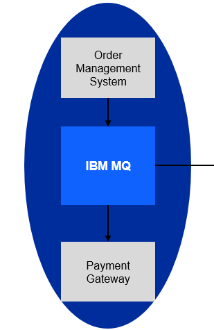

1. Now go to the github repo to download.

```
https://github.com/ibm-cloudintegration/mqandes
```

1. Click on **Code** drop down and select the **Download ZIP**

    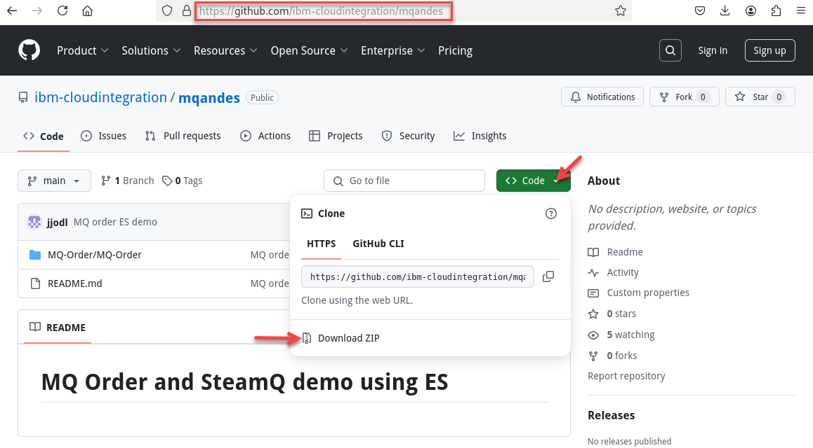

1.  Now go to the Download directory and run the following commands.   Once done you should be in */home/ibmuser/MQ-Order* directory.  

    ```
    cd ~/Downloads
    unzip mqandes-main.zip
    cd mqanddes-main
    mv MQ-Order ~/
    cd ~/MQ-Order
    find . -type f -iname "*.sh" -exec chmod +x {} \;
    ```
       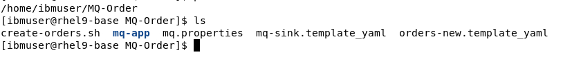

1.  Now we will run the create script that will build everything  

    **Note:** There is just one argument to pass which is your student id.   The screen shots will show us using **Student1**

    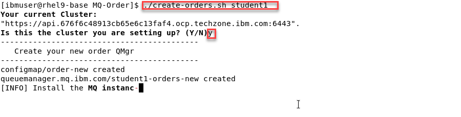
  
1. This will take about 5-10 minutes to build everything.   Leave the window open where you started the script.  You can go to the CP4I Platform Navigator to see that it is in progress. 

     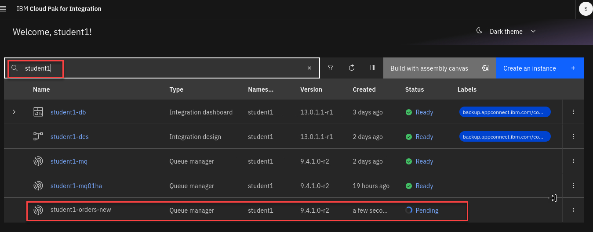

1. When the script is done the command window will look similar  to this.  

     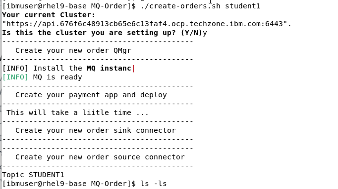

# 1.2 Review the MQ environment. <a name="review"></a> 

1. Now from the Platform Navigator search for your userid (ex: student1)

    Right click on the new Qmgr and open in a new tab.
   
    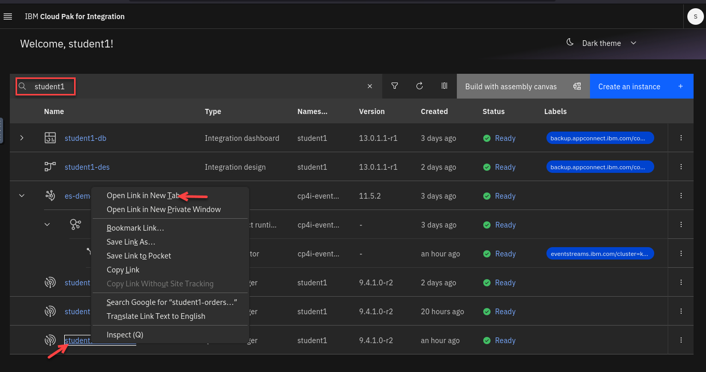
   
1. If you get worries like this click on advanced and accept the certificates.    
   
    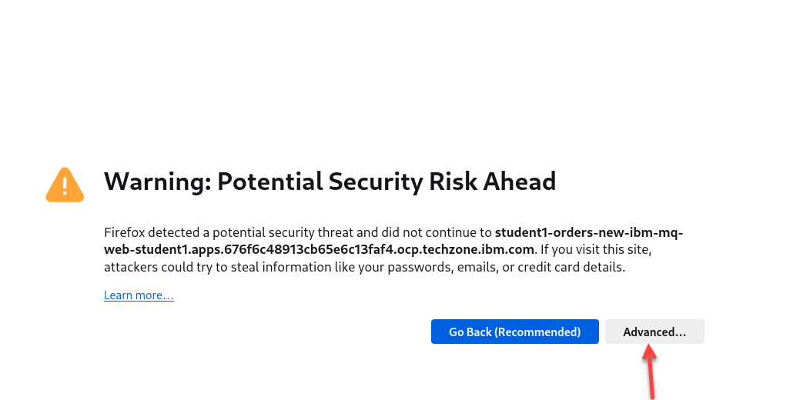

1. You are now on the MQ Console page for the new Qmgr (ex: student1ordersnew)

    Click on the tile.
   
    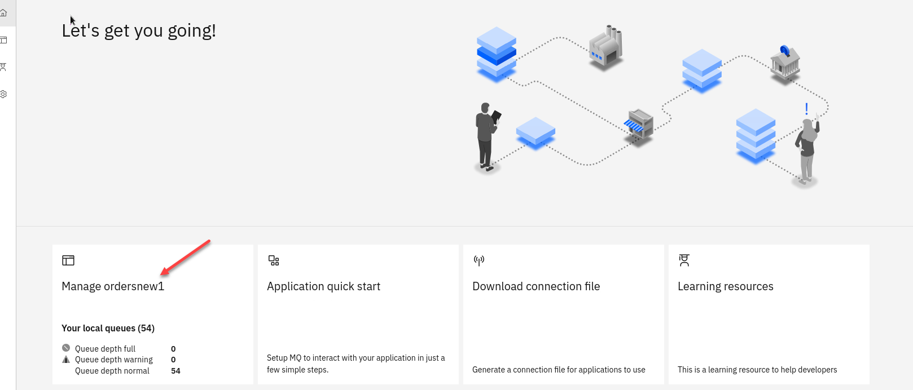

1. Here you will see all the details for your QMgr about queues, channels, connections, etc.  

    Click on **Queues**
   
    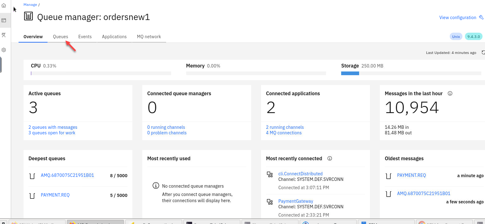

1. You will see your payment queues here.  You will notice that you will always have at least 5 messages on the payment queue.  That is the way we have the payment consuming app confiugred. 

    Click on the **PAYMENT.REQ** queue to see the messages to view details of the messages. 
   
    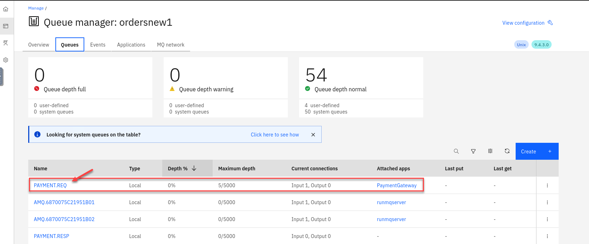

1. Click on one of the messages and review the application data.  
   
    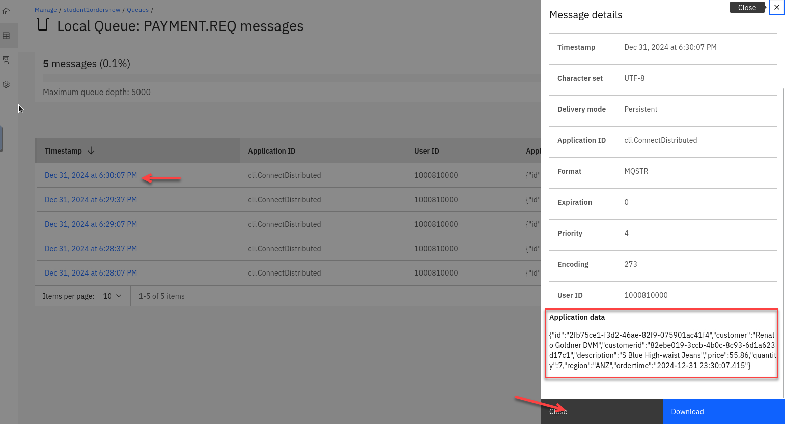

# 1.3 Clone and publish the Payment Messages to Event Streams. <a name="clone"></a> 

1. We have our MQ payments processing all running and now we will need to clone the messages and publish to Event Streams without impacting the current environment.  

    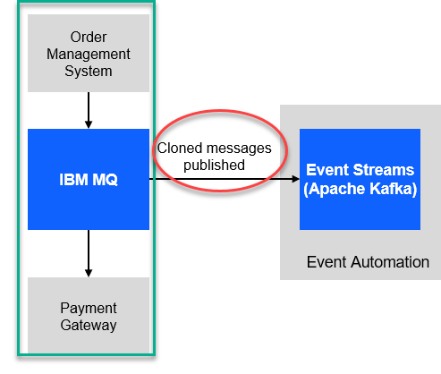

1. Now go to the MQ console for the orders QMgr and select **Queues** and click on **Create**

    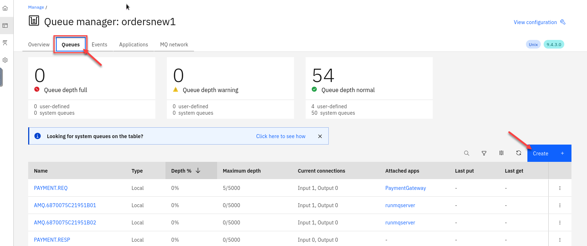

1. Select the tile for Local Queues and click **Next**

    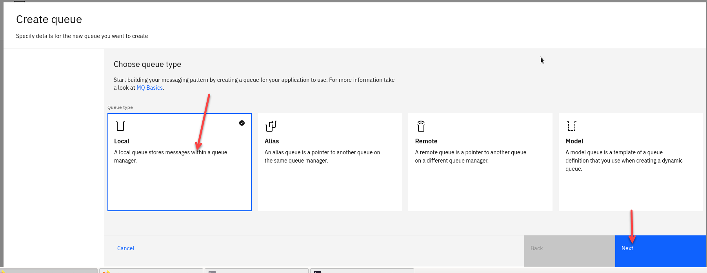

1. Now we will create our new StreamQ and call it **TO.KAFKA**.  

    Click **Create**  

    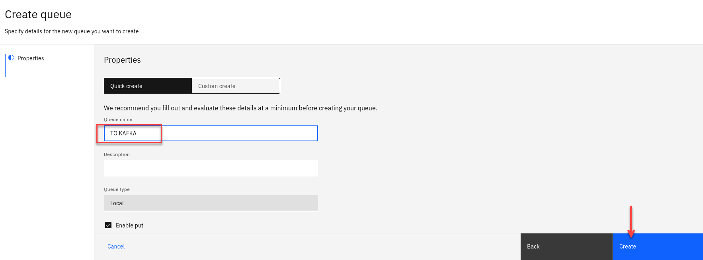

1. Now you will be back on the Queue page and will see your new queue **TO.KAFKA** you just created. 

    We will now update our **PAYMENT.REQ** queue to use the new queue as a streaming queue.

    Click **View configuration**

    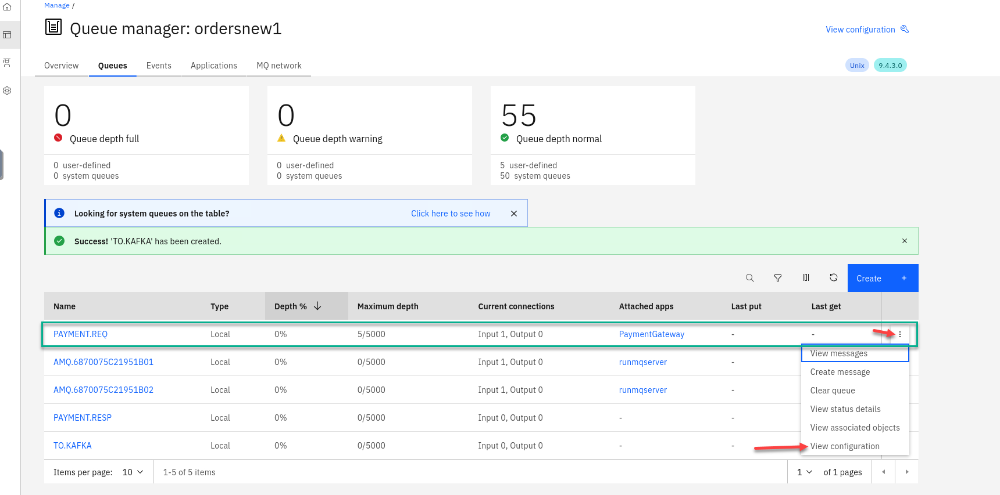

1. Now select **Edit** so we can update the PAYMENT.REQ config.

    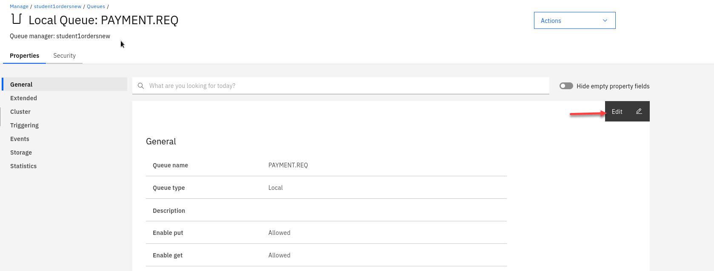

1. On the left hand menu select **Storage** and you will see the field for *Streaming queue name*

    Enter the streaming queue name **TO.KAFKA** and click on **Save**

    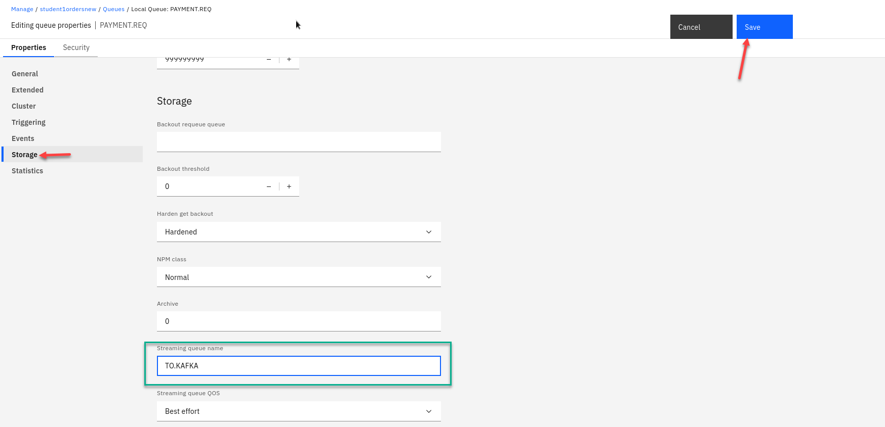

1. You will now be back on the MQ console page showing your queues.  You will now see messages being added to the new streamQ **TO.KAFKA**

    **NOTE:** The Qmgr takes care of this with no impact to are current processing of messages. 

    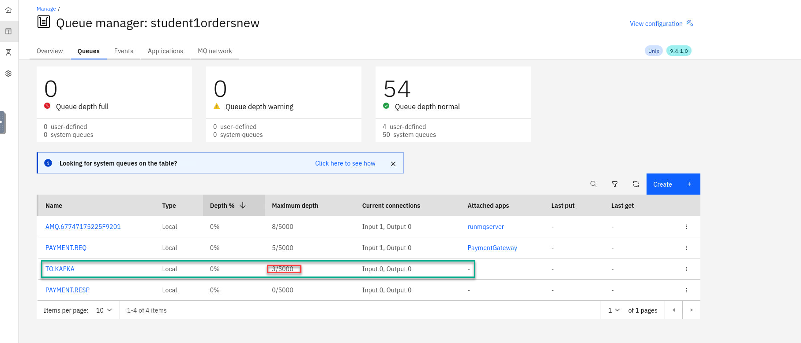

1. Last step now is to create our kafka source connector that will take messages from the **TO.KAFKA** queue and publish to Event Streams.

    You have two options for this:

    1. From the command line where you ran the **create-orders.sh** script there is a mq-source.yaml file.  
        You can run the following command but make sure you are login to the OCP cluster in order to run **oc* commands.
        ```
        oc apply -f mq-source.yaml
        ```
    1. The other option is open a **Import YAML** screen by clicking the **+** on the top menu.
    Then run the following command. 
        ```
        cat mq-source.yaml 
        ```
        copy the content and paste it into the OCP console and click **Create**

    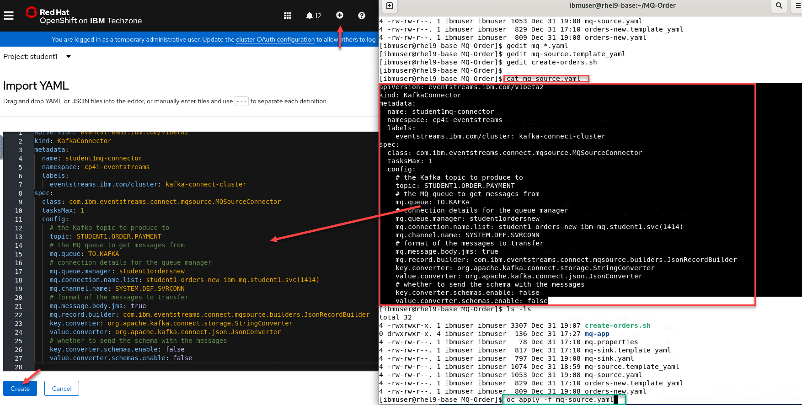

1. Now in the OCP console we can verify the source connector is running.  Go to **Installed Operators** and select **cp4i-eventstreams** project and click on **Kafka Connector**

    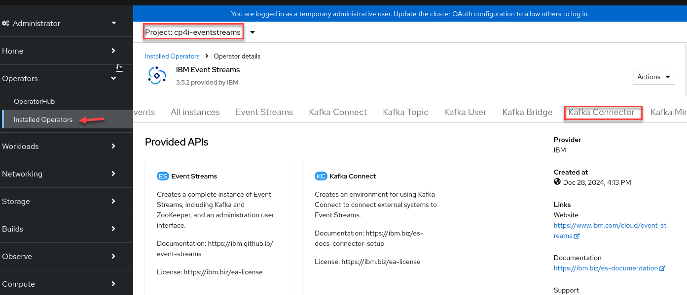

1. You should see your source connector and the sink connectors.

    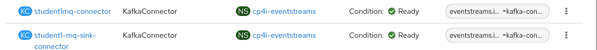

1. Now if you go back to your MQ Console for the ordersnew QMgr you will see that the current depth for the **TO.KAFKA** queue is zero.  Every time the **PAYMENT.REQ** queue gets a message it also goes to the **TO.KAFKA** queue and the source connector will take the message and publish to the Topic. 

    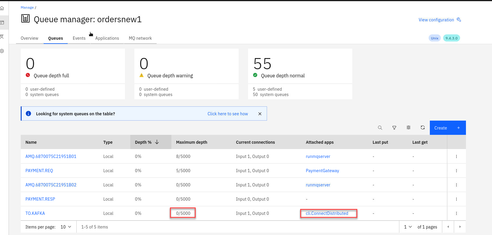

1. From the Platform Navigaotor *right click* on the **es-demo** and open in new tab. 

    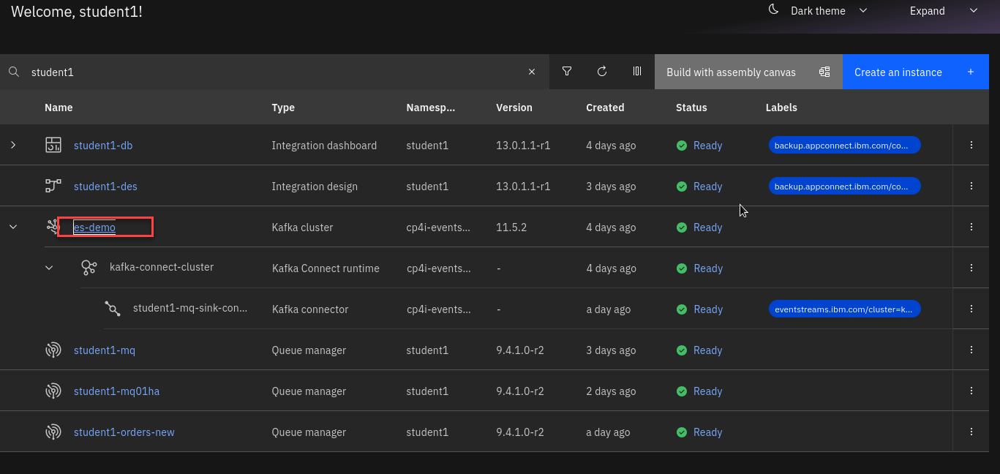

1. On the Event Streams page click on topics and search for your user id (ex: student1)

    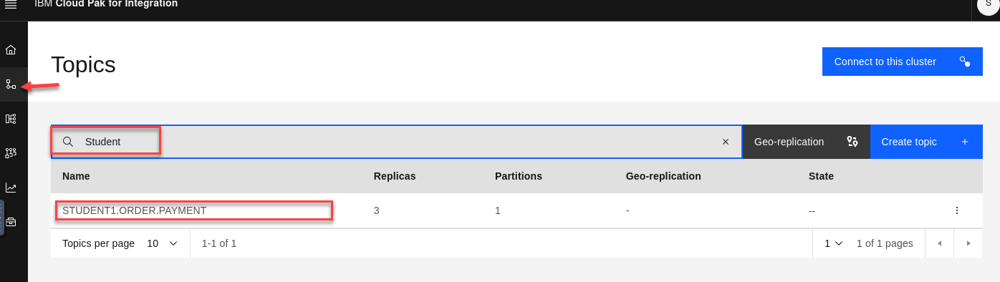

1. You will see the messages from your MQ queue being published to the topic.  Select a message to view the details. 

    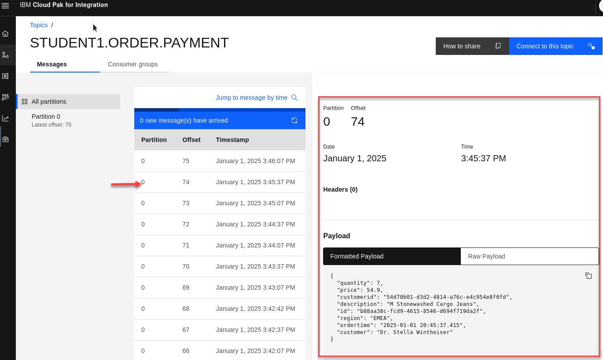


# Recap  <a name="recap"></a>

 So we have our **Order Management System** processing messages on MQ and we are also cloning them to kafka topic in Event streams.  
    In the <b> Event Automatnion Authoring Experience</b> there is a Event Processing lab to tap in to this new data. 

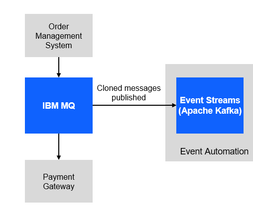

[Return to main Event processing lab page](../index.md#lab-abstracts)

# 1. Appendix A <a name="appendixa"></a>


## Topology overview for stream queues


The topology diagram shows the basic capability of stream queues. A regular local queue that is currently being used by MQ applications can be configured to stream a duplicate of every message put to that queue, to a second destination called a stream queue.

The streaming queues feature of IBM® MQ is configured by the administrator on individual queues, and the messages are streamed by the queue manager, not by the application itself.

This means that in almost all cases the application putting messages to the original queue is completely unaware that streaming is taking place. Similarly, the application consuming messages from the original queue is unaware that message streaming has taken place. 

**The version of the IBM MQ client library does not need upgrading to make use of streaming queues, and the original messages are completely unchanged by the streaming process.**

You can configure streaming queues in one of two modes:

* Best effort
    
    In this mode, the queue manager considers it more important that delivery of the original message is not affected by delivery of the streamed message. 
    If the original message can be delivered, but the streamed message cannot, the original message is still delivered to its queue. This mode is best suited to those applications, where it is important for the original business application to remain unaffected by the streaming process.
    
* Must duplicate
    
    In this mode, the queue manager ensures that both the original message and the streamed message are successfully delivered to their queues. 
    If, for some reason, the streamed message cannot be delivered to its queue, for example, because the second queue is full, then the original message is not delivered to its queue either. The putting application receives an error reason code and must try to put the message again. 

### Streamed messages

In most cases, the copy of the message delivered to the second queue is a duplicate of the original message. This includes all of the message descriptor fields, including the message ID and correlation ID. The streamed messages are intended to be very close copies of the original messages, so that they are easier to find and, if necessary, replay them back into another IBM MQ system.

There are some message descriptor fields that are not retained on the streamed message. The following changes are made to the streamed message before it is placed on the second queue:

* The expiry of the streamed message is set to MQEI_UNLIMITED, regardless of the expiry of the original message. If CAPEXPRY has been configured on the secondary queue this value is applied to the streamed message.
   
* If any of the following report options are set on the original message, they are not enabled on the streamed message. This is to ensure that no unexpected report messages are delivered to applications that are not designed to receive them:  

    * Activity reports
   * Expiration reports
   * Exception reports

Due to the near-identical nature of the streamed messages, most of the attributes of the secondary queue have no affect on the message descriptor fields of the streamed message. For example, the DEFPSIST and DEFPRTY attributes of the secondary queue have no affect on the streamed message.

The following exceptions apply to the streamed message:

* CAPEXPRY set on the CUSTOM attribute

    If the secondary queue has been configured with a CAPEXPRY value in the CUSTOM attribute, this expiry cap is applied to the expiry of the streamed message.
   
* DEFBIND for cluster queues

    If the secondary queue is a cluster queue, the streamed message is put using the bind option set in the DEFBIND attribute of the secondary queue.

### Streaming queue restrictions

Certain configurations are not supported when using streaming queues in IBM® MQ, and these are documented here.

The following list specifies the configurations that are not supported:

* Defining a chain of queues streaming to each other, for example, Q1->Q2, Q2->Q3, Q3->Q4
* Defining a loop of streaming queues, for example, Q1->Q2, Q2->Q1
* Defining a subscription with a provided destination, where that destination has a STREAMQ defined
* Defining STREAMQ on a queue configured with USAGE(XMITQ)
* Modifying the STREAMQ attribute of a dynamic queue
* Setting STREAMQ to any value that begins SYSTEM.*, except for SYSTEM.DEFAULT.LOCAL.QUEUE
* Defining STREAMQ on any queue named SYSTEM.*, with the following exceptions:
        
  * SYSTEM.DEFAULT.LOCAL.QUEUE
  * SYSTEM.ADMIN.ACCOUNTING.QUEUE
  * SYSTEM.ADMIN.ACTIVITY.QUEUE
  * SYSTEM.ADMIN.CHANNEL.EVENT
  * SYSTEM.ADMIN.COMMAND.EVENT
  * SYSTEM.ADMIN.CONFIG.EVENT
  * SYSTEM.ADMIN.LOGGER.EVENT
  * SYSTEM.ADMIN.PERFM.EVENT
  * *SYSTEM.ADMIN.PUBSUB.EVENT
  * SYSTEM.ADMIN.QMGR.EVENT
  * SYSTEM.ADMIN.STATISTICS.QUEUE
  * SYSTEM.DEFAULT.MODEL.QUEUE
  * SYSTEM.JMS.TEMP.QUEUE

* Setting STREAMQ to the name of a model queue

### Stream queues and transactions

The streaming queues feature allows a message put to one queue, to be duplicated to a second queue. In most cases the two messages are put to their respective queues under a unit of work.

If the original message was put using MQPMO_SYNCPOINT, the duplicate message is put to the stream queue under the same unit of work that was started for the original put.

If the original was put with MQPMO_NO_SYNCPOINT, a unit of work will be started even though the original put did not request one. This is done for two reasons:

1. It ensures the duplicate message is not delivered if the original message could not be. The streaming queues feature only delivers messages to stream queues if the original message was also delivered.
    
1. There can be a performance improvement by doing both puts inside a unit of work

The only time the messages are not delivered inside a unit of work is when the original MQPUT is non-persistent with MQPMO_NO_SYNCPOINT, and the STRMQOS attribute of the queue is set to BESTEF (best effort).

**The additional put to the stream queue does not count towards the MAXUMSGS limit.  In the case of a queue configured with STRMQOS(BESTEF), failure to deliver the duplicate message does not cause the unit of work to be rolled back.**

### Streaming to and from cluster queues

It is possible to stream messages from a local queue to a cluster queue and to stream messages from cluster queue instances to a local queue.

#### Streaming to a cluster queue

This can be useful if you have a local queue where original messages are delivered, and would like to stream a copy of every message to one or more instances of a cluster queue. This could be to workload balance the processing of the duplicate messages, or simply to have duplicate messages streamed to another queue elsewhere in the cluster.

When streaming messages to a cluster queue, messages are distributed using the cluster workload balancing algorithm. A cluster queue instance is chosen based on the DEFBIND attribute of the cluster queue.

For example, if the cluster queue is configured with DEFBIND(OPEN), an instance of the cluster queue is chosen when the original queue is opened. All duplicate messages go to the same cluster queue instance, until the original queue is reopened by the application.

If the cluster queue is configured with DEFBIND(NOTFIXED), an instance of the cluster queue will be chosen for every MQPUT operation.

**You should configure all cluster queue instances with the same value for the DEFBIND attribute.**

#### Streaming from a cluster queue

This can be useful if you already send messages to several instances of a cluster queue, and would like a copy of each message to be delivered to a streaming queue, on the same queue manager, as the cluster queue instance.

When the original message is delivered to one of the cluster queue instances, a duplicate message is delivered to the stream queue by the cluster-receiver channel.

[def]: #appendixa