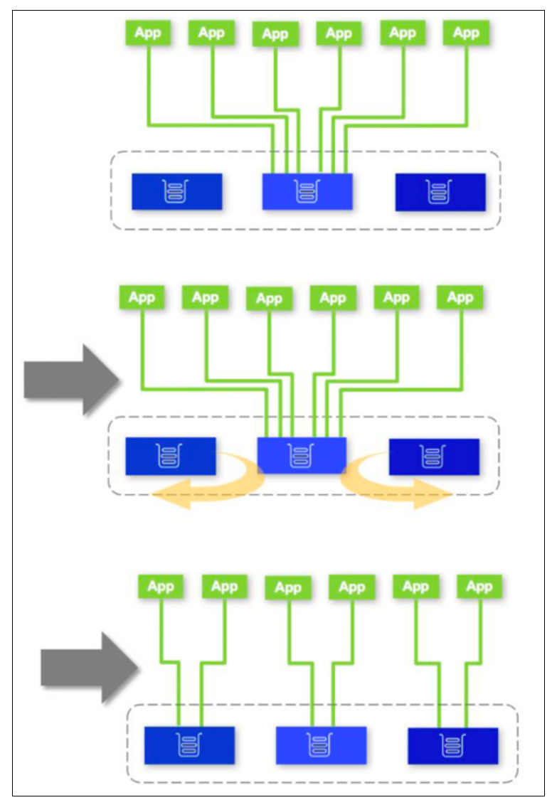
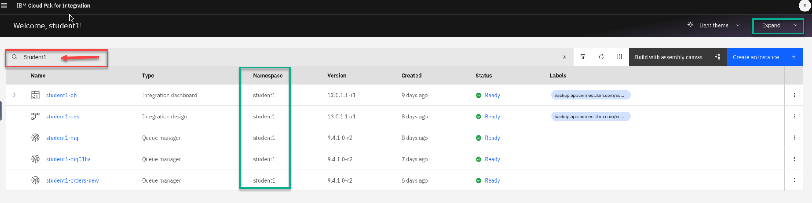
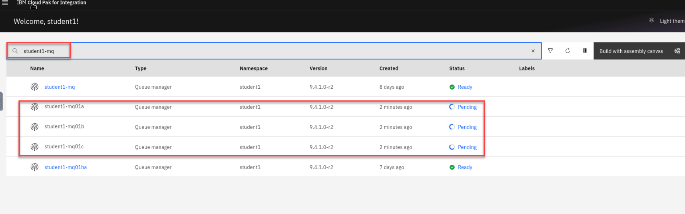
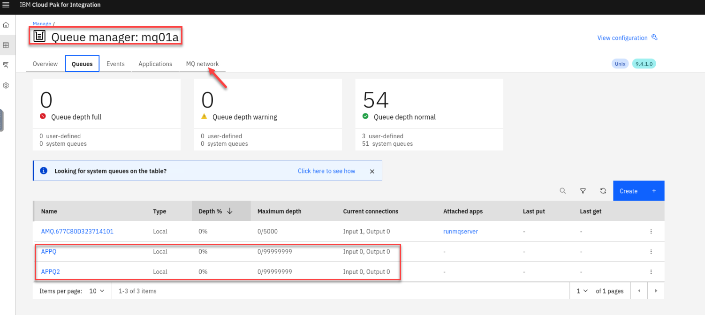
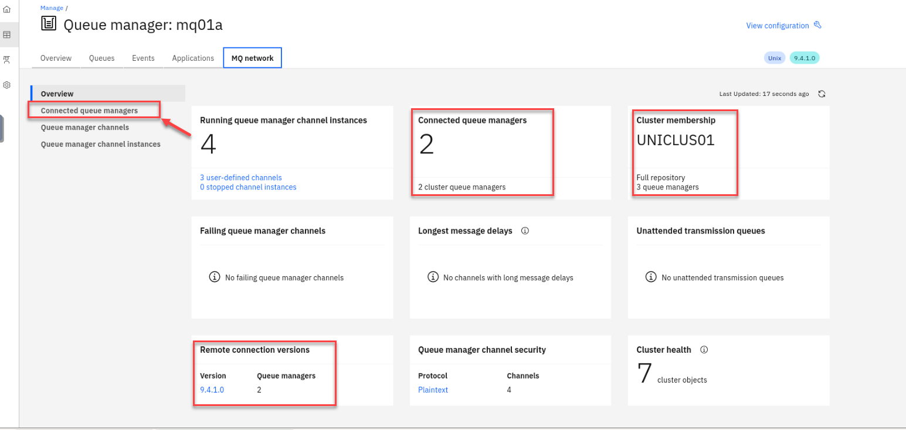
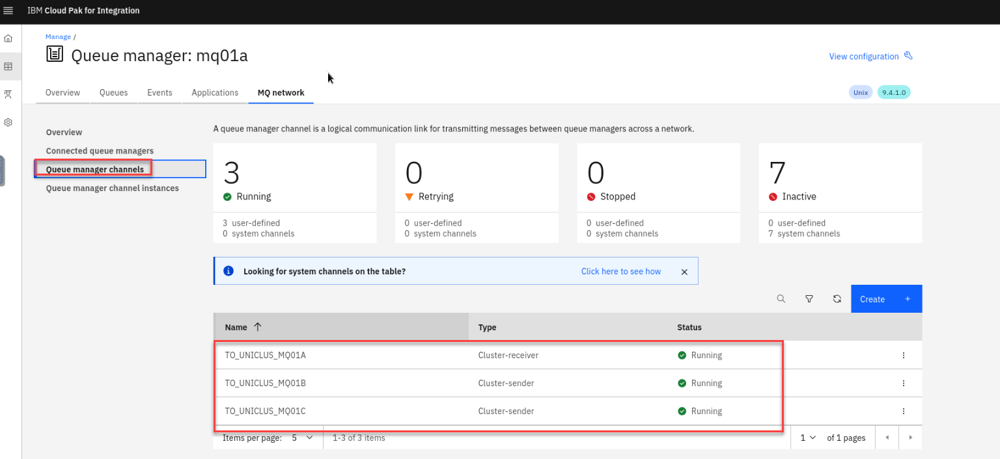
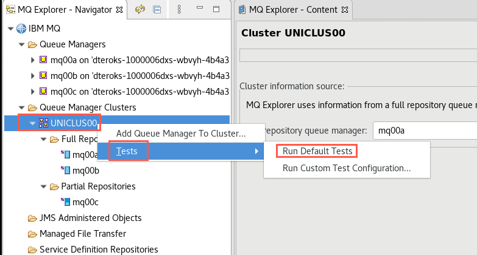

# Lab 3 - MQ Uniform Cluster on CP4I 

Featuring:

 * Creating a Uniform Cluster
 * Application Rebalancing
 * Application Rebalancing & Queue Manager Outage
 * Metrics
 * Using CCDT Queue Manager Groups

## Introduction

This lab introduces MQ Uniform Cluster and Application Rebalancing as of MQ 9.2 code level. The lab can be run on any IBM Cloud environment running RedHat OpenShift 4.6 or above with IBM Cloud Pak for Integration (CP4I) 2020.4.1 or above.

In this lab, you will:

* Create a Uniform Cluster quickly using yaml configuration files consisting of three identical queue managers
* Run re-connectable sample applications to a queue manager within the Uniform Cluster to show automatic rebalancing of the apps to other queue managers in the Uniform Cluster

	

* Stop then restart a queue manager with connected apps to show automatic application rebalancing to remaining running queue managers in the Uniform Cluster
* Report resource usage metrics for the applications, introduced in MQ 9.1.5.
* Connect an application to a Queue Manager Group instead of a queue manager

### Pre-reqs

You should have already downloaded the artifacts for this lab in the lab Environment Setup.

If you are doing this lab out of order return to [Environment Setup](../envsetup/mq_cp4i_pot_envsetup.md) to perform the download. Then continue from here.

#### Important points to note

The lab guide assumes you are using the RHEL desktop VM from the IBM Asset Repo. If you are using another platform, you can download the necessary artifacts from the github repo. The instructor will provide directions.

## Configure the cluster using yaml

1. Open a Firefox web browser by double-clicking the icon on the desktop.

	
	
1. Navigate to the URL for the OCP console provided in your PoT email. If required to log in use the userid / password provided in the email.

	

	

1. Then add another browser tab by clicking the "+" sign and opening the *CP4I Navigator* URL for the platform navigator provided in your PoT email.

	

1. You may still be logged in from the previous labs. If your platform navigator session timed out, you may be required to log-in again.

	
	
1. If you ran the *Cleanup* step in prior labs there should be none of your queue managers running. However there may be other's instances running. 

	**Note:** You can use the search option to show just your instances in your student namespace. *(ex: student1)*
	<br>Also in the upper right corner you can collapase the top part of the screen. 

	
	

1. Open a new terminal window by double-clicking the icon on the desktop.

	

1. Navigate to the */MQonCP4I/unicluster/* directory using the following commnand:
	```
	cd ~/MQonCP4I/unicluster/deploy
	```
	1. *unicluster.yaml_template* contains the yaml code to define a cluster.
	1. *uni-install.sh* is a shell script which contains environment variables using your student ID and copies *unicluster.yaml_template* to *unicluster.yaml* and runs the openshift command to apply the definitions.
	1. *uni-cleanup.sh* is another shell script containing environment variables with your student ID and commands to delete your queue managers and related artifacts when you are finished. 

	
	

1. Review the yaml template file.  Scan through the template which has definitions for all three queue managers. Your environment variables will be substituted throughout the file. If you execute a find for "$" you can easily locate the substitutions. 

	Each queue manager has two *ConfigMap* stanzas, one *QueueManager* stanza, and one *Route* stanza. One *ConfigMap* is the mqsc commands for the queue manager - **uniform-cluster-mqsc-x** and one for the cluster ini file - **uniform-cluster-ini-x**.
	
	The queue managers share the same secret - lines 1 - 9.
	Queue manager **mqxxa** is defined on lines 11 - 116.
	Queue manager **mqxxb** is defined on lines 118 - 223.
	Queue manager **mqxxc** is defined on lines 225 - 325.	
	
	
	Pay particular attention to the mqsc commands which define the cluster repository queue managers and the cluster channels. 
		
1. You should still be logged into the OpenShift environment. Click on your username on the top right menu of the OpenShift Console, then click on *Copy Login Command*. 

	

1. A new tab will be opened.  Login with your username/password Click *Display Token*, copy the token and run it on your terminal.
	
		
	**Note**: You should still be in your project so you shouldn't need to run this command.
	
	Run the following command to navigate to your project substituting your personal project name:
	
	```
	oc project student1
	``` 

1. Now we will run the install script for the unicluster Qmgrs **./uni-install.sh** 
	
	Review the output from the script.  You should see 3 Qmgrs created with all required assets. 
	
	
	
1. Return to the *Platform Navigator* web browser page. In *Integration Instances* click the *Refresh* button. 
The queue managers will be in a *Pending* state for a couple of minutes while they are provisioned.
 
 	

1. After a few minutes the queue managers will then show *Ready* on the *Platform Navigator* and the pods will show *Running* on the *OpenShift Console*.

 	

## Check uniform cluster health

If you like you can go to **Appendix A** which has directions for testing Uniform cluster using **MQExplorer**

But with all the new features that have been added to the **MQ Console** you can verify the cluster using the MQ console.  This section will hightlight the MQ console.

1. Your cluster is also now completely configured. Check this from the *MQ Console* of one of three queue managers. Right click the hyperlink for your **mq..a** QMgr and open in new tab

	
	
1. You will be presented with a warning pop-up. Click *Advanced*, then scroll down and click *Accept the Risk and Continue*.

	

1. In the *MQ Console* click *Manage mq00a*. Of course your queue managers are different, 00 being replaced by your student ID.

	
	
1. You are now on the Overview page.  You will see varies information regarding your QMgr.  

	Click on the **Queue** tab now.

	

1. You will see the two local queues **APPQ** and **APPQ2** which were defined by the mqsc *ConfigMap* defined in the yaml template. The other queue managers also have the queues by that name.

	Next Click on the **MQ network** tab

	

1. Now on the **MQ network** page we see that we have 2 cluster queue mangers connected, and this Qmgr is a full repository for the Cluster.
You will also see the other QMgr versions. 

	Click on the **Connected queue managers** channel instances. 

	
	
1. Here you will see the connected queue manager names and status. 

	Next click on the **Queue manager channel**
	

1. Here you find your cluster channels. If you looked closely at the yaml template, you'll remember that your *mqxxa* and *mqxxb* are the primary repositories for your cluster *UNICLUSxx*. While looking at *mqxxa* you see a cluster receiver channel **TO_UNICLUS_MQ00A** and two cluster sender channels **TO_UNICLUS_MQ00B** and **TO_UNICLUS_MQ00C**. They should be *Running*. 
	
	

1. You can check the other queue manager's console to verify that they are all configured the same. 

	You are all set, time for testing.

## Using CCDT Queue Manager Groups to test 

We could connect our getting applications to *mqxxa* directly, and relied on the Uniform Cluster to rebalance them across the other queue managers over a period of time. There are 2 disadvantages to connecting in this way:

* When the applications initially connect, they all start out connected to *mqxxa* and there is a delay in the Uniform Cluster balancing them across the other queue managers
* If *mqxxa* is stopped unexpectedly or for maintenance, any applications connected to it will try to reconnect to *mqxxa* and fail. They will not attempt to connect to the other queue managers in the cluster. This will also be true if applications connected to other queue managers try to reconnect after an outage.

For testing our cluster we shall see that by using Queue Manager Groups within our CCDT file we can decouple application instances from a particular queue manager and take advantage of the built-in load balancing capabilities available with CCDTs.

1. In the classroom environment, We have a ccdt.json_template file that we will use to create the ccdt.json for the testing.  There is an update script that will update the clientConnection name depending on your student number and will pull the host from OCP.

	1. ```cd ../test``` or ```cd /home/ibmuser/MQonCP4I/unicluster/test/```

	1. Run the update script ```./update-ccdt.sh```
		You will need to pass in your *Student number* and *Namespace*

	1. Then edit the new ccdt.json file.   
		The *host* is updated for each Qmgr and the clientConnection name.  Also for the queueManager name it will have *ANY_QM.
		
		values for each queue manager as you did in the *ccdt.json* file. There are 8 hosts parameters to change. As well as containing the original set of direct references to the queue managers, it gives a queue manager group definition with a route to all queue managers using the name **ANY_QM**.
	1. We also have two new attributes:
		* **clientWeight**: a priority list for each client. The default value is zero. A client with a higher clientWeight will be picked over a client with a smaller value.
		* **affinity**: setting the affinity to “none” will build up an ordered list of group connections to attempt to try in a random order, for any clients on a particular named host.
	
	When done click the **X** to close the editor without making changes.

	 

1. Now let’s put the updated CCDT to the test.

	To make it easier to visaluze this we will create both *getter* and *putter* monitors that will show the counts of connected apps.

	 
		
1. Now to make it easier to look at all these terminals you should resize them and move them around.   Should look something like this.

	You will have a getter and putter monitor for each of the three QMgrs.  

	Do a quick test by running ```./getMessage.sh``` You will see one of the Qmgrs getters update.  When done do CTL-C

	 
	

1. Open a new terminal window using the menu bar.

	

1. In the new terminal click the plus **+** to create a new tab and make sure both tabs are in the ```/home/ibmuser/MQonCP4I/unicluster/test/```

	This terminal will be used for the sending applactions.  The other terminal window will be for the getting applications.   Arrange them like this. 

	


	
1. Now from the **Getter** terminal we will start six new tabs each running a getting application *amqsghac* using *ccdt.json*. 

	Run ```./start-get-tabs.sh```

	You will see six new tabs created on your terminal each running the *amqsghac* program.  You can click on those tabs and observe the behavior as the queue managers rebalance the connections. 
	
	Watch the **Getter** windows running the *GETTER Apps*.  Eventually, the applications are evenly distributed across the queue managers.

	Return to the first tab where you ran the *./start-get-tabs.sh*
	
	 
	
1. Now from the **Putter** terminal we will start the putting application *amqsphac* using *ccdt.json*. 

	Run ```./sendMessage.sh```

	Watch the **Putter** windows running the *PUTTER Apps*.  You will see which QMgrs the putting applications are connected.

	Repeat this on the other tab you have opened.

	You can also view the varies *GetMsg tabs*. You will see the generated messages split across the getting application sessions that are running. Each tab will contain a subset of messages.
	
	 	

	
1. Now let's say that the getting apps can't keep up with the load.  We can easily create more getting apps to process the workload.Open one more terminal window and run the following command:

	```
	./rClient.sh
	```
	This will start six more clients in the background and you will see the messages that window is receiving.	

	Watch the **Getter** windows running the *GETTER Apps*.  Eventually, the applications are evenly distributed across the queue managers.
	
		
	
## Queue Manager maintenance

In this scenario, imagine a queue manager needs to be stopped for maintenance purposes. We shall demonstrate how doing this will cause the applications running on that queue manager to run instead on the remaining active queue managers in the Uniform Cluster. Once the maintenance is complete, the queue manager will be re-enabled.

1. Return to the OpenShift Console tab in the web browser. You should still be in your *studentx* Project. Click the drop-down for *Workloads* and select *pods*. Filter on your **student-mq** queue managers.  

	You should see your three unicluster QMgrs.
	
	
1.	To simulate taking down a QMgr we will simply delete the running Pod which OCP will restart for us.  While this is down the putter and getter applications running on that QMgr will rebalance for us.  

	Select a QMgr where you have one of the sender applications running. In this screen shot we select mq01a.  
	
	Click on the 3 dots and click on **Delete Pod** 

		

1. In the pop-up window click **Delete**
		

1. You will now see the **Pod** you just deleted in a Terminating state.  You will also see in your sender window the application reconnecting.  In the Putter and Getter connection monitoring terminals you will see that the QMgr we stopped is zero connections and the other two QMgrs will rebalance the load.  

	

1. Once you see in the OCP console the QMgr is restarted you will see the sender sending messages again.  ALso you will see the Putter and Getter connection monitoring terminals that the connections are now rebalanced and you should see the sender has moved QMgrs.

	You have completed this lab Uniform Clusters and Application Rebalancing.

	

1. You can now in both sender terminals do CTL-c to stop the senders. You will see the Putter connection monitoring terminals showing no more connections. 

	

1. Now in the sender terminal run the ```./killall.sh``` command to terminate  all getter applications.  You will see all the **Get Tabs** close in the one terminal and will also see the Getter connection monitoring terminals showing no more connections.

## Congratulations

You have completed this lab Uniform Clusters and Application Rebalancing.

[Return to MQ lab page](../index.md#introduction)

# Appendix A
Perform health-check on Uniform Cluster using MQExplorer

1. Open a new terminal window.
 
 Enter the following command to start MQ Explorer making sure to use the correct case:

	```
	MQExplorer
	```
	
 

1. When the utility is ready, right-click *Queue Managers* and select *Add Remote Queue Manager*.

	

1. Enter your queue manager name using your student ID. Click *Next*.

	

1. We will now need to get the hostname for this Qmgr to connect to it outside the OCP cluster to MQExplorer.   
Run the following command 

```
oc get route -n melch1 | grep mq01a
```
Copy the hostname 
	

*	Enter the value from the *hostname* above. 
*	Enter **443** for the *Port number*.
*	Enter your SVRCONN channel name in the *Server-connection channel* field.
	
	**Note** for the uniform cluster lab do not click the checkbox for Multi-instance queue manager.
	
	Click *Next* three times.
	
	
	
	[For more information refer to KnowledgeCenter](https://www.ibm.com/support/knowledgecenter/SSFKSJ_9.1.0/com.ibm.mq.ctr.doc/cc_conn_qm_openshift.htm)
		
1. Click the checkbox for *Enable SSL key repositories*. Click *Browse* and navigate to */home/ibmuser/MQonCP4I/tls* and select **MQExplorer.jks**. Then click *Open*.

	
	
1. Click the *Enter password* button and enter the jks password **'password'**. Click *OK* then *Next*.

	
	
1. On the next screen click the checkbox for *Enable SSL options*. Click the drop-down next to *SSL CipherSpec* and select **ANY_TLS12_OR_HIGHER**.

	
	
1. Click *Finish*. You will get a pop-up saying "Trying to connect to the queue manager".

	
	
1. After a few seconds you see that MQ Explorer has connected. The Queue Manager will be added and shown in the navigator.

	
	
1. Operate MQ Explorer as you normally would. Expand the queue manager and "explore" MQ looking at queues, channels, etc.

	


**You now have the hosts to connect to the QMgrs Connect all 3 Qmgrs in MQExplorer**

1. Expand *Queue Manager Clusters* to confirm that queue managers **mqxxa** and **mqxxb** have full repositories, while **mqxxc** has a partial repository.

	
	
1. You observed the cluster channels in the MQ Console, but you can verify them in MQ Explorer also. Since *mqxxc* is a partial repository, it has two cluster sender channels, one to each full repository.

	

1. Check that Cluster Sender and Receiver Channels for each queue manager are running and if not, start them.

	

	**Note**: the Server Connection Channels will be inactive – do not attempt to start these.
	
1. Right-click you cluster name and select *Tests* > *Run Default Tests*.
	
	
	
1. Check that there are no errors or warnings resulting in the *MQ Explorer - Test Results*.

	