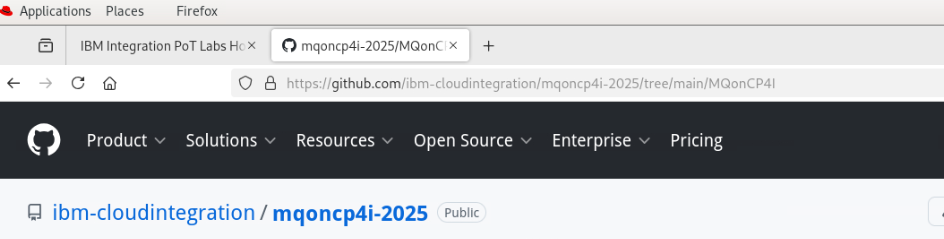
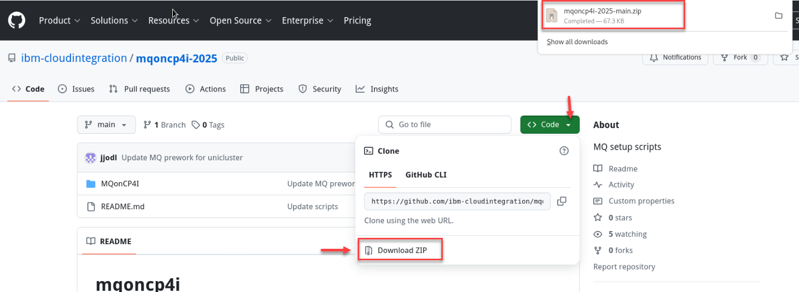
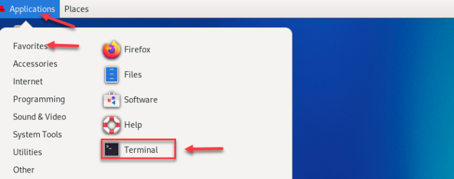

# Setup environment for MQ PoT

[Return to MQ lab page](../../index.md)

<a name="download"></a>	
## Download artifacts for MQ on CP4I PoT

You should be logged on your VDI as *ibmuser*.

1. Open a Firefox browser tab and navigate to [Github MQonCP4i](https://github.com/ibm-cloudintegration/mqoncp4i-2025).

	
	
1. Click *Code* and select *Download zip*.

	
	
1. Open a terminal window by clicking on the **Application** on top menu and under **Favorites** click the icon for **Terminal**.

	
	
1. Enter the following command to see the zip file you just downloaded.

	```
	cd Downloads
	```
	
1. Enter the following command to unzip the downloaded file:

	```
	unzip mqoncp4i-2025-main.zip
	```
	
1. Change to the main directory of the zip file you unzipped.
<br>

	x`Move the unzipped directory to your home directory with the following command:
	
	```
	cd mqoncp4i-2025-main
	```
	
	```
	mv MQonCP4I/ ~/
	```
	
	```sh
	cd ~/MQonCP4I
	ls -l
	```

1. Now we will need to change the mode to executable for all the scripts.  From the MQonCP4I directory run the following command.

	```
	find . -type f -iname "*.sh" -exec chmod +x {} \;
	```

1. Now we will run the script that will create all the install scripts for your userid. <br>

	```
	./MQ_setup.sh
	-i \<your student number\>
	-n \<your openshift student namespace\>
	```

	<b>Example: If I am student2 I would do this.
<br>
./MQ_setup.sh -i 2 -n student2

<br>
<br>


Great! You are now ready to start working in the MQ and Kafka labs.

[Return to MQ lab page](../../index.md)