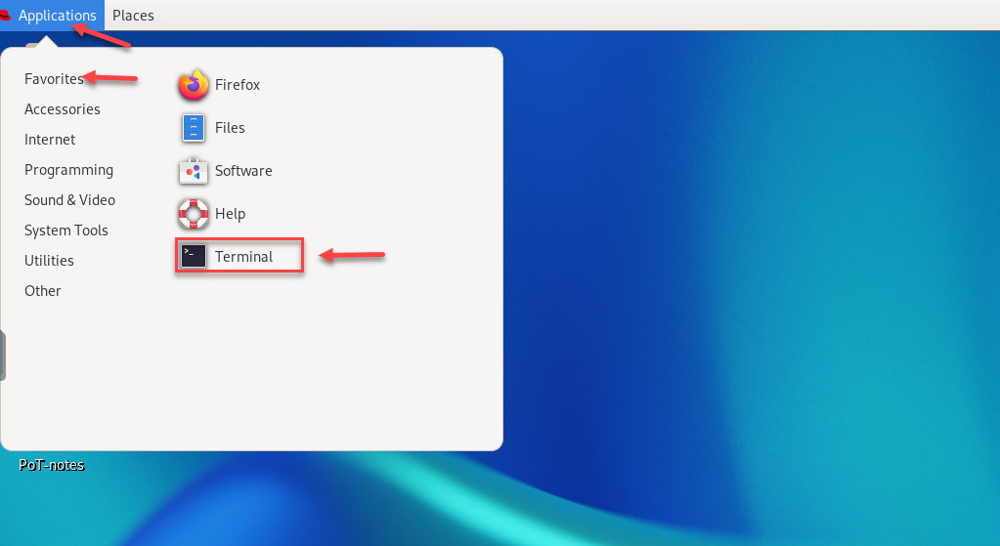
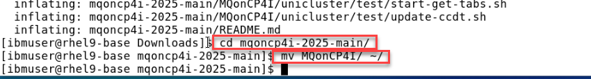

# Setup environment for MQ PoT

[Return to MQ lab page](../../index.md)

<a name="download"></a>	
## Download artifacts for MQ on CP4I PoT

You should be logged on your VDI as *ibmuser*. 

1. Open a Firefox browser tab and navigate to [Github MQonCP4i](https://github.com/ibm-cloudintegration/mqoncp4i-2025).

	
	
1. Click *Code* and select *Download zip*.

	
	
1. Open a terminal window by clicking on the **Application** on top menu and under **Favorites** click the icon for **Terminal**.

	
	
1. Enter the following command to see the zip file you just downloaded.

	```
	cd Downloads
	```
	
1. Enter the following command to unzip the downloaded file:

	```
	unzip mqoncp4i-2025-main.zip
	```
	
	
	
1. Move the unzipped directory to your home directory with the following command:
	
	```
	cd mqoncp4i-2025-main
	```
	
	```
	mv MQonCP4I/ ~/
	```
	
	 
	
	This will create the directory **/home/ibmuser/MQonCP4I**.  Change to your home directory and list the contents of the directory to verify that it contains *MQonCP4I*. 
	
	```sh
	cd ~/MQonCP4I
	ls -l 
	```
1. Now first we will need to update the setup.properties file with cluster info so that the scripts will be able to login to the correct clusters. 
Enter the following command to edit file.

	```
	gedit setup.properties
	```

	

	1. Update *OCP Cluster 1* with the primary cluster URL.  
	
		If you are going to do the MQ NativeHA CRR labs you will have a second cluster so update the *OCP Cluster 2* with that cluster URL.     

	1. 	Update the OCP CLUSTER USER and PASSWORD with the ones provide to you.  This will be the same for both clusters. 

	1. Select **Save**   

1. Now we will need to change the mode to executable for all the scripts.  From the MQonCP4I directory run the following command.

	```
	find . -type f -iname "*.sh" -exec chmod +x {} \;
	```

1. Now we will run the script that will create all the install scripts for your userid. ```./MQ_setup.sh```  

	1. 	When you run the MQ_setup.sh You will use your student id that was given to you from the instructor.

		**Note:** In this example we are user student1 so would use that as the namespace and 01 as the student id.
	1. If will ask if this is correct.  enter **Y**

	
	
Great! You are now ready to start working in the MQ and Kafka labs. 

[Return to MQ lab page](../../index.md)