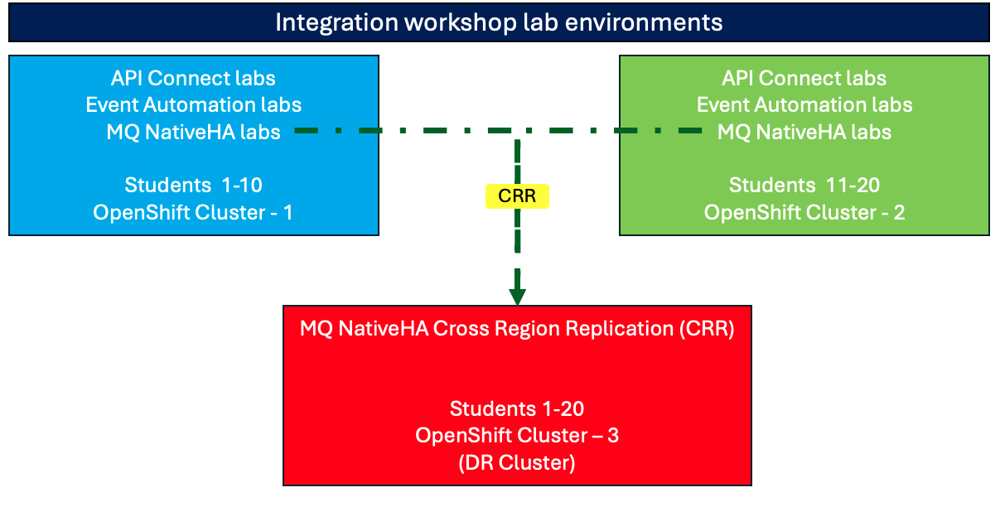

[//]:

[//]:

**What is a Proof of Technology?**

Proof of Technology sessions are complimentary classes to build
understanding of IBM technology and software with practical
presentations and hands-on lab exercises. 

We will cover all the various components that are part of Cloud Pak for Integration. We will also discuss how these components can be used in combination. The following are the varies areas depending on your interest.

*  **IBM App Connect**
*  **IBM API Connect**
*  **IBM DataPower Gateway**
*  **IBM Event Streams**
*  **IBM MQ Advanced**
*  **IBM Aspera High Speed Transfer Server**

**Cloud Pak for Integration is IBM’s hybrid integration platform (HIP) that helps to solve**
- Complexity of integration. Integrating where apps and data that now live in hybrid landscapes including on-prem, and multiple clouds
- Need for speed. Agility in development, architecture, and operations aspects of integration
- Developer sharing and re-use of integration assets
- Unification of integration broad ranging integration technologies – e.g. iPaaS, API management, messaging, events
- Easily portable to other clouds, since this can run on RedHat OpenShift. This allows you to install and operate the Pak identically across multiple cloud vendors.  

## Lab section:
Before starting the labs you should review the lab environment and the use of the VDI desktop you will be using along with the OCP cluster to complete the labs.  
**[Review Lab environment.](Setup/VDI-overview/index.md)**

|  Topic                                | Description                                                                
|---------------------------------------|-----------------------------------------------------------------------------|
| [API Management Experiences](APIC-labs/ReadMe.md)          | This section you will explore an API Management platform for use in your API Economy. IBM API Connect enables users to create, assemble, manage, secure and socialize APIs  
|---------------------------------------|-----------------------------------------------------------------------------|   
| [Integration Experiences](Integration/index.md)         | This section you will explorer key capabilities using both the ACE Toolkit and ACE Designer to build integrations solutions.  When creating APIs you will also import them into APIC.
|---------------------------------------|-----------------------------------------------------------------------------|     
| [Event Automation Experiences](Kafka/index.md)          | This section you will explore MQ messaging solutions as well as Event Streams solutions.   A message platform to simplify and accelerate integration of diverse applications and business data across multiple platforms with multiple messaging styles.  A full-scale streaming platform, capable of not only publish-and-subscribe, but also the storage and processing of data within the stream.  
|---------------------------------------|-----------------------------------------------------------------------------|
| [MQ Messaging Experiences](MQ/index.md)          | This section you will explore MQ messaging solutions as well as Event Streams solutions.   A message platform to simplify and accelerate integration of diverse applications and business data across multiple platforms with multiple messaging styles.  A full-scale streaming platform, capable of not only publish-and-subscribe, but also the storage and processing of data within the stream.  
|---------------------------------------|-----------------------------------------------------------------------------|     

<!-- | [CP4I Addon](Add-on/index.md)         | This section will show additional Unique Value and Capabilities when using Cloud pak for Integration. Collaboration and Asset Sharing with Cloud Pak for Integration **Asset Catalog**
|---------------------------------------|-----------------------------------------------------------------------------| 
-->

<!--- <[ACE Toolkit Labs](ACE-toolkit-labs/index.md) > -->
<!--- <[Event Endpoint Labs](Event_EndPoint/index.md) > -->
<!--- <[Aspera Labs](Aspera/index.md) > -->

LAB ENVIRONMENT:  

 

**Please right click on the below links to open in a new tab,**  

 
**OpenShift Cluster - 1 (rcr3gi):** 
**STUDENTS 1 - 10**  
**Login Credentials (User/Password**): student(n) / welcometopot  
 
**+++ OpenShift Console URL +++**  
<a href="https://console-openshift-console.apps.itz-rcr3gi.infra01-lb.dal14.techzone.ibm.com" target="_default">https://console-openshift-console.apps.itz-rcr3gi.infra01-lb.dal14.techzone.ibm.com </a>
 

**--OpenShift Command Line Login--**   
oc login -u student(n) -p welcometopot --server=https://api.itz-rcr3gi.infra01-lb.dal14.techzone.ibm.com:6443
  

**+++ CP4I Platform Navigator URL +++** 
<a href="https://cp4i-navigator-pn-cp4i.apps.itz-rcr3gi.infra01-lb.dal14.techzone.ibm.com" target="_default">https://cp4i-navigator-pn-cp4i.apps.itz-rcr3gi.infra01-lb.dal14.techzone.ibm.com</a>
 

 

 
**OpenShift Cluster - 3 (rz9v1d):** 
**STUDENTS 1-20 (SHARED CLUSTER for MQ NativeHA CRR Lab)**  
**Login Credentials (User/Password**): student(n) / welcometopot  
 
**+++ OpenShift Console URL +++**  
<a href="https://console-openshift-console.apps.itz-rz9v1d.infra01-lb.dal14.techzone.ibm.com" target="_default">https://console-openshift-console.apps.itz-rz9v1d.infra01-lb.dal14.techzone.ibm.com</a>
 

**--OpenShift Command Line Login--**   
oc login -u student(n) -p welcometopot --server=https://api.itz-rz9v1d.infra01-lb.dal14.techzone.ibm.com:6443
  

**+++ CP4I Platform Navigator URL +++**  
<a href="https://cp4i-navigator-pn-cp4i.apps.itz-rz9v1d.infra01-lb.dal14.techzone.ibm.com" target="_default">https://cp4i-navigator-pn-cp4i.apps.itz-rz9v1d.infra01-lb.dal14.techzone.ibm.com</a>  

 

 
**OpenShift Cluster - 2 (uz6rl0):** 
**STUDENTS 11 - 20**  
**Login Credentials (User/Password**): student(n) / welcometopot  

**OpenShift Console URL:**  
<a href="https://console-openshift-console.apps.itz-uz6rl0.infra01-lb.wdc04.techzone.ibm.com" target="_default">https://console-openshift-console.apps.itz-uz6rl0.infra01-lb.wdc04.techzone.ibm.com</a> 
 

**__OpenShift Command Line Login__**   
oc login -u student(n) -p welcometopot --server=https://api.itz-uz6rl0.infra01-lb.wdc04.techzone.ibm.com:6443
   

**CP4I Platform Navigator URL:**  
<a href="https://cp4i-navigator-pn-cp4i.apps.itz-uz6rl0.infra01-lb.wdc04.techzone.ibm.com" target="_default">https://cp4i-navigator-pn-cp4i.apps.itz-uz6rl0.infra01-lb.wdc04.techzone.ibm.com</a>  

  

<!--
[https://cp4i-navigator-pn-cp4i.apps.itz-rz9v1d.infra01-lb.dal14.techzone.ibm.com](https://cp4i-navigator-pn-cp4i.apps.itz-rz9v1d.infra01-lb.dal14.techzone.ibm.com)
-->